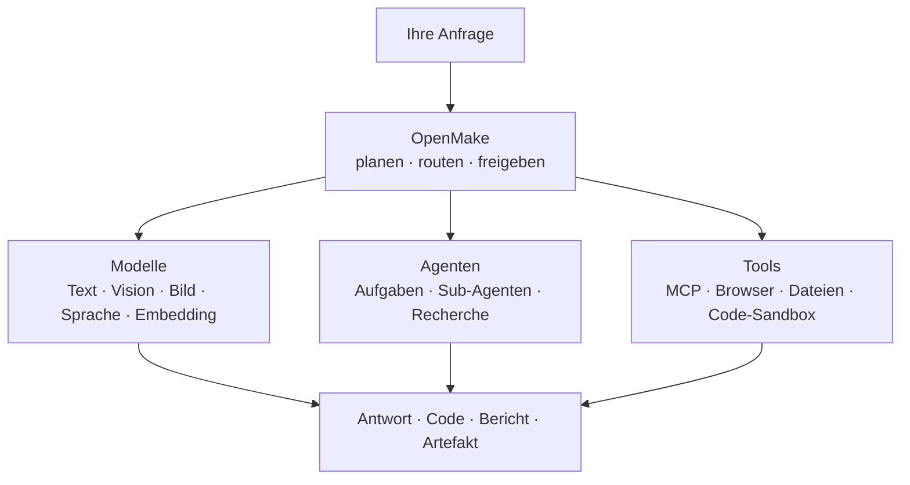
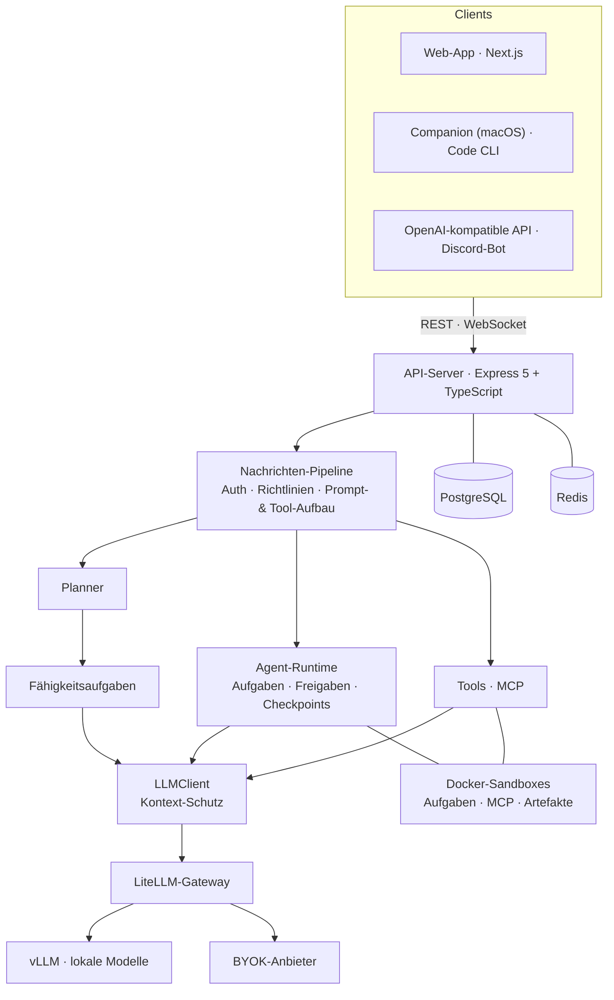

<h1 align="center">OpenMake</h1>

<p align="center">
  <strong>Open-Source-KI-Workspace und Agent-Runtime für lokale, Open-Weight- und OpenAI-kompatible Modelle.</strong>
</p>

<p align="center">
  OpenMake koordiniert spezialisierte Modelle, Agenten, MCP-Tools, Recherche und Sandbox-Ausführung<br/>
  in einem einzigen selbst gehosteten Workspace.
</p>

<p align="center">
  <a href="https://chat.openmake.cc"><b>Live-Demo</b></a> ·
  <a href="https://openmake.cc/en/docs/"><b>Dokumentation</b></a> ·
  <a href="https://openmake.cc/en/roadmap/"><b>Roadmap</b></a> ·
  <a href="https://openmake.cc/en/blog/"><b>Engineering Log</b></a>
</p>

<p align="center">
  Local-first · Self-hosted · Multi-model · Agents · MCP · BYOK
</p>

<p align="center">
  <a href="LICENSE"></a>
  <a href="https://github.com/openmake/openmake_llm/releases"></a>
  <a href="https://github.com/openmake/openmake_llm/actions/workflows/ci.yml"></a>
  <a href="https://github.com/openmake/openmake_llm"></a>
</p>

<p align="center">
  <a href="README.md">English</a> · <a href="README.ko.md">한국어</a> · <a href="README.ja.md">日本語</a> · <a href="README.zh-CN.md">简体中文</a> · <strong>Deutsch</strong>
</p>

<p align="center">
  
</p>

<p align="center">
  <sub>Eine Anfrage, mehrere Modelle: Der Planner führt eine Websuche, eine Reasoning-Aufgabe und eine Bilderzeugung aus; das Chat-Modell prüft die Quellen und antwortet mit Belegen und dem erzeugten Bild. Aufgenommen in der laufenden App (beschleunigt).</sub>
</p>

> Dieses Dokument ist eine deutsche Übersetzung der englischen [README.md](README.md). Bei Abweichungen gelten die englische Fassung und der Code. Die verlinkten Seiten auf openmake.cc sind auf Englisch.

---

## Schnellstart

```bash
curl -fsSL https://raw.githubusercontent.com/openmake/openmake_llm/main/install.sh | bash
```

Das Installationsskript prüft die Toolchain (Node.js 24, Docker, PM2), schreibt eine `.env` mit frisch erzeugten Secrets, startet PostgreSQL und Redis, baut OpenMake, startet es unter PM2 und führt einen Health-Check aus.

Öffnen Sie anschließend die ausgegebene URL, melden Sie sich als Administrator an und verbinden Sie ein Modell — einen lokalen vLLM- oder Ollama-Server oder einen beliebigen OpenAI-kompatiblen Endpunkt.

Läuft unter Linux und macOS (Windows: in WSL2). Mit `bash -s -- --yes` läuft die Installation ohne Rückfragen. Manuelle Einrichtung, Optionen, Updates und Hinweise zum Reverse Proxy stehen im **[Self-Hosting-Leitfaden](https://openmake.cc/en/docs/)**.

---

## Warum OpenMake?

Die meisten selbst gehosteten KI-Oberflächen helfen Ihnen, **mit einem Modell zu sprechen**. OpenMake ist darauf ausgelegt, **Modelle, Tools und Agenten so zu koordinieren, dass sie die Arbeit erledigen** — auf Infrastruktur, die Sie kontrollieren, und mit nachvollziehbaren Einzelschritten.

| Projekt | Hauptaufgabe |
|---|---|
| Ollama / vLLM | Modelle ausführen |
| Open WebUI | Modelle über eine selbst gehostete Oberfläche nutzen |
| Dify | KI-Apps und Workflows bauen |
| OpenHands | Agenten für die Softwareentwicklung |
| **OpenMake** | **Modelle, Agenten und Tools für allgemeine KI-Arbeit koordinieren** |

Diese Projekte liegen auf unterschiedlichen Ebenen und schließen sich nicht aus: OpenMake stellt lokale Modelle über vLLM bereit und kann einen Ollama-Server als Modell-Endpunkt nutzen.

---

## Funktionsweise



Eine einfache Frage geht direkt an Ihr Chat-Modell. Eine Anfrage, die mehr braucht — ein Bild, eine Transkription, eine Websuche, eine mehrstufige Aufgabe —, wird in Aufgaben zerlegt, die auf den von Ihnen zugewiesenen Modellen und Tools laufen; Ihr Chat-Modell schreibt aus den Ergebnissen die endgültige Antwort.

**Sie wählen die Modelle. OpenMake koordiniert, wie sie zusammenarbeiten.**

---

## Was Sie damit tun können

- **Ein Thema recherchieren** — über mehrere Suchquellen hinweg, mit einem Bericht samt Quellenangaben, der sich als PDF oder DOCX exportieren lässt.
- **Mit einem lokalen Modell chatten**, während ein separates Vision-Modell die angehängten Bilder liest.
- **Ein Bild, eine Sprachausgabe oder eine Transkription anfordern** — jede Anfrage geht an das Modell, das dieser Fähigkeit zugewiesen ist.
- **Einem Agenten ein Ziel übergeben** — er plant, recherchiert im Web, bearbeitet Dateien, führt Code in einer Docker-Sandbox aus und wartet vor riskanten Schritten auf eine Freigabe.
- **Externe Dienste über MCP anbinden** (Notion, Context7, Tavily, NotebookLM und weitere) oder Plugins und Skills im Claude-Code-Format installieren.
- **Agentenarbeit in einem Ordner auf Ihrem eigenen Rechner ausführen** — mit der App OpenMake Companion oder der OpenMake Code CLI.

| Bereich | Umfang |
|---|---|
| **Modelle** | vLLM + LiteLLM-Gateway, Ollama oder beliebiger OpenAI-kompatibler Endpunkt, BYOK-Anbieter, Login mit ChatGPT-Abo |
| **Orchestrierung** | Planner, Modellrollen, Modelle pro Fähigkeit, parallele Fähigkeitsaufgaben |
| **Agenten** | Mehrstufige Aufgaben, Sub-Agenten, Freigaben, Zeitpläne, Vorlagen, lokale Ausführung |
| **Recherche & Tools** | Deep Research, 23 integrierte Tools, MCP-Katalog, Skills, Erweiterungen |
| **Ergebnisse** | Gestreamte Antworten, Artefakte, HTML/PDF/DOCX-Berichte, Dateien, generierte Medien |

Die Anleitung nach Aufgaben steht im **[Benutzerhandbuch](https://openmake.cc/en/manual/)**.

<p align="center">
  
</p>

---

## Modelle & Routing

**OpenMake verlangt nicht, dass ein einziges Modell alles erledigt.**

```
OpenMake
 ├── LiteLLM-Gateway (OpenAI-kompatibel)
 │    ├── vLLM ─────────── Ihre lokalen / Open-Weight-Modelle
 │    └── BYOK-Anbieter ── OpenRouter · NVIDIA NIM · Ollama Cloud · Open AI Service Hub · B.AI
 ├── Direkt ────────────── Login mit ChatGPT-Abo
 └── Spezialisierte Modelle, pro Fähigkeit zugewiesen
      ├── Text & Code
      ├── Vision & OCR
      ├── Bilderzeugung & -bearbeitung
      ├── Spracherkennung · Sprachausgabe · Video
      └── Embedding
```

- **Modellrollen** — wählen Sie ein Modell für `agent`, `judge`, `research`, `spawn`, `review`, `summary` und `planner`. Nutzer wählen ihre eigenen; Administratoren legen Standards fest und können Server-Schlüssel mit täglichen und monatlichen Token-Budgets freigeben.
- **Modell pro Fähigkeit** — weisen Sie das Modell zu, das Vision, Bilderzeugung, Sprache, Video und Code übernimmt. Fähigkeiten ohne Zuweisung werden als nicht verfügbar gemeldet, statt stillschweigend auf ein anderes Modell auszuweichen.
- **Eigene Schlüssel (BYOK)** — Anbieter-Schlüssel werden AES-256-GCM-verschlüsselt gespeichert und pro Anfrage über das Gateway übergeben. Rate-Limits, fehlendes Guthaben und eingeschränkte Modelle werden als solche gemeldet, nicht als allgemeiner Upstream-Fehler.
- **Kontext-Schutz** — Prompts (einschließlich Bildern) werden mit dem Kontextfenster des Modells abgeglichen; zu große Eingaben werden vor dem Aufruf gekürzt, und eine unerfüllbare Anfrage liefert `413` mit einem Audit-Eintrag.
- **Automatische Modellerkennung** — Modelle hinter dem Gateway werden beim Start erkannt, sodass ein Modellwechsel auf dem Inferenz-Host keine Codeänderung erfordert.
- **Vergleichsmodus** — denselben Prompt an zwei Modelle senden und die Antworten nebeneinander lesen.

---

## Agent-Runtime

Eine Agentenaufgabe verfolgt ein Ziel über viele Runden mit Tool-Aufrufen. Agenten können:

- den Aufgabenzustand über Runden hinweg halten, mit einem Checkpoint am Ende jeder Runde
- Tools unter einer Freigaberichtlinie nutzen — manuell, automatisch oder übersprungen
- mit angehängten Dateien arbeiten und Ergebnisse wie Excel- und PDF-Dateien erstellen
- Shell- und Python-Code in einem isolierten Docker-Workspace ausführen
- aus einem separaten Browser-Container mit Egress-Allowlist im Web recherchieren
- unabhängige Arbeit auf parallele Sub-Agenten verteilen
- über einen Ziel-Prüfer *nicht erreicht* melden, statt fälschlich „erledigt“

**Heute verfügbar**

- ✓ Persistente Aufgaben mit Pausieren, Fortsetzen, Abbrechen und Wiederherstellung nach einem Serverneustart
- ✓ Ein **Freigaben**-Postfach für Agentenschritte, Skills, Erweiterungen und MCP-Server
- ✓ Vorlagen, geplante Ausführungen und teilbare Aufgabenergebnisse
- ✓ Lokale Ausführung über OpenMake Companion (macOS) oder die OpenMake Code CLI — mit Pfadbegrenzung, Bestätigung für Befehle und Isolation per Git-Worktree

**Opt-in** — diese Funktionen sind standardmäßig deaktiviert. Aktivieren Sie sie in der `.env`:

| Einstellung | Aktiviert | Voraussetzung |
|---|---|---|
| `TASK_SANDBOX_ENABLED=true` | Persistenter Docker-Workspace pro Aufgabe | Zuerst `infra/mcp-runtime`, dann `infra/task-runtime` bauen |
| `LOCAL_EXECUTOR_ENABLED=true` | Tool-Aufrufe auf dem Rechner eines Nutzers | OpenMake Companion oder CLI mit einem API-Schlüssel mit `bridge`-Scope |
| `AGENT_TASK_QUEUE_ENABLED=true` | Globale Limits und Limits pro Nutzer für parallele Aufgaben | — |

```bash
docker build -t openmake-mcp-runtime:latest infra/mcp-runtime
docker build -t openmake-task-runtime:latest infra/task-runtime
```

**Geplant**

- ○ **Ausführungsgraph** — Planknoten, die ihre Abhängigkeiten, Berechtigungen, Wiederholungen und Abschlusskriterien selbst tragen. Heute ist der gespeicherte Plan eine flache Liste von Schritten.
- ○ **Deklarative Policy-Engine** — serverseitig erzwungene Berechtigungsstufen über die heutige Freigabe hinaus.
- ○ **Dauerhaftigkeit innerhalb einer Runde** — ein Journal pro Tool-Aufruf, damit eine unterbrochene Runde sicher wiederholt werden kann.
- ○ **Begrenzter Speicher** — Arbeits-, episodisches und semantisches Gedächtnis mit Quelle und Ablaufdatum.

---

## Recherche, Tools & Artefakte

**Deep Research** — zerlegt eine Frage in Unterthemen, durchsucht sie parallel, liest die Quellen, fasst sie abschnittsweise zusammen und schreibt einen Bericht mit Quellenangaben. Wikipedia, Google News und DuckDuckGo funktionieren ohne Schlüssel; SearXNG, Google Custom Search, Naver und Kakao erweitern die Abdeckung, sobald sie konfiguriert sind.

**Integrierte Tools** — 23 Tools für Websuche und Faktenprüfung, Seitenextraktion und Crawling, Bildanalyse und OCR, Planung, Code- und Sicherheitsreview, das Laden von Skills sowie Git-Importe. Die meisten Tools werden nur in Runden angeboten, die sie brauchen — so bleiben Prompts klein.

**MCP** — installieren Sie Server aus dem Katalog (Tavily, Context7, Notion, NotebookLM, Kakao Map, OpenDART und weitere) oder registrieren Sie eigene. Jeder stdio-Server kann in einem eigenen Docker-Container laufen — mit entzogenen Capabilities, Nicht-Root-Nutzer und optional schreibgeschütztem Dateisystem; Remote-Server melden sich per OAuth an.

**Skills & Erweiterungen** — installieren Sie Plugins, Skills, eigene Agenten und MCP-Server aus Git, einem Zip-Archiv oder einem Marketplace. Claude-Code-Konventionen — Tool-Namen, `$ARGUMENTS`, `commands/`, `agents/`, mitgelieferte Skripte — werden bei der Installation angepasst, und alles, was eine Prüfung braucht, landet im Freigaben-Postfach.

**Artefakte** — Antworten lassen sich als Live-Vorschau in einer Sandbox darstellen; Berichtsanfragen werden zu HTML-Artefakten, die als PDF und DOCX exportiert werden können, und ein Viewer auf separatem Origin liefert geteilte Artefakte aus.

**Integrationen** — eine OpenAI-kompatible API (`/api/v1/chat/completions`) mit API-Schlüsseln und Scopes, ein Discord-Gateway-Bot und [OpenMake Bench](https://bench.openmake.cc), um Modelle vor der Zuweisung zu vergleichen.

---

## Architektur



- **Ein Ausführungspfad** — lokale und externe Modelle teilen sich dasselbe Streaming-Dispatch und dieselbe Tool-Schleife. Diskussion und Deep Research sind eigene Modi, die vor dem Dispatch abzweigen.
- **Planner → Fähigkeiten → Zusammenführung** — ein `simple`-Plan verursacht keinen zusätzlichen Modellaufruf. Ein `multi`-Plan wird vorab geprüft (Zuweisungen, Schlüsselstatus, Kontingente), seine Aufgaben laufen nach Abhängigkeitsebenen parallel, und nur erfolgreich erzeugte Medien werden an die Antwort angehängt.
- **Modellauflösung** — jedes Subsystem, das ein Modell aufruft, bestimmt es über eine Rolle oder Fähigkeit: Nutzereinstellung → Administrator-Standard → eingebauter Standard.
- **Robustes Streaming** — wenn ein Browser-Tab in den Hintergrund geht oder die Verbindung abbricht, läuft die Generierung weiter, und der Client verbindet sich wieder mit derselben Antwort.
- **Single-Host-Design** — die Anwendung läuft unter PM2; PostgreSQL, Redis und alle Sandboxes laufen in Docker.

| Ebene | Technologien |
|---|---|
| Backend | Node.js 24, Express 5, TypeScript (strict), Zod, Winston |
| Frontend | Next.js 16, React 19, Zustand, Tailwind CSS 4, `next-intl` (ko · en · ja · zh) |
| Daten | PostgreSQL über rohes, parametrisiertes SQL (kein ORM), Redis |
| LLM | vLLM, LiteLLM-Gateway, `openai` SDK |
| Agenten & Tools | Model Context Protocol Client v2, Docker-isolierte Sandboxes |
| Native Clients | SwiftUI (macOS Companion, iOS in Arbeit), Node-CLI — gemeinsam `packages/local-bridge-core` |

### Designprinzipien

**Ein Modell aufzurufen ist einfach. KI zuverlässig zu betreiben ist es nicht.** Schwierig sind: Zustand halten, Berechtigungen durchsetzen, sicher ausführen, sich von Fehlern erholen und belegen, was passiert ist. Darauf ist OpenMake ausgerichtet:

- **Zustand** — Aufgaben, Schritte und Checkpoints werden persistiert, sodass Arbeit einen Neustart übersteht.
- **Berechtigungen** — RBAC, API-Schlüssel mit Scopes, Freigaberichtlinien und Schutz von Zugangsdaten-Dateien bei Agenten-Tools.
- **Isolation** — Agentencode, MCP-Server und Artefakte laufen in Docker mit begrenzten Capabilities, Speicher und Netzwerk.
- **Wiederherstellung** — klare Fehlergründe, Wiederholungen bei vorübergehenden Fehlern und fortsetzbare Aufgaben.
- **Nachvollziehbarkeit** — ein Audit-Log mit Alarmierung sowie ein Verlauf jeder Aufgabe auf Schrittebene.
- **Wenige Zusatzaufrufe vor der Antwort** — das Modell wählt Tools in derselben Runde statt über einen separaten Klassifikator; die verbleibenden Aufrufe vor der Antwort (der Planner und das LLM-Agenten-Routing) werden gemessen und laufend überprüft.

---

## Deployment

Ein Referenz-Deployment besteht aus einem Anwendungs-Host und einem Inferenz-Host:

```
Application host                                   Inference host (GPU)
┌──────────────────────────────────────────┐       ┌──────────────────────┐
│ PM2: API · web                           │       │ vLLM                 │
│ Docker: PostgreSQL · Redis · sandboxes   │ ────► │ chat · embedding ·   │
│ LiteLLM gateway (OpenAI-compatible)      │       │ image models         │
└──────────────────────────────────────────┘       └──────────────────────┘
```

Alles kann auch auf einem einzigen Rechner laufen, oder der Modell-Endpunkt ist ein gehosteter Anbieter.

Der tägliche Betrieb läuft über `openmake_llm.sh`:

```bash
./openmake_llm.sh start     # PostgreSQL → Redis → App, danach Logs anzeigen
./openmake_llm.sh status    # Ports, Container und PM2-Status
./openmake_llm.sh update    # git pull (nur Fast-Forward) → Build → Migration → Neustart
./openmake_llm.sh deploy    # Build → Migration → Neustart
./openmake_llm.sh stop
```

Das Installationsskript schreibt eine funktionsfähige `.env`. Das Wichtigste:

| Variable | Zweck |
|---|---|
| `LLM_BASE_URL` · `LLM_API_KEY` · `LLM_DEFAULT_MODEL` | OpenAI-kompatibler Modell-Endpunkt |
| `LLM_GATEWAY_PROVIDERS` | BYOK-Anbieter, die über das Gateway geroutet werden |
| `DATABASE_URL` · `REDIS_URL` | Datenspeicher |
| `JWT_SECRET` · `API_KEY_PEPPER` · `TOKEN_ENCRYPTION_KEY` | Secrets (werden beim ersten Start erzeugt, falls sie fehlen) |

`.env.example` ist die vollständige Referenz, und viele Betriebseinstellungen lassen sich zur Laufzeit unter **Admin → Systemeinstellungen** ändern. Datenbankmigrationen werden beim Start automatisch angewendet. Für eine öffentliche Adresse übergeben Sie dem Installationsskript `--public-url https://chat.example.com`; eine Caddy-Konfiguration liegt unter `scripts/caddy/`.

---

## Entwicklung

```bash
git clone https://github.com/openmake/openmake_llm.git
cd openmake_llm
npm install

npm run dev                 # API + Web
npm test                    # gemeinsame Pakete bauen, dann Jest-Unit-Tests
npm run test:e2e            # Playwright (chromium + webkit)
npm run lint                # ESLint
```

```
apps/
├── api/             Express-5-API — Chat-Pipeline, Orchestrator, Agenten, MCP, Daten
├── web/             Next.js-Web-App
├── cli/             OpenMake Code — Local-Bridge-CLI
├── desktop-native/  OpenMake Companion — SwiftUI-Menüleisten-App (macOS)
├── ios/             SwiftUI-iOS-Client (in Arbeit)
└── discord-bot/     Discord-Gateway-Bot
packages/            gemeinsame Typen, API-Verträge, Konfiguration, API-Client, Local-Bridge-Kern
db/                  Basisschema und Migrationen
infra/               Docker-Images und Compose-Dateien für Sandboxes und Datenspeicher
```

---

## Roadmap

| Aktuell — verfügbar | Als Nächstes | Später |
|---|---|---|
| Multi-Modell-Gateway mit Rollen- und Fähigkeits-Routing | Ausführungsgraph | Begrenzter Speicher |
| Dauerhafte Aufgaben-Runtime: Checkpoints, Pausieren/Fortsetzen, Wiederherstellung nach Neustart | Deklarative Policy-Engine und Freigabe-Wartezustände | Organisationen, Projekte und Mandantenfähigkeit |
| Tools, MCP-Gateway, Freigaben, Docker-Sandboxes | Agenten- und Skill-Manifeste | SSO (OIDC, SAML), Budgets, Deployment-Freigaben |
| Deep Research, Artefakte, Local-Execution-Bridge | Dauerhaftigkeit innerhalb einer Runde | Air-Gapped-Installation, Hochverfügbarkeit, Kubernetes |

Die Richtung steht fest, der Zeitplan ist kein Versprechen — was nicht in einem [Release](https://github.com/openmake/openmake_llm/releases) enthalten ist, gilt als Plan. Details: **[openmake.cc/roadmap](https://openmake.cc/en/roadmap/)**.

---

## Engineering Log

OpenMake wird offen entwickelt. Wir veröffentlichen laufend Implementierungsnotizen, Fehlschläge, Abwägungen und Erfahrungen aus dem Betrieb (Beiträge auf Englisch):

- [Six months serving vLLM on a DGX Spark](https://openmake.cc/en/blog/six-months-vllm-dgx-spark/)
- [We built isolation, and in production it did nothing](https://openmake.cc/en/blog/mcp-sandbox-docker/)
- [All four times, the tests were green](https://openmake.cc/en/blog/green-tests-four-gaps/)
- [Connecting the plan to the execution, in three increments](https://openmake.cc/en/blog/execution-graph-increments/)
- [Swapping the inference backend in a day, then paying for it](https://openmake.cc/en/blog/ollama-to-vllm-migration/)

Jede Woche wird außerdem im [wöchentlichen Entwicklungslog](https://openmake.cc/en/blog/) zusammengefasst — zuletzt: [W37](https://openmake.cc/en/blog/weekly-log-2026-w37/).

---

## Mitwirken

Beiträge sind willkommen — Fehlerberichte, Fixes, Dokumentation sowie neue Skills oder MCP-Integrationen.

- Erstellen Sie einen Branch und öffnen Sie einen Pull Request gegen `main`; Commits folgen den [Conventional Commits](https://www.conventionalcommits.org/) (`feat`, `fix`, `refactor`, `docs`, `test`, `chore`).
- Konventionen: TypeScript im Strict-Modus, Validierung mit Zod, rohes parametrisiertes SQL (kein ORM) und ausgelagerte Konfiguration — keine fest codierten Modellnamen, Magic Numbers oder Inline-Prompts.
- Vor dem Pull Request: `npm run lint` und `npm test` laufen durch; Schemaänderungen enthalten eine Migration; neue Umgebungsvariablen sind in `.env.example` dokumentiert; UI-Änderungen enthalten einen Screenshot.

Die CI führt bei jedem Push und Pull Request ein einziges **CI Gate** aus (Test → Build → Größe → Lint).

**Community & Kontakt** — Fragen und Hilfe beim Self-Hosting: support@openmake.cc · Maintainer: riskpw@openmake.cc, rockyhan@openmake.cc. Wenn Ihnen OpenMake hilft, hilft ein Stern anderen Entwicklern, das Projekt zu finden.

## Lizenz

Veröffentlicht unter der [MIT-Lizenz](LICENSE).
