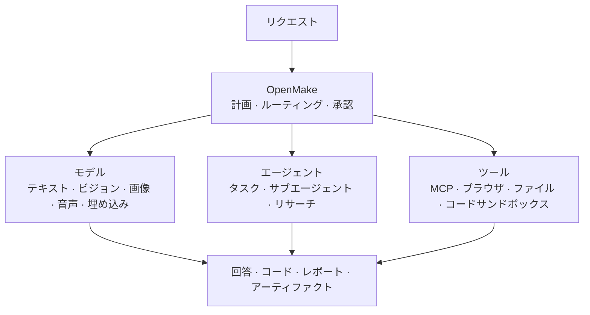
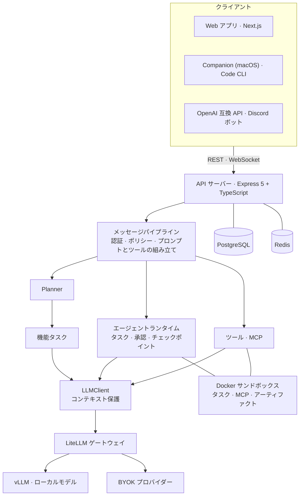

<h1 align="center">OpenMake</h1>

<p align="center">
  <strong>ローカルモデル、オープンウェイトモデル、OpenAI 互換モデルのためのオープンソース AI ワークスペース兼エージェントランタイム。</strong>
</p>

<p align="center">
  OpenMake は、専門モデル・エージェント・MCP ツール・リサーチ・サンドボックス実行を<br/>
  ひとつのセルフホスト型ワークスペースで連携させます。
</p>

<p align="center">
  <a href="https://chat.openmake.cc"><b>ライブデモ</b></a> ·
  <a href="https://openmake.cc/ja/docs/"><b>ドキュメント</b></a> ·
  <a href="https://openmake.cc/ja/roadmap/"><b>ロードマップ</b></a> ·
  <a href="https://openmake.cc/ja/blog/"><b>エンジニアリングログ</b></a>
</p>

<p align="center">
  Local-first · Self-hosted · Multi-model · Agents · MCP · BYOK
</p>

<p align="center">
  <a href="LICENSE"></a>
  <a href="https://github.com/openmake/openmake_llm/releases"></a>
  <a href="https://github.com/openmake/openmake_llm/actions/workflows/ci.yml"></a>
  <a href="https://github.com/openmake/openmake_llm"></a>
</p>

<p align="center">
  <a href="README.md">English</a> · <a href="README.ko.md">한국어</a> · <strong>日本語</strong> · <a href="README.zh-CN.md">简体中文</a> · <a href="README.de.md">Deutsch</a>
</p>

<p align="center">
  
</p>

<p align="center">
  <sub>ひとつのリクエスト、複数のモデル: Planner が Web 検索・推論・画像生成を実行し、チャットモデルが出典を確認して、引用と生成画像付きで回答します。実行中のアプリから録画(早送り)。</sub>
</p>

> 本書は英語版 [README.md](README.md) の日本語訳です。内容が異なる場合は英語版とコードを正とします。

---

## クイックスタート

```bash
curl -fsSL https://raw.githubusercontent.com/openmake/openmake_llm/main/install.sh | bash
```

インストーラーがツールチェーン(Node.js 24、Docker、PM2)を確認し、新しいシークレットで `.env` を作成、PostgreSQL と Redis を起動し、OpenMake をビルドして PM2 で起動したうえで、ヘルスチェックまで行います。

表示された URL を開いて管理者としてサインインし、モデルを接続してください — ローカルの vLLM・Ollama サーバー、または OpenAI 互換エンドポイントが使えます。

Linux と macOS で動作します(Windows は WSL2 内で)。対話なしでインストールするには `bash -s -- --yes` を付けます。手動セットアップ、オプション、アップデート、リバースプロキシについては **[セルフホスティングガイド](https://openmake.cc/ja/docs/)** を参照してください。

---

## なぜ OpenMake か

多くのセルフホスト型 AI インターフェースは **モデルと対話する** ためのものです。OpenMake は **モデル・ツール・エージェントを連携させ、実際の仕事をさせる** ことを目的に設計されています — 自分で管理するインフラ上で、すべてのステップを確認できる形で。

| プロジェクト | 主な役割 |
|---|---|
| Ollama / vLLM | モデルを動かす |
| Open WebUI | セルフホスト型インターフェースでモデルを使う |
| Dify | AI アプリとワークフローを構築する |
| OpenHands | ソフトウェア開発のためのエージェント |
| **OpenMake** | **汎用的な AI の仕事のために、モデル・エージェント・ツールを連携させる** |

これらは異なるレイヤーのプロジェクトで、排他的ではありません。OpenMake は vLLM でローカルモデルを提供し、Ollama サーバーをモデルエンドポイントとして使うこともできます。

---

## 仕組み



単純な質問はそのままチャットモデルへ送られます。画像、文字起こし、Web 検索、複数ステップの作業など、それ以上が必要なリクエストは、割り当てたモデルとツールで動くタスクに分割され、チャットモデルがその結果をもとに最終回答を書きます。

**モデルを選ぶのはあなた。モデル同士の連携は OpenMake が担います。**

---

## できること

- **テーマを調査し**、複数の検索ソースに基づく出典付きレポートを受け取り、PDF・DOCX に書き出す。
- **ローカルモデルとチャットしながら**、添付した画像は別のビジョンモデルに読ませる。
- **画像生成、読み上げ、文字起こしを依頼する** — リクエストごとに、その機能に割り当てたモデルが処理します。
- **エージェントに目標を任せる** — 計画を立て、Web を調べ、ファイルを編集し、Docker サンドボックスでコードを実行し、リスクのある手順の前には承認を待ちます。
- **MCP で外部サービスに接続する**(Notion、Context7、Tavily、NotebookLM など)、または Claude Code 形式のプラグインやスキルをインストールする。
- **自分のマシンのフォルダーでエージェント作業を実行する** — OpenMake Companion アプリまたは OpenMake Code CLI から。

| 領域 | 対象 |
|---|---|
| **モデル** | vLLM + LiteLLM ゲートウェイ、Ollama または任意の OpenAI 互換エンドポイント、BYOK プロバイダー、ChatGPT サブスクリプションログイン |
| **オーケストレーション** | Planner、モデルロール、機能ごとのモデル、並列の機能タスク |
| **エージェント** | 複数ターンのタスク、サブエージェント、承認、スケジュール実行、テンプレート、ローカル実行 |
| **リサーチ・ツール** | ディープリサーチ、組み込みツール 23 種、MCP カタログ、スキル、拡張機能 |
| **成果物** | ストリーミング回答、アーティファクト、HTML/PDF/DOCX レポート、ファイル、生成メディア |

タスク別の使い方は **[ユーザーマニュアル](https://openmake.cc/ja/manual/)** にあります。

<p align="center">
  
</p>

---

## モデルとルーティング

**OpenMake は、ひとつのモデルにすべてを任せることを前提にしていません。**

```
OpenMake
 ├── LiteLLM ゲートウェイ (OpenAI 互換)
 │    ├── vLLM ─────────── ローカル / オープンウェイトモデル
 │    └── BYOK プロバイダー ─ OpenRouter · NVIDIA NIM · Ollama Cloud · Open AI Service Hub · B.AI
 ├── 直接接続 ──────────── ChatGPT サブスクリプションログイン
 └── 機能ごとに割り当てる専門モデル
      ├── テキスト · コード
      ├── ビジョン · OCR
      ├── 画像生成 · 編集
      ├── 音声認識 · 音声合成 · 動画
      └── 埋め込み
```

- **モデルロール** — `agent`、`judge`、`research`、`spawn`、`review`、`summary`、`planner` ごとにモデルを選びます。ユーザーは各自で設定し、管理者は既定値を決め、日次・月次のトークン予算付きでサーバー共用キーを共有できます。
- **機能ごとのモデル** — ビジョン、画像生成、音声、動画、コードを処理するモデルを割り当てます。割り当てのない機能は、黙って別のモデルに切り替えず、利用できないと通知します。
- **BYOK(自分のキーを使う)** — プロバイダーキーは AES-256-GCM で暗号化して保存し、リクエストごとにゲートウェイへ渡します。レート制限、クレジット不足、利用制限のあるモデルは、汎用的な上流エラーではなくその理由のまま通知します。
- **コンテキスト保護** — プロンプト(画像を含む)をモデルのコンテキスト長と照合し、はみ出す入力は呼び出し前に削り、どうしても収まらないリクエストは監査記録とともに `413` を返します。
- **ローカルモデルの自動検出** — ゲートウェイの背後にあるモデルを起動時に検出するため、推論サーバーでモデルを入れ替えてもコード変更は不要です。
- **比較モード** — 同じプロンプトを 2 つのモデルに送り、回答を並べて比較します。

---

## エージェントランタイム

エージェントタスクは、ツールを呼び出す複数のターンにわたって目標を進めます。エージェントは次のことができます:

- ターンの終わりごとにチェックポイントを残し、タスクの状態を引き継ぐ
- 承認ポリシー(手動・自動・スキップ)のもとでツールを使う
- 添付ファイルを扱い、Excel や PDF などの成果物を作る
- 隔離された Docker ワークスペースでシェルや Python のコードを実行する
- 許可リストで外部通信を制限した別のブラウザコンテナから Web を閲覧する
- 独立した作業を並列のサブエージェントに分ける
- 目標を達成できなかった場合、偽の「完了」ではなく目標判定で *未達成* を報告する

**現在利用可能**

- ✓ 一時停止・再開・キャンセルができ、サーバー再起動後も復旧する永続タスク
- ✓ エージェントの手順・スキル・拡張機能・MCP サーバーをまとめて扱う **承認** 画面
- ✓ テンプレート、スケジュール実行、タスク結果の共有
- ✓ OpenMake Companion(macOS)または OpenMake Code CLI によるローカル実行 — パス範囲の制限、コマンド確認ゲート、git worktree による隔離

**オプトイン** — 既定では無効です。`.env` で有効にします:

| 設定 | 有効になる機能 | 前提条件 |
|---|---|---|
| `TASK_SANDBOX_ENABLED=true` | タスクごとの永続 Docker ワークスペース | `infra/mcp-runtime` をビルドしてから `infra/task-runtime` をビルド |
| `LOCAL_EXECUTOR_ENABLED=true` | ユーザーのマシンでのツール実行 | `bridge` スコープの API キーで接続した OpenMake Companion または CLI |
| `AGENT_TASK_QUEUE_ENABLED=true` | 全体・ユーザー単位の同時実行上限 | — |

```bash
docker build -t openmake-mcp-runtime:latest infra/mcp-runtime
docker build -t openmake-task-runtime:latest infra/task-runtime
```

**計画中**

- ○ **実行グラフ** — 各ノードが依存関係・権限・リトライ・完了条件を持つ計画。現在保存される計画はステップの平坦なリストです。
- ○ **宣言的ポリシーエンジン** — 現在の承認ゲートを超えて、サーバーが強制する権限レベル。
- ○ **ターン内の耐久性** — ツール呼び出し単位の記録により、途中で中断したターンを安全に再実行する。
- ○ **スコープ付きメモリ** — 出典と有効期限を持つ作業・エピソード・意味メモリ。

---

## リサーチ・ツール・アーティファクト

**ディープリサーチ** — 質問をサブトピックに分けて並列に検索し、ソースを読み、分割して要約したうえで出典付きレポートを書きます。Wikipedia、Google News、DuckDuckGo はキーなしで動作し、SearXNG・Google カスタム検索・Naver・Kakao は設定すると検索範囲が広がります。

**組み込みツール** — Web 検索・ファクトチェック、ページ抽出・クロール、画像分析・OCR、計画、コード・セキュリティレビュー、スキルの読み込み、Git からのインポートなど 23 種。多くのツールは必要なターンにだけ提示し、プロンプトを小さく保ちます。

**MCP** — カタログ(Tavily、Context7、Notion、NotebookLM、カカオマップ、OpenDART など)からサーバーをインストールするか、独自に登録します。stdio サーバーはそれぞれ専用の Docker コンテナで、権限の削減・非 root ユーザー・任意の読み取り専用ファイルシステムのもとで実行でき、リモートサーバーは OAuth でサインインします。

**スキル・拡張機能** — プラグイン、スキル、カスタムエージェント、MCP サーバーを Git・zip・マーケットプレイスからインストールします。Claude Code の慣習(ツール名、`$ARGUMENTS`、`commands/`、`agents/`、同梱スクリプト)はインストール時にこの環境へ合わせて変換され、確認が必要なものはすべて承認画面に届きます。

**アーティファクト** — 回答をサンドボックス化されたライブプレビューとして描画し、レポート依頼は PDF・DOCX に書き出せる HTML アーティファクトになり、共有アーティファクトは別オリジンのビューアーで配信します。

**連携** — スコープ付き API キーを使う OpenAI 互換 API(`/api/v1/chat/completions`)、Discord ゲートウェイボット、割り当て前にモデルを比較できる [OpenMake Bench](https://bench.openmake.cc)。

---

## アーキテクチャ



- **ひとつの実行経路** — ローカルモデルと外部モデルが同じストリーミングディスパッチとツールループを共有します。ディスカッションとディープリサーチは、ディスパッチ前に分岐する別モードです。
- **Planner → 機能タスク → 統合** — `simple` の計画はモデル呼び出しを増やしません。`multi` の計画は実行前にチェック(割り当て、キーの状態、クォータ)され、タスクは依存レベルごとに並列実行され、成功したメディアだけが回答に添付されます。
- **モデルの決定** — モデルを呼び出すすべてのサブシステムは、ロールまたは機能を通じてモデルを決めます: ユーザー設定 → 管理者の既定値 → 組み込みの既定値。
- **途切れても続くストリーミング** — ブラウザのタブがバックグラウンドに回ったりソケットが切れたりしても生成は続き、クライアントは同じ回答に再接続します。
- **単一ホスト設計** — アプリケーションは PM2 で、PostgreSQL・Redis・すべてのサンドボックスは Docker で動かします。

| レイヤー | 技術 |
|---|---|
| バックエンド | Node.js 24、Express 5、TypeScript(strict)、Zod、Winston |
| フロントエンド | Next.js 16、React 19、Zustand、Tailwind CSS 4、`next-intl`(ko · en · ja · zh · de) |
| データ | パラメーター化した生 SQL による PostgreSQL(ORM なし)、Redis |
| LLM | vLLM、LiteLLM ゲートウェイ、`openai` SDK |
| エージェント・ツール | Model Context Protocol クライアント v2、Docker で隔離したサンドボックス |
| ネイティブクライアント | SwiftUI(macOS Companion、iOS は開発中)、Node CLI — `packages/local-bridge-core` を共有 |

### 設計原則

**モデルを呼び出すのは簡単です。AI を安定して運用するのは簡単ではありません。** 難しいのは、状態の維持、権限の強制、安全な実行、障害からの復旧、そして何が起きたかの証明です。OpenMake はこれらを中心に作られています:

- **状態** — タスク・ステップ・チェックポイントを永続化し、再起動をまたいで作業を続けます。
- **権限** — RBAC、スコープ付き API キー、承認ポリシー、エージェントツールでの認証情報ファイルの保護。
- **隔離** — エージェントのコード、MCP サーバー、アーティファクトを、権限・メモリ・ネットワークを制限した Docker で実行します。
- **復旧** — 明確な失敗理由、一時的なエラーのリトライ、再開可能なタスク。
- **監査可能性** — アラートと連動した監査ログと、ステップ単位のタスク履歴。
- **回答前の追加呼び出しを最小限に** — 別の分類器ではなく、モデルが同じターンの中でツールを選びます。残っている回答前の呼び出し(Planner と LLM によるエージェントルーティング)は計測しながら見直しを続けています。

---

## デプロイ

参考構成は、アプリケーションホスト 1 台と推論ホストの組み合わせです:

```
Application host                                   Inference host (GPU)
┌──────────────────────────────────────────┐       ┌──────────────────────┐
│ PM2: API · web                           │       │ vLLM                 │
│ Docker: PostgreSQL · Redis · sandboxes   │ ────► │ chat · embedding ·   │
│ LiteLLM gateway (OpenAI-compatible)      │       │ image models         │
└──────────────────────────────────────────┘       └──────────────────────┘
```

すべてを 1 台で動かすことも、モデルエンドポイントにホスティング型プロバイダーを使うこともできます。

日々の運用は `openmake_llm.sh` で行います:

```bash
./openmake_llm.sh start     # PostgreSQL → Redis → アプリ、続けてログを表示
./openmake_llm.sh status    # ポート、コンテナ、PM2 の状態
./openmake_llm.sh update    # git pull(fast-forward のみ)→ ビルド → マイグレーション → 再起動
./openmake_llm.sh deploy    # ビルド → マイグレーション → 再起動
./openmake_llm.sh stop
```

インストーラーが動作する `.env` を作成します。主な項目:

| 変数 | 用途 |
|---|---|
| `LLM_BASE_URL` · `LLM_API_KEY` · `LLM_DEFAULT_MODEL` | OpenAI 互換のモデルエンドポイント |
| `LLM_GATEWAY_PROVIDERS` | ゲートウェイ経由の BYOK プロバイダー |
| `DATABASE_URL` · `REDIS_URL` | データストア |
| `JWT_SECRET` · `API_KEY_PEPPER` · `TOKEN_ENCRYPTION_KEY` | シークレット(未設定なら初回起動時に生成) |

すべての項目は `.env.example` にあり、多くの運用設定は **管理 → システム設定** から実行中に変更できます。データベースのマイグレーションは起動時に自動適用されます。公開アドレスが必要な場合は、インストール時に `--public-url https://chat.example.com` を指定してください。Caddy の設定は `scripts/caddy/` にあります。

---

## 開発

```bash
git clone https://github.com/openmake/openmake_llm.git
cd openmake_llm
npm install

npm run dev                 # API + Web
npm test                    # 共有パッケージをビルドしてから Jest 単体テスト
npm run test:e2e            # Playwright (chromium + webkit)
npm run lint                # ESLint
```

```
apps/
├── api/             Express 5 API — チャットパイプライン、オーケストレーター、エージェント、MCP、データ
├── web/             Next.js Web アプリ
├── cli/             OpenMake Code — ローカルブリッジ CLI
├── desktop-native/  OpenMake Companion — SwiftUI メニューバーアプリ (macOS)
├── ios/             SwiftUI iOS クライアント (開発中)
└── discord-bot/     Discord ゲートウェイボット
packages/            共有型、API 契約、設定、API クライアント、ローカルブリッジコア
db/                  ベーススキーマとマイグレーション
infra/               サンドボックスとデータストア用の Docker イメージと compose ファイル
```

---

## ロードマップ

| 現在 — 提供中 | 次 | その後 |
|---|---|---|
| ロール・機能ルーティングを備えたマルチモデルゲートウェイ | 実行グラフ | スコープ付きメモリ |
| 永続タスクランタイム: チェックポイント、一時停止・再開、再起動後の復旧 | 宣言的ポリシーエンジンと承認待ち | 組織、プロジェクト、マルチテナンシー |
| ツール、MCP ゲートウェイ、承認、Docker サンドボックス | エージェント・スキルのマニフェスト | SSO(OIDC、SAML)、予算、デプロイ承認 |
| ディープリサーチ、アーティファクト、ローカル実行ブリッジ | ターン内の耐久性 | エアギャップ環境へのインストール、HA、Kubernetes |

方向性は定まっていますが、スケジュールは約束ではありません — [リリース](https://github.com/openmake/openmake_llm/releases)に含まれていない機能は計画として扱ってください。詳細: **[openmake.cc/roadmap](https://openmake.cc/ja/roadmap/)**。

---

## エンジニアリングログ

OpenMake はオープンに開発しています。実装メモ、失敗、トレードオフ、運用で得た教訓を随時公開しています:

- [Six months serving vLLM on a DGX Spark](https://openmake.cc/ja/blog/six-months-vllm-dgx-spark/)(英語)
- [分離を作ったのに、本番では何もしていなかった](https://openmake.cc/ja/blog/mcp-sandbox-docker/)
- [四回とも、テストは緑だった](https://openmake.cc/ja/blog/green-tests-four-gaps/)
- [計画と実行をつなぐ作業を、三回に分けてやった](https://openmake.cc/ja/blog/execution-graph-increments/)
- [推論バックエンドを一日で載せ替え、その請求書を十三日かけて払った](https://openmake.cc/ja/blog/ollama-to-vllm-migration/)

毎週の内容は [週次開発ログ](https://openmake.cc/ja/blog/) にもまとめています — 最新: [W37](https://openmake.cc/ja/blog/weekly-log-2026-w37/)。

---

## コントリビューション

バグ報告、修正、ドキュメント、新しいスキルや MCP 連携など、どのような貢献も歓迎します。

- ブランチを作成し、`main` に対してプルリクエストを送ってください。コミットは [Conventional Commits](https://www.conventionalcommits.org/)(`feat`、`fix`、`refactor`、`docs`、`test`、`chore`)に従います。
- 規約: TypeScript strict モード、Zod による検証、パラメーター化した生 SQL(ORM なし)、設定の外部化 — モデル名・マジックナンバー・インラインプロンプトをハードコードしません。
- PR の前に: `npm run lint` と `npm test` が通ること、スキーマ変更にはマイグレーションを含めること、新しい環境変数は `.env.example` に記載すること、UI の変更にはスクリーンショットを添えること。

CI はすべてのプッシュとプルリクエストで **CI Gate**(テスト → ビルド → サイズ → lint)をひとつ実行します。

**コミュニティ・連絡先** — 質問やセルフホスティングの相談: support@openmake.cc · メンテナー: riskpw@openmake.cc、rockyhan@openmake.cc。OpenMake が役に立ったら、スターを付けていただくと他の開発者が見つけやすくなります。

## ライセンス

[MIT License](LICENSE) のもとで公開しています。
