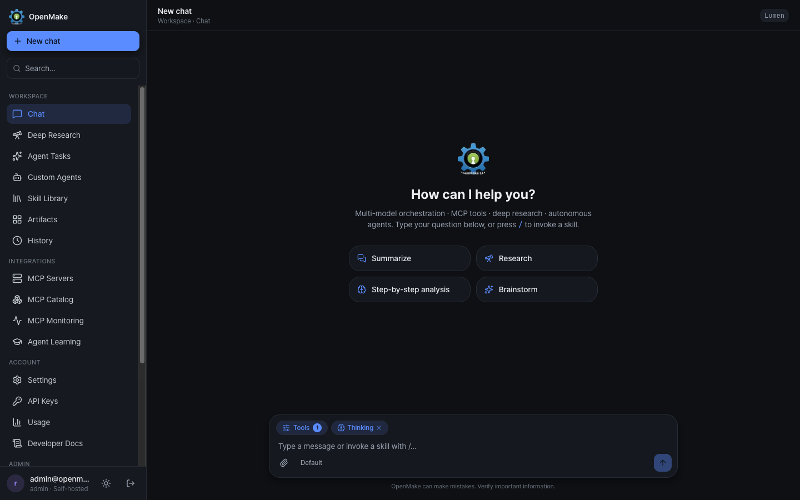
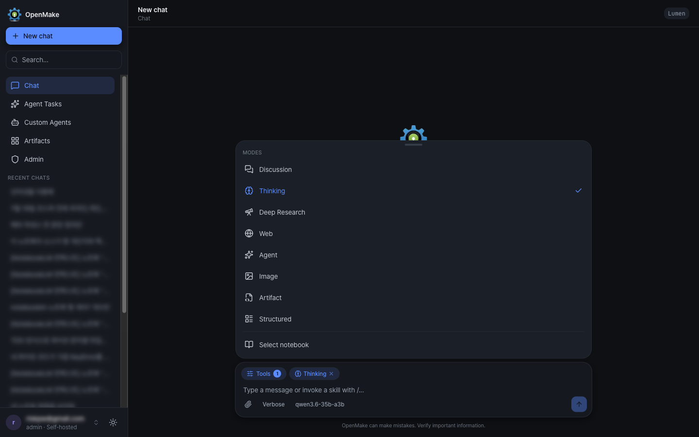
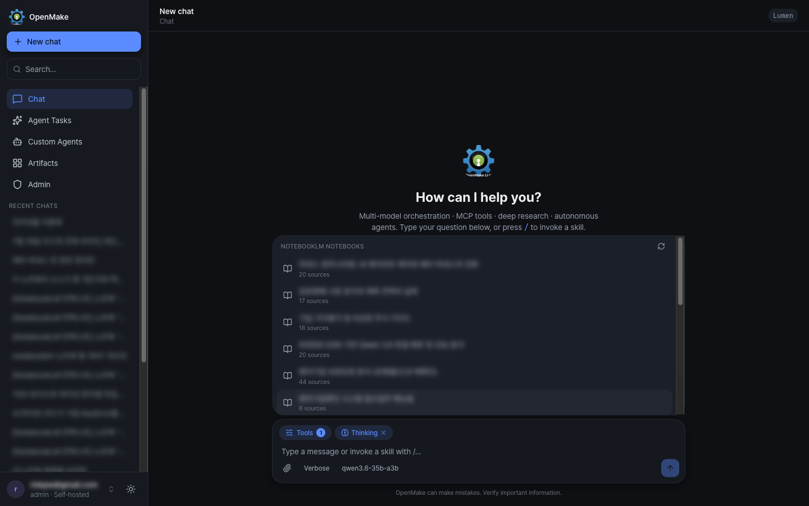
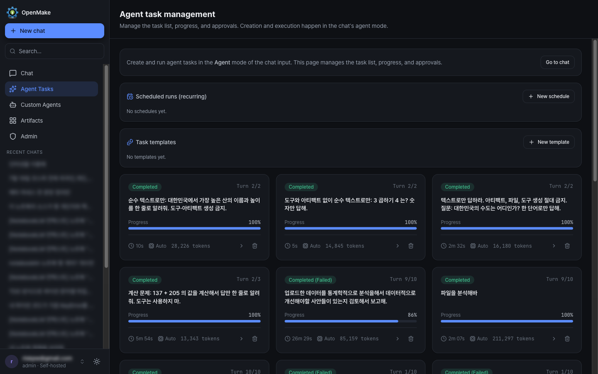
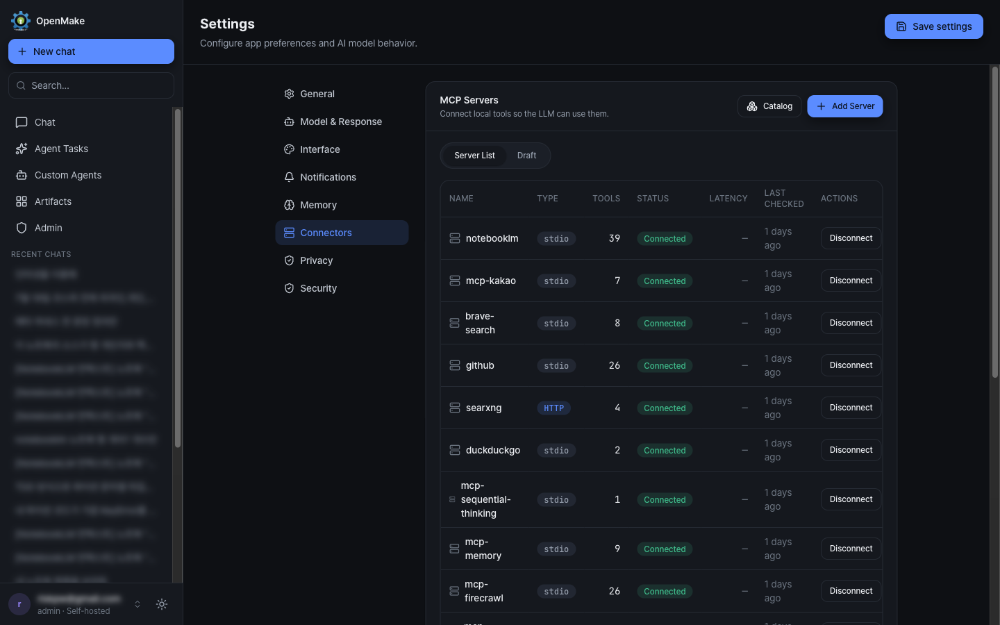
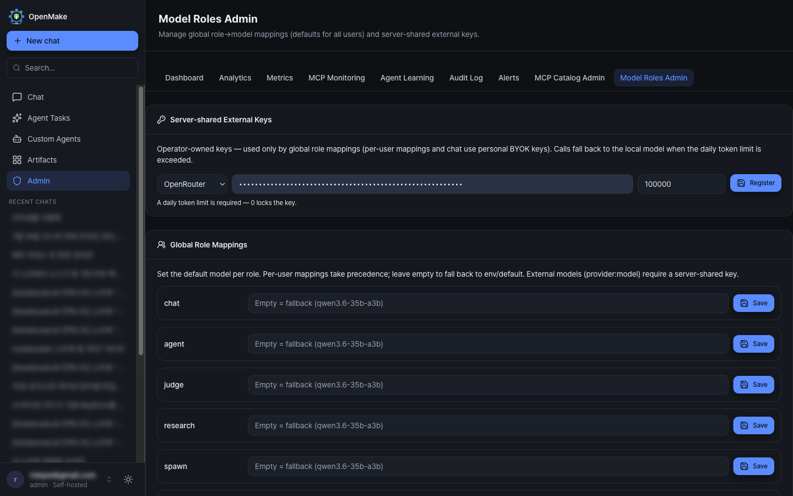
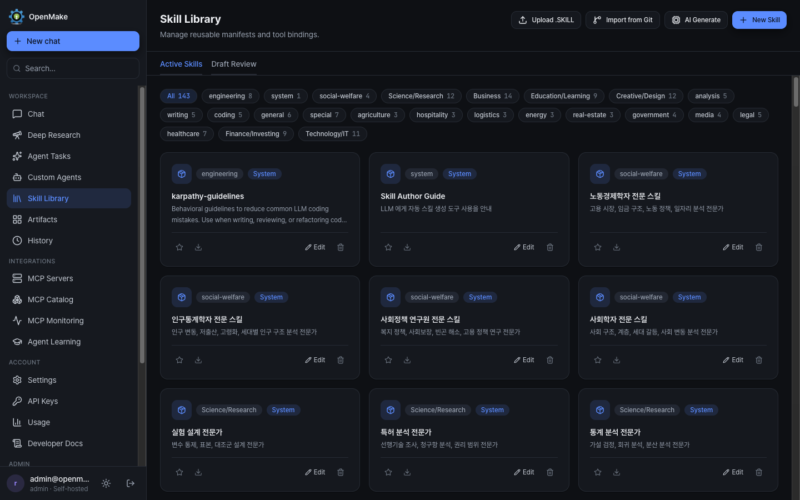
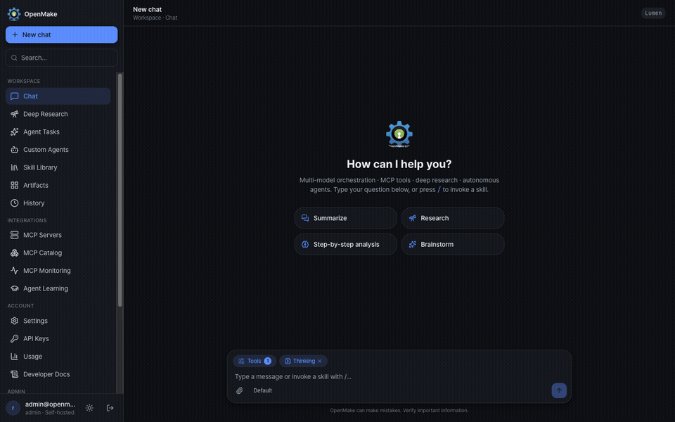

<h1 align="center">OpenMake LLM</h1>

<p align="center">
  <strong>オープンウェイトモデルと BYOK モデルのための、オープンソース・ローカルファースト・セルフホスト型 AI ワークスペース。</strong><br/>
  vLLM/LiteLLM 推論 · 自律型 AI エージェント · MCP ツール · ディープリサーチ · Docker サンドボックス。
</p>

<p align="center">
  <a href="https://github.com/openmake/openmake_llm/actions/workflows/ci.yml"></a>
  <a href="LICENSE"></a>
  
  =24 <25" />
  
  
</p>

<p align="center">
  <a href="https://openmake.cc/ja/">ホームページ</a> ·
  <a href="https://chat.openmake.cc">ライブデモ</a> ·
  <a href="https://bench.openmake.cc">Bench</a> ·
  <a href="https://openmake.cc/ja/docs/">セルフホスティングガイド</a><br/>
  <a href="README.md">English</a> ·
  <a href="README.ko.md">한국어</a> ·
  <strong>日本語</strong> ·
  <a href="README.zh-CN.md">简体中文</a>
</p>

---

> 本書は英語版 [README.md](README.md) の日本語訳です。内容が異なる場合は英語版とコードを正とします。

## 概要

**OpenMake LLM** は、自分のハードウェア上で動かすセルフホスト型 AI アシスタントです。ローカルモデルを **vLLM** で提供し、その前段に **LiteLLM プロキシ**(OpenAI 互換)を置きます。そして *同じ* 抽象化のまま、自分のキーで登録した外部プロバイダー(**OpenRouter、NVIDIA NIM、Ollama** のローカル/クラウド。いずれも OpenAI 互換で、Anthropic アダプターも組み込み済み)へルーティングします。これにより、データはデフォルトで自分のマシンに留まります。

すべてのリクエストは軽量な **メッセージパイプライン** を通り、プロバイダーゲート、セキュリティおよび言語ポリシー、プロンプト/ツールの組み立てを、追加の LLM ルーティング往復 *なしで* 適用します。その後、ローカルモデルと外部モデルは同じ実行パスと常時オンのツールループを共有します。現在の **`ExecutionPlanBuilder`** は意図的に狭く設計されており、選択されたときに認可済みのカスタムエージェントを読み込むだけです。挙動は不透明なプリセットではなく、直交する軸だけで制御します。すなわち **モデル · スタイル · モードトグル · カスタムエージェント** です。パワーユーザーはさらに **ロールベースのモデルオーケストレーション** に踏み込めます。各機能ロール(エージェント、ジャッジ、リサーチ、並列サブエージェント、レビュー、思考サマリー)ごとに、異なるモデル(ローカルまたは外部)を割り当てられます。チャットにとどまらず、自律型エージェント、ディープリサーチのパイプライン、MCP ツールシステムを備え、いずれも JWT 認証とロールベースのアクセス制御の背後で動作します。

> **シングルホスト設計:** アプリケーション(API + Web)は **PM2** の下で動作し、ステートフルな依存関係(PostgreSQL / Redis)とサンドボックス化されたエージェント / MCP / アーティファクトのプロセスは、隔離のため **Docker** で動作します。

**ひと目でわかる特徴**

| | |
|---|---|
| 🧠 **1 つのローカルモデルを、リクエストごとにルーティング** | `qwen3.8-27b` を vLLM + LiteLLM で提供。262K のコンテキスト適合セーフティネット付き |
| 🎛️ **ロールベースのモデルオーケストレーション** | 機能ロールごとに異なるモデル(ローカルまたは BYOK 外部)を割り当て。ユーザーごと + 管理者グローバルのマッピング、トークン予算付きのサーバー共有キー |
| 🤖 **自律型エージェント** | 永続的な Docker サンドボックス(シェル · Python · ブラウザ · ファイル)内で動く Manus スタイルのマルチターンエージェント。ヒューマン・イン・ザ・ループの承認付き |
| 🔬 **ディープリサーチ** | ファンアウト型のウェブ検索 → ソース取得 → 主張の検証 → 出典付きの統合 |
| 📊 **レポートパイプライン** | レポート意図のクエリでは、モデルが生成したデータを固定のデザインテンプレートを通して HTML アーティファクトにレンダリング。**PDF/DOCX** へエクスポート可能 |
| 📓 **NotebookLM グラウンディング** | 自分の Google NotebookLM ノートブックの 1 つを会話コンテキストとしてピン留め。コンポーザーから直接操作 |
| 🧩 **22 個の組み込み MCP ツール** + 外部 MCP サーバー | 各外部サーバーは Docker 内で隔離(`--cap-drop ALL`、非 root、ネットワークポリシー) |
| 👤 **カスタムエージェントとスキル** | プロジェクトスコープのペルソナ(エージェントごとにモデルを任意指定可)+ 自動選択可能なスキルライブラリ + 18 の業種別エージェント(100 名のスペシャリスト) |
| 💬 **Discord ゲートウェイボット** | Discord メッセージを OpenAI 互換 API へ中継する任意のワークスペース。ロール/メンションによるアクセス制御付き |
| 🖥️ **ネイティブクライアント** | ローカルフォルダーでのエージェント作業向けの **OpenMake Companion**(SwiftUI メニューバーアプリ、macOS Apple Silicon)、**OpenMake Code** CLI(ローカルブリッジ)、開発中の SwiftUI iOS クライアント。チャット本体は Web アプリに残ります |
| 📊 **OpenMake Bench** | [bench.openmake.cc](https://bench.openmake.cc):ブラインドのペアワイズモデル比較とハードウェア適合スコア。Web SSO クライアント経由でサインイン。ここで選んだモデルは自分のモデルロールに適用されます |
| 🌐 **4 言語 UI** | 한국어 · English · 日本語 · 简体中文(`next-intl`、Cookie ロケール、ブラウザー自動判定) |
| 🔒 **セキュリティファースト** | JWT(HttpOnly)、Google OAuth 2.0、RBAC、ルートごとのレート制限、SSRF ガード、監査 ↔ アラート |

---

## スクリーンショット

> 会話タイトル、ノートブック名、アカウントのメールアドレスはぼかしています。それ以外はすべて実際に動作しているアプリです。

**チャットワークスペース** — 5 項目のワークスペースナビ、モデルセレクター、応答スタイル、スラッシュで呼び出すスキル:

<p align="center">
  
</p>

| モードメニュー — Discussion / Thinking / Deep Research / Web / Agent / Image / Artifact / Structured | NotebookLM ピッカー — ノートブックを会話コンテキストとしてピン留め |
|---|---|
|  |  |

**エージェントタスク** — ライブ進捗、トークン集計、繰り返しスケジュール、再利用可能なタスクテンプレートを備えた自律型マルチターン実行:

<p align="center">
  
</p>

| コネクター — 外部 MCP サーバー、それぞれ Docker で隔離 | モデルロール管理 — グローバルなロール→モデルのマッピング |
|---|---|
|  |  |

**スキルライブラリ** — ツールバインディングを備えた再利用可能なマニフェスト。Git からインポート、またはモデルによる生成:

<p align="center">
  
</p>

**多言語 UI(한국어 · English · 日本語 · 简体中文)** — インターフェース言語は設定で切り替えるか、ブラウザー(`Accept-Language`)に追従させられます。AI の応答言語は、それとは独立してメッセージの言語に追従します:

<p align="center">
  
</p>

---

## アーキテクチャ

OpenMake は **ポリシー**(*どう* 答えるかを決める)と **実行**(実際にモデルを呼び出す)を分離します。SQL のプランナー/エグゼキューター分割になぞらえた設計です。この 2 層は意図的に独立して保たれています。

```
                          WebSocket / REST
                                  │
                    ┌─────────────▼─────────────┐
  Query ───────────►│      message-pipeline     │  request processing
                    │                           │  · provider gate
                    └─────────────┬─────────────┘  · security & language policy
                                  │                · prompt & tool assembly
                                  │                · authorized custom-agent load
                    ┌─────────────▼─────────────┐
                    │ streamFromExternalProvider│  single path — local & external alike
                    │   (always-on tool loop)   │  · 5 tool turns max
                    └─────────────┬─────────────┘  · special modes intercept earlier
                                  │
                    ┌─────────────▼─────────────┐
                    │       LLMClient.chat      │  execution — per call
                    │  (context-fit safety net) │  · token estimate → truncate → cap
                    └─────────────┬─────────────┘  · overflow → 413 + audit + alert
                                  │
           vLLM serve → LiteLLM proxy (OpenAI-compatible endpoint)
```

- **単一の実行パス** — かつての戦略ごとの層(generate-verify、agent-loop、thinking、direct)は廃止されました。`message-pipeline` は、常時オンの MCP ツールループを備えた単一の `streamFromExternalProvider` ディスパッチを通じて、ローカルモデルと外部モデルを送出します。`ExecutionPlanBuilder` は現在、認可済みのカスタムエージェントを読み込むだけです。Discussion と Deep Research は、ディスパッチ前にインターセプトされる独立したモードとして残っています。
- **コンテキスト適合セーフティネット** — 入口で、プロンプトのトークン数(画像を含む)を推定します。実効的な **262K** のウィンドウを超える場合、入力を切り詰め → `max_tokens` を削減 → 極端な場合は `ContextOverflowError` が **HTTP 413** を返し、監査レコードと自動的な Webhook アラートを伴います。
- **ユーザーカスタマイズ(4 つの直交する軸)** — **モデル**(セレクター)· **スタイル**(Concise / Default / Verbose)· **モード**(Discussion / Thinking / Deep Research / Web / Agent Task)· **カスタムインストラクションとエージェント**。システムプロンプトの組み立て順序は `memory + custom-instructions + style` です。
- **ロールベースのモデルオーケストレーション** — LLM を呼び出すすべてのサブシステムは、フェイルオープンのフォールバックチェーンを持つ単一のロールレジストリを通じてモデルを解決します。ユーザーごとのマッピング → 管理者が設定したグローバル(DB)→ グローバル env → ローカルデフォルト、の順です。ロールごとの外部モデルは、ユーザーの BYOK キー、またはグローバルロール向けのサーバー共有オペレーターキー(日次/月次のトークン予算付き)で動作します。カスタムエージェントも独自のモデルをピン留めできます。
- **会話をまたぐメモリー** — 明示的な長期メモリーがシステムプロンプトに注入されます。プライバシートグルにより、ユーザーはセッションごとにそれらを除外できます。
- **思考表示(Claude Web スタイル)** — Thinking モードがオンのとき、推論ストリームはライブのタイムラインとしてレンダリングされます。専用の `summary` ロールのモデルが 1 行の見出し(暫定をストリーミング → 最終)を生成し、推論と見出しの両方が永続化されるため、会話を再度開くとタイムラインが復元されます。

---

## 機能

**▸ モデルとルーティング**
- ローカルモデルと外部モデルは、プロバイダーゲート付きの `message-pipeline` とツールループを共有します。挙動は直交する軸(モデル · スタイル · モード · カスタムエージェント)で制御されます。
- セルフホストの vLLM + LiteLLM(デフォルトは `qwen3.8-27b`)。出力トークンを保護し、オーバーフロー時に緩やかに劣化するコンテキスト適合セーフティネット付き。
- 外部キーの持ち込み(BYOK)— **OpenRouter、NVIDIA NIM、Ollama**(ローカル + クラウド)。いずれも OpenAI 互換(Anthropic アダプターはプロバイダー抽象化に組み込み済み)で、保存時に AES-256-GCM で暗号化されます。**ゲストはデフォルトのローカルモデルのみ利用可能** で、外部プロバイダーにはサインインが必要です。
- **ロールベースのモデルオーケストレーション** — 各機能ロール(`agent`、`judge`、`research`、`spawn`、`review`、`summary`)に異なるモデル(ローカルまたは BYOK 外部)を設定から割り当てられます。管理者は組織全体のデフォルトを設定し、キーごとのトークン予算付きでサーバー共有の外部キーを管理コンソールで登録します。解決はフェイルオープンです(いかなる失敗でもローカルデフォルトにフォールバックします)。モデル一覧は、実際に到達可能でロール対応のものだけに絞り込まれます。
- **外部プロバイダーのスロットリング** — プロバイダーごとの同時実行数制限と、429 時の指数バックオフ(`Retry-After` を尊重)により、Discussion や Deep Research のファンアウトのバーストで BYOK キーがレート制限されるのを防ぎます。UI の推論エフォート設定(low / medium / high)は、OpenAI 互換の外部プロバイダーへ `reasoning_effort` として転送されます。ローカルモデルには思考の ON/OFF 用のサンプリングプリセットが適用されます。
- **テールルーティング(オプトイン、デフォルトはオフ)** — 軽量なゲートが各クエリの誤答可能性をスコアリングします。クエリを *事実的テール*(誤って答えられやすく、外部から検証可能)と判断したとき、最初のターンで `web_search` を決定論的に強制します。挙動を変えずにゲートの判断を記録するシャドウモード(`TAIL_ROUTING_SHADOW_ENABLED`)を同梱しており、`TAIL_ROUTING_STAGE2B_ENABLED` をオンにする前に、実トラフィックでしきい値を調整できます。

**▸ エージェントとリサーチ**
- **自律型エージェントタスク** — Manus スタイルのエージェントが、**永続的な Docker サンドボックス**(シェル、Python、ブラウザ、ファイル、プランニングのツール)の中で、複数のツール呼び出しターンをまたいでゴールを追求します。ヒューマン・イン・ザ・ループの承認付きです。ファイル添付を記録し、ビジョンチャネル経由で画像を注入し、**Excel(.xlsx)** や **PDF**(韓国語/CJK フォント対応)を含む成果物を生成します。そして、偽って「完了」とマークするのではなく、未達成を正直に報告します(`[GOAL_INCOMPLETE]` マーカー + ゴールジャッジ)。タスクは **再利用可能なテンプレート** として保存したり、**繰り返しスケジュール** に載せたりできます。
- **ディープリサーチ** — ファンアウト型のウェブ検索 → ソース取得 → 主張の検証 → 出典付きの統合。
- **レポートパイプライン** — レポート意図のクエリ(「X を調査してレポートを書いて」)では、モデルは **データ(JSON)のみ** を生成し、サーバーが固定のデザインテンプレートを通してそれを HTML アーティファクトにレンダリングします(*デザインはレンダラーが所有* — 一貫した編集レイアウト、KPI タイル、テーブル、依存関係なしの SVG チャート、出典付きソース。モデルの文字列はすべてエスケープ)。自己完結型のリサーチ形式のレポート要求は、より多くのリサーチターンのために自動でエージェントタスクへ委譲され、同じコントラクトがエージェントタスクの成果物にも適用されます。失敗はフェイルオープンで、有効なデータブロックがなければ、応答は通常のチャットとしてストリーミングされます。
- **カスタムエージェントとスキル** — プロジェクトスコープのエージェント(claude.ai の Projects 相当)をコンポーザーから直接選択でき、それぞれ独自のモデルを任意でピン留めできます。加えて、自動選択可能なスキルライブラリと、18 個の組み込み業種別エージェント(100 名のスペシャリスト)を備えます。

**▸ ツールと拡張性**
- **MCP ツールシステム** — 22 個の組み込みツール(ウェブ検索、ファクトチェック、ウェブのスクレイプ/マップ/クロール、画像解析、エージェントタスク制御、スキル/エージェント/MCP の git 取り込み、など)に加え、外部 MCP サーバーを備えます。各サーバーは Docker 内で隔離されます(`--cap-drop ALL`、非 root、`--memory`+`--memory-swap`、ネットワークポリシー、realpath でガードされたマウント)。**設定 → コネクター** の MCP カタログからサーバーをインストールできます(Tavily、Sentry、Context7 などを初期登録済み。`{{env.KEY}}` のシークレットはシェル変数参照として渡され、argv に焼き込まれることはありません)。カタログレベルの **ツール許可リスト** により、チャットへの自動公開が絞られます(39 ツールのサーバーが 39 個のスキーマをすべてのプロンプトに投入する必要はありません)。一方で、REST 実行と明示的なツールピッカーはフルアクセスを維持します。
- **NotebookLM グラウンディング** — 自分の Google セッション Cookie(AES-256-GCM で暗号化され、スポーン時のみ注入)で NotebookLM コネクターをインストールし、コンポーザーからノートブックをピン留めします。グラウンディングのプレフィックスは LLM 専用チャネルに乗るため、保存されるメッセージやサイドバーのタイトルはクリーンに保たれ、ピンは 1 つの会話にスコープされます。
- **アーティファクト** — ライブのサンドボックス化された iframe レンダリング、任意の Docker コード実行(Python / JS)、リサイズ可能なサイドパネル、そして公開用の別オリジンで厳格な CSP を持つ共有ビューアー。OpenAI 互換 API はアーティファクトを `message.artifacts` 拡張として返し、`publish_artifacts: true` により、サーバーは自力で公開できない API キークライアントのために共有リンクを発行します。
- **PDF / DOCX エクスポート** — 任意の HTML アーティファクト(チャットまたはエージェントタスクの成果物)は、ヘッドレス Chromium の印刷経由で **PDF** にエクスポートできます(CJK フォント込み)。レポートアーティファクトは構造化されたソースデータ(`artifacts.source_data`)を保持し、`python-docx` による高忠実度の **DOCX** 生成を可能にします。どちらの変換も、オーナースコープのレート制限付きエンドポイントの背後で、Docker サンドボックス(`--network none`、`--cap-drop ALL`、メモリー/pids の上限)内でワンショット実行されます。
- **メモリーとインストラクション** — 永続的な会話をまたぐメモリー(セッションごとの利用トグル付き)と、常時オンのカスタムインストラクション。
- **思考表示** — Claude Web スタイルの推論タイムライン。ライブの 1 行見出し(専用のサマリーモデルが生成)付きで、永続化され、再オープン時に復元されます。
- **多言語 UI** — 韓国語、英語、日本語、簡体字中国語を `next-intl` で対応(Cookie ベースのロケール、ブラウザー自動判定、ロケール対応の日付/数値フォーマット)。

**▸ 統合**
- **Discord ゲートウェイボット**(`apps/discord-bot`)— Discord メッセージを `/api/v1/chat/completions` へ中継する任意のスタンドアロンワークスペース。ユーザーごとのセッション分離(`/reset`)、ロール/メンションによるアクセス制御、API キー認証を備えます。生成された画像やアーティファクトは実際の Discord ファイル添付(共有リンク付き)として返ります。Discord は API の相対パスやプレースホルダーをレンダリングできないためです。自身の PM2 プロセスとして動作します。
- **OpenMake Bench** — [bench.openmake.cc](https://bench.openmake.cc) は API の Web SSO クライアント経由でサインインし、ライブ更新される `/v1/models` 一覧を読み取ります。OpenAI 互換 API は、ベンチマーククライアント向けの raw モードも提供します。
- **ネイティブクライアント** — `apps/desktop-native`(OpenMake Companion、SwiftUI メニューバー:フォルダーリンク、デバイスステータス、実行承認、タスク完了通知、Web ディープリンク)、`apps/cli`(OpenMake Code。サーバーサンドボックスの代わりに自分のマシンでエージェントのツール呼び出しを実行するローカルブリッジ)、`apps/ios`(SwiftUI クライアント、開発中)。3 つとも、Web アプリと Instrument デザイントークンを共有します。
- **NotebookLM** — `GET /api/mcp/notebooklm/notebooks` がコンポーザーのピッカーを支えます(ユーザーごとのキャッシュ。上流の失敗は `502 NOTEBOOKLM_UPSTREAM` に収束するため、Google Cookie が期限切れになったとき UI が再接続を促せます)。

**▸ セキュリティ**
- HttpOnly Cookie 内の JWT、Google OAuth 2.0、RBAC、ユーザーごと・ルートごとのレート制限、SSRF ガード、Helmet ヘッダー、そして統合された監査 ↔ アラートのパイプライン。

---

## 技術スタック

| レイヤー | 技術 |
|---|---|
| **バックエンド** | Node.js(≥24)、Express 5、TypeScript(strict、CommonJS)、Zod、Winston |
| **フロントエンド** | Next.js 16、React 19、Zustand 5、Tailwind CSS 4、`next-intl`;Instrument デザインシステム(コバルトプライマリ · シアンセカンダリ、IBM Plex Mono) |
| **データベース** | `pg` 経由の PostgreSQL — 生のパラメータ化 SQL(ORM なし) |
| **リアルタイム** | ストリーム切断/再開に対応した WebSocket(`ws`)ストリーミングチャット — バックグラウンドのタブやアプリが応答を失わずに再接続 |
| **LLM バックエンド** | vLLM + LiteLLM(OpenAI 互換);外部プロバイダー向けに `@anthropic-ai/sdk`、`openai` |
| **エージェント / ツール** | Model Context Protocol(`@modelcontextprotocol/sdk`)、Docker で隔離されたサンドボックス |
| **統合** | Discord ゲートウェイボット(`discord.js`)— 任意のスタンドアロンワークスペース;Web SSO 経由の OpenMake Bench |
| **ネイティブクライアント** | SwiftUI(macOS Companion、iOS)、`packages/local-bridge-core` を共有する Node CLI(`apps/cli`) |
| **認証 / セキュリティ** | `jsonwebtoken`、Google OAuth 2.0、Helmet、AES-256-GCM |
| **インフラ** | PM2(API · web · Discord ボット)+ Docker(PostgreSQL/Redis、MCP / エージェント / アーティファクトのサンドボックス) |
| **テスト / CI** | Jest/ts-jest、Playwright、ESLint、GitHub Actions(CI Gate) |

---

## はじめに

対応プラットフォーム:**Linux** と **macOS**(Intel & Apple Silicon)。

### インストール(1 コマンド)

```bash
curl -fsSL https://raw.githubusercontent.com/openmake/openmake_llm/main/install.sh | bash
```

クローンは不要です。インストーラーはリポジトリ外で実行されていることを検出すると、
ソースを `~/openmake_llm` に取得し(`OMK_HOME=...` で上書き、`OMK_REF=...` でブランチや
タグを選択)、そこで自身を再実行します。パイプ実行でも `/dev/tty` 経由で対話的に
プロンプトが表示されます。非ターミナルのコンテキスト(CI)ではプロンプトは自動承認されます。
従来の方法がお好みですか。これまでどおり動作します:

```bash
git clone https://github.com/openmake/openmake_llm.git
cd openmake_llm
./install.sh
```

**Windows** では、同じワンライナーを **WSL2**(Ubuntu)の中で実行してください。インストーラーは
ネイティブの Windows シェルを検出し、代わりに WSL2 のセットアップ手順を表示します。

これで完了です。インストーラーはツールチェーン(Node 24、Docker、PM2 — 不足分は可能な限り
`sudo` なしでインストール)をチェックし、新しくランダムなシークレットを含む `.env` を生成し、
依存関係をインストールし、PostgreSQL + Redis を起動し、すべてのマイグレーションを適用し、両アプリを
ビルドし、PM2 の下で起動し、`/health` を待ちます。最後に Web URL と生成された管理者パスワードを
表示します。

質問は 1 つだけ — どの OpenAI 互換 LLM エンドポイントを使うか(Ollama / OpenRouter /
カスタム / 後で決める)です。すべてのプロンプトをスキップするには:

```bash
# フラグはワンライナーにもそのまま渡せます:
curl -fsSL https://raw.githubusercontent.com/openmake/openmake_llm/main/install.sh | bash -s -- --yes

./install.sh --yes                                    # プレースホルダー LLM、あとで .env を埋める
./install.sh --yes \
  --llm-base-url https://openrouter.ai/api/v1 \
  --llm-api-key  sk-or-... \
  --llm-model    qwen/qwen3-235b-a22b
```

`./install.sh` の再実行は安全です — 上書きではなく修復を行います。便利なフラグ:
`--skip-docker`(Postgres/Redis を自分で動かす)、`--skip-build`、`--no-start`、
`--force-env`、および下記のポート上書き。詳しくは `./install.sh --help` を参照してください。

すでに Postgres や Redis をデフォルトポートで動かしていますか。5432/6379 を奪い合うのではなく、
コンテナ側を移動してください — ポートは `.env` に書き込まれ、`openmake_llm.sh` がそれを読み戻します:

```bash
./install.sh --yes --postgres-port 55432 --redis-port 56379
```

macOS では、インストーラーは Docker Desktop、OrbStack、または **Colima**
(`brew install colima docker docker-compose` — ヘッドレス、GUI なし)で動作します。Homebrew の
compose プラグインが docker CLI に登録されていない場合、インストーラーが `~/.docker/config.json`
に `cliPluginsExtraDirs` を追加してくれます。

### インストール済みインスタンスの更新

```bash
./openmake_llm.sh update            # git pull (ff-only) → build → migrate → restart
./openmake_llm.sh update --yes      # マイグレーション確認をスキップ(非対話)
```

`update` は、コミットされていない変更や乖離したローカルコミットがあるツリーには触れることを
拒否します — あなたの編集を上書きすることはありません。新しく pull するものがなければ、
再デプロイをスキップします(それでも再デプロイするには `--force`)。tarball インストール
(git なし)は代わりに `install.sh` を再実行してください。これはその場で修復します。

インストールを `main` ではなくリリースに固定するには、ワンライナーで `OMK_REF` を設定します:

```bash
curl -fsSL https://raw.githubusercontent.com/openmake/openmake_llm/main/install.sh \
  | OMK_REF=v1.31.1 bash -s -- --yes
```

### 前提条件(インストーラーが処理)

- **git** — まっさらな macOS では、最初の `git clone` が Xcode Command Line Tools の
  インストールダイアログをトリガーします。一度だけ承認してください(あるいはソースを zip として
  ダウンロードします)。`install.sh` 自体は git の欠如を許容します(ビルドメタデータは
  `unknown` にフォールバックします)
- **Node.js** `>=24 <25` — `mise`/`fnm`/`nvm`、Homebrew、またはそれらがなければローカルの
  `~/.openmake/node` tarball 経由でプロビジョニングされます
- **Docker** — PostgreSQL/Redis と MCP/エージェントのサンドボックスに必要です。Linux では
  インストーラーが公式の `get.docker.com` スクリプトの実行を提案します。macOS では
  Docker Desktop または OrbStack が必要です。注意:Docker Desktop の **初回起動** は GUI の
  承認(特権ヘルパー)を求めることがあり、インストーラーの約 60 秒のデーモン待機を超える場合が
  あります。その場合は Docker の起動完了を待ってから `./install.sh` を再実行してください
  (繰り返し実行は安全です)
- OpenAI 互換の LLM エンドポイント:ローカルの **vLLM + LiteLLM** スタック、**Ollama**、
  または外部プロバイダーのキー

### 手動セットアップ

自分で組み立てたい場合、`install.sh` は次の手順を読める形で記述したものです:

```bash
npm install
node scripts/setup/gen-env.mjs        # 生成されたシークレット付きの最小 .env
docker compose --env-file .env -f infra/docker-compose.yml up -d postgres redis
npx ts-node apps/api/src/data/migrations/cli.ts migrate
npm run build && pm2 start ecosystem.config.js
```

> `--env-file .env` は省略できません:Compose はデフォルトの `.env` を compose ファイルの
> ディレクトリ(`infra/`)を基準に解決するため、これがないと `POSTGRES_PASSWORD` が空になり
> 起動が失敗します。

`gen-env.mjs` は起動に必要なキーだけを書き込みます。`.env.example` が完全なリファレンスです —
必要に応じて、そこから任意ブロック(OAuth、ウェブ検索、MCP サンドボックス、Discord ボット)を
コピーしてください:

| 変数 | 用途 |
|---|---|
| `PORT` | API ポート(デフォルト `52416`) |
| `DATABASE_URL` | PostgreSQL 接続文字列(パスワードは `POSTGRES_PASSWORD` と一致する必要があります) |
| `JWT_SECRET` | JWT 署名シークレット(≥32 文字) |
| `API_KEY_PEPPER` | API キーのハッシュ用ペッパー — 本番で必須 |
| `TOKEN_ENCRYPTION_KEY` | 外部プロバイダー資格情報の AES-256-GCM キー(正確に 64 桁の 16 進) |
| `ADMIN_PASSWORD` | ブートストラップ管理者アカウントのパスワード — 本番で必須 |
| `LLM_BASE_URL` / `LLM_API_KEY` / `LLM_DEFAULT_MODEL` | LiteLLM プロキシのエンドポイント、マスターキー、デフォルトモデル |
| `GOOGLE_CLIENT_ID` / `GOOGLE_CLIENT_SECRET` | Google OAuth(任意) |

### 実行

日々の運用は `openmake_llm.sh` を通します。これは Linux と macOS の両方で 3 つの層
(PostgreSQL → Redis → アプリ)を順に立ち上げます:

```bash
./openmake_llm.sh start     # すべて起動し、ログをストリーム
./openmake_llm.sh status    # 各層のポート + docker + PM2 の状態
./openmake_llm.sh logs      # ライブの PM2 ログ
./openmake_llm.sh health    # GET /health
./openmake_llm.sh deploy    # ビルド + マイグレーション + 再起動(コード変更を適用)
./openmake_llm.sh stop      # 逆順でシャットダウン
```

または各部分を直接操作します:

```bash
# 開発
npm run dev                 # API + フロントエンドを同時に
npm run dev:api             # バックエンドのみ(ts-node)
npm run dev:frontend-next   # フロントエンドのみ(next dev)

# 本番
npm run build               # バックエンド + フロントエンド
npm start                   # node apps/api/dist/server.js
```

再起動後も生き残らせるには、PM2 を init システムに登録します — `pm2 startup`(実行すべき
コマンドを表示:macOS では `launchd`、Linux では `systemd`)を実行し、続いて `pm2 save`。

### テストと lint

```bash
npm test                    # Jest ユニットテスト(apps/api)
npm run test:e2e            # Playwright(chromium + webkit)
npm run lint                # ESLint
```

> `apps/api` のユニットテストは git 管理外(ローカル専用)のため、まっさらなクローンでは
> `npm test` が「0 matches」と報告します — これは想定どおりであり、壊れたインストールでは
> ありません。CI も同様にゲートをスキップします。

### データベースマイグレーション

`db/migrations/` 内のファイルは **起動時に自動適用** されます — `db/init/` のベースラインスキーマの
あと、保留中のマイグレーションが PostgreSQL のアドバイザリーロック(複数インスタンスの起動を
直列化)の下で実行され、失敗は即座にフェイルします。オプトアウトして CLI で手動実行するには
`DB_AUTO_MIGRATE=false` を設定します:

```bash
npx ts-node apps/api/src/data/migrations/cli.ts status    # 保留中を表示
npx ts-node apps/api/src/data/migrations/cli.ts migrate   # 適用
```

ロールバックスクリプトは `db/migrations/rollbacks/` 配下にあります(前進マイグレーションの
スキャン対象から除外されています)。

---

## プロジェクト構成

```
openmake_llm/
├── apps/
│   ├── api/          # Express 5 + TypeScript API server (strict, CommonJS)
│   │   └── src/
│   │       ├── routes/ controllers/ services/   # REST + business logic
│   │       ├── chat/                            # ExecutionPlanBuilder, classifiers, prompts
│   │       ├── agents/                          # 18 industry agents, router, discussion engine
│   │       ├── llm/ providers/ cluster/         # LLM client, provider abstraction, node routing
│   │       ├── mcp/                             # MCP tool router, external client, Docker sandbox
│   │       ├── sockets/                         # WebSocket chat handler
│   │       ├── auth/ security/ middlewares/     # JWT/OAuth, SSRF guard, rate limiting
│   │       └── data/                            # PostgreSQL (raw SQL), migrations, repositories
│   ├── web/          # Next.js + React frontend (the operating UI)
│   ├── cli/          # OpenMake Code — local bridge CLI (run agent tasks in your own folder)
│   │                 # private workspace: build from source, see apps/cli/README.md
│   ├── desktop-native/ # OpenMake Companion — SwiftUI menu-bar app (macOS Apple Silicon)
│   ├── ios/          # SwiftUI iOS client (in progress)
│   ├── discord-bot/  # Optional Discord gateway bot (relays to /api/v1/chat/completions)
│   └── legacy-web/   # Static asset host (e.g. /generated) — legacy SPA retired
├── db/               # init schema + migrations (+ rollbacks/) — read at runtime
├── packages/         # shared-types, api-contracts, config, api-client, local-bridge-core (shared workspaces)
├── infra/            # Dockerfiles & compose (mcp-runtime, task-runtime, artifact-viewer, egress-proxy)
├── scripts/          # setup/ (gen-env.mjs) + host setup for the LLM backend — vLLM/LiteLLM
│                     # systemd units, serve scripts, litellm.config.yaml, Caddyfile, diagnostics
├── tests/            # Playwright E2E
├── install.sh        # one-shot installer (Linux/macOS): toolchain → .env → DB → build → PM2
├── openmake_llm.sh   # service manager: start/stop/restart/deploy/status/logs/health
└── ecosystem.config.js  # PM2 process definitions (API, Next frontend, optional Discord bot)
```

**動作中のサーバーが実際に必要とするもの:** ビルド済みの `apps/api/dist` + `apps/web/.next`、
`db/`(起動パスが `db/init/` を適用し、マイグレーション CLI が作業ディレクトリから
`db/migrations/` を解決)、そして Docker で隔離されたサンドボックス向けの `infra/`。`scripts/` と
`tests/` はどのランタイムコードからも読み込まれません — ただし `scripts/vllm/` と `scripts/caddy/`
は、推論バックエンドを立ち上げたり再構築したりする際に GPU ホストへコピーするデプロイ成果物
なので、リポジトリと一緒に保管してください。

ビルド、マイグレーション、CI のエントリーポイントは別の場所にあります:ビルドは各ワークスペースの
`package.json`、マイグレーションは `apps/api/src/data/migrations/cli.ts`、CI は
`.github/workflows/`。

---

## コントリビューション

コントリビューションを歓迎します。以下をお願いします:

- [Conventional Commits](https://www.conventionalcommits.org/) を使用してください — `feat`、`fix`、`refactor`、`docs`、`test`、`chore`。
- feature/fix ブランチで作業し、`main` に対して PR を開いてください。
- コード規約に従ってください:TypeScript strict モード、入力検証には Zod、ロギングには Winston、**生のパラメータ化 SQL のみ**(ORM なし)、そして外部化された設定(ハードコードされたモデル、マジックナンバー、インラインプロンプトなし)。

**PR を開く前に:**

- [ ] `npm run lint` が通る
- [ ] `npm test` が通る
- [ ] DB スキーマ変更にはマイグレーションファイルを含める(シーケンス競合なし)
- [ ] 新しい env 変数を `.env.example` に記載する
- [ ] UI 変更にはスクリーンショットを含める;セキュリティ変更にはその影響を記述する

CI はすべての push と pull request で単一の **CI Gate**(Test → Build → Size → Lint)を実行します。

---

## お問い合わせ

| | |
|---|---|
| 一般のお問い合わせ・セルフホスティング支援 | support@openmake.cc |
| メンテナー | riskpw@openmake.cc · rockyhan@openmake.cc |

---

## ライセンス

**MIT ライセンス** の下でリリースされています — 詳細は [LICENSE](LICENSE) を参照してください。
