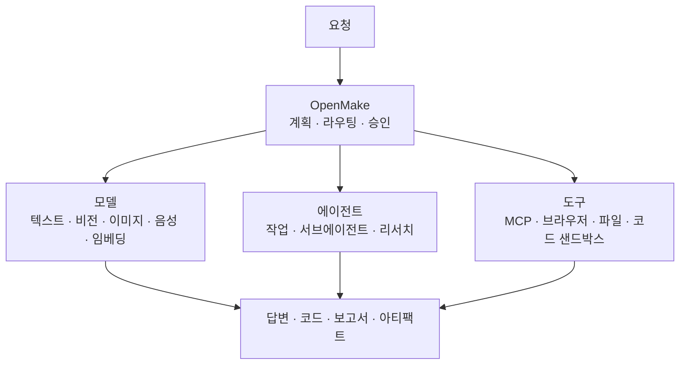
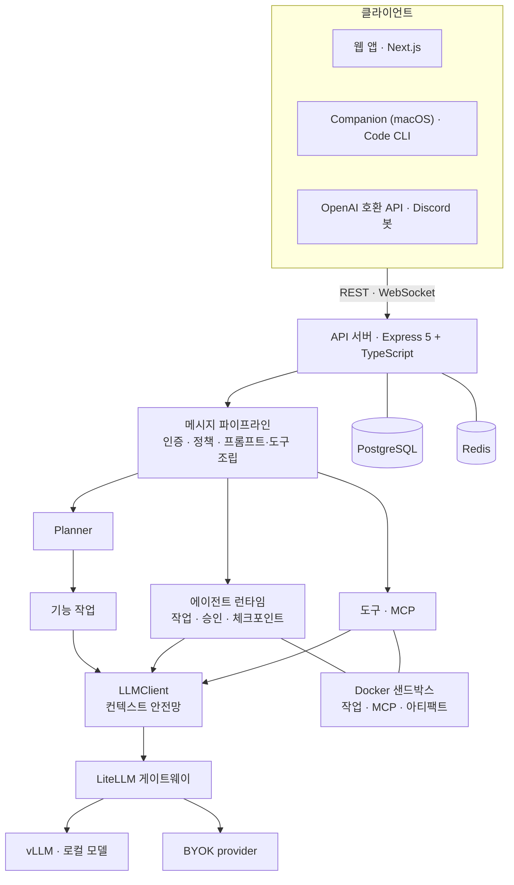

<h1 align="center">OpenMake</h1>

<p align="center">
  <strong>로컬 모델, 오픈 웨이트 모델, OpenAI 호환 모델을 위한 오픈소스 AI 워크스페이스이자 에이전트 런타임.</strong>
</p>

<p align="center">
  OpenMake 는 전문 모델·에이전트·MCP 도구·리서치·샌드박스 실행을<br/>
  하나의 셀프 호스팅 워크스페이스에서 조율합니다.
</p>

<p align="center">
  <a href="https://chat.openmake.cc"><b>라이브 데모</b></a> ·
  <a href="https://openmake.cc/ko/docs/"><b>문서</b></a> ·
  <a href="https://openmake.cc/ko/roadmap/"><b>로드맵</b></a> ·
  <a href="https://openmake.cc/ko/blog/"><b>엔지니어링 로그</b></a>
</p>

<p align="center">
  Local-first · Self-hosted · Multi-model · Agents · MCP · BYOK
</p>

<p align="center">
  <a href="LICENSE"></a>
  <a href="https://github.com/openmake/openmake_llm/releases"></a>
  <a href="https://github.com/openmake/openmake_llm/actions/workflows/ci.yml"></a>
  <a href="https://github.com/openmake/openmake_llm"></a>
</p>

<p align="center">
  <a href="README.md">English</a> · <strong>한국어</strong> · <a href="README.ja.md">日本語</a> · <a href="README.zh-CN.md">简体中文</a> · <a href="README.de.md">Deutsch</a>
</p>

<p align="center">
  
</p>

<p align="center">
  <sub>한 번의 요청, 여러 모델: Planner 가 웹 검색·추론·이미지 생성을 실행하고, 채팅 모델이 출처를 다시 확인해 인용과 생성 이미지를 붙여 답합니다. 실행 중인 앱에서 녹화(배속).</sub>
</p>

> 이 문서는 영어 [README.md](README.md)의 한국어 번역입니다. 내용이 다르면 영어판과 코드가 기준입니다.

---

## 빠른 시작

```bash
curl -fsSL https://raw.githubusercontent.com/openmake/openmake_llm/main/install.sh | bash
```

새 머신에서는 설치 스크립트가 사전 준비와 전체 스택까지 설치합니다(아래 참고). `bash -s -- --minimal` 을 붙이면 앱만 설치합니다 — 도구 체인(Node.js 24, Docker, PM2)을 점검하고, 새 비밀값으로 `.env` 를 만들고, PostgreSQL·Redis 를 띄운 뒤, OpenMake 를 빌드해 PM2 로 실행하고 헬스 체크까지 합니다.

그다음 출력된 주소를 열어 관리자로 로그인하고 모델을 연결하세요 — 로컬 vLLM·Ollama 서버나 OpenAI 호환 엔드포인트면 됩니다.

Linux 와 macOS 에서 동작합니다(Windows 는 WSL2 안에서). 수동 설치, 옵션, 업데이트, 리버스 프록시 설정은 **[셀프호스팅 가이드](https://openmake.cc/ko/docs/)** 에 있습니다.

한 줄 명령은 OS 에 맞는 설치 스크립트로 넘어갑니다 — Linux·WSL2 는 `install_linux.sh`, macOS 는 `install_mac.sh`. 새 머신에서는 질문을 처음에 한 번에 받은 뒤, 사전 준비(macOS: Xcode 명령줄 도구·Homebrew·Docker Desktop · Linux: 배포판 패키지·Docker Engine)와 전체 스택(`scripts/env/omk.sh` — LiteLLM 게이트웨이·SearXNG·샌드박스 이미지·내부망 HTTPS·백업·재부팅 자동 시작)을 설치합니다. 질문 없이 설치하려면 모델 백엔드도 함께 지정하세요: `--yes --dgx-host <주소> --vllm-api-key <키>` 또는 `--yes --llm-provider <이름> --llm-model <ID> --llm-api-key <키>`.

---

## 왜 OpenMake 인가?

대부분의 셀프 호스팅 AI 인터페이스는 **모델과 대화하는 것**을 돕습니다. OpenMake 는 **모델·도구·에이전트를 조율해 실제 일을 하게** 만드는 데 목적이 있습니다 — 여러분이 통제하는 인프라에서, 모든 단계를 확인할 수 있게.

| 프로젝트 | 주 역할 |
|---|---|
| Ollama / vLLM | 모델 실행 |
| Open WebUI | 셀프 호스팅 인터페이스로 모델 사용 |
| Dify | AI 앱·워크플로 구축 |
| OpenHands | 소프트웨어 개발용 에이전트 |
| **OpenMake** | **범용 AI 업무를 위해 모델·에이전트·도구를 조율** |

이 프로젝트들은 서로 다른 계층에 있고 배타적이지 않습니다. OpenMake 는 vLLM 으로 로컬 모델을 서빙하고, Ollama 서버를 모델 엔드포인트로 쓸 수도 있습니다.

---

## 동작 방식



간단한 질문은 채팅 모델로 바로 갑니다. 이미지, 음성 전사, 웹 검색, 여러 단계의 작업처럼 더 많은 것이 필요한 요청은 여러분이 배정한 모델과 도구에서 도는 작업으로 나뉘고, 채팅 모델이 그 결과를 바탕으로 최종 답변을 씁니다.

**모델은 여러분이 고르고, 모델들이 함께 일하는 방식은 OpenMake 가 조율합니다.**

---

## 할 수 있는 일

- **주제를 조사해** 여러 검색 소스를 바탕으로 출처가 달린 보고서를 받고, PDF·DOCX 로 내보내기.
- **로컬 모델과 채팅하면서** 첨부한 이미지는 별도 비전 모델이 읽게 하기.
- **이미지 생성, 낭독, 음성 전사를 요청** — 요청마다 해당 기능에 배정된 모델로 갑니다.
- **에이전트에게 목표 맡기기** — 계획을 세우고, 웹을 찾아보고, 파일을 고치고, Docker 샌드박스에서 코드를 실행하며, 위험한 단계 전에는 승인을 기다립니다.
- **MCP 로 외부 서비스 연결**(Notion, Context7, Tavily, NotebookLM 등)하거나 Claude Code 형식의 플러그인·스킬 설치하기.
- **내 컴퓨터의 폴더에서 에이전트 작업 실행** — OpenMake Companion 앱이나 OpenMake Code CLI 로.

| 영역 | 포함하는 것 |
|---|---|
| **모델** | vLLM + LiteLLM 게이트웨이, Ollama 또는 OpenAI 호환 엔드포인트, BYOK provider, ChatGPT 구독 로그인 |
| **오케스트레이션** | Planner, 모델 역할, 기능별 모델, 병렬 기능 작업 |
| **에이전트** | 여러 턴 작업, 서브에이전트, 승인, 예약 실행, 템플릿, 로컬 실행 |
| **리서치·도구** | 딥 리서치, 내장 도구 23종, MCP 카탈로그, 스킬, 확장 |
| **결과물** | 스트리밍 답변, 아티팩트, HTML/PDF/DOCX 보고서, 파일, 생성 미디어 |

작업별 사용법은 **[사용자 매뉴얼](https://openmake.cc/ko/manual/)** 에 있습니다.

<p align="center">
  
</p>

---

## 모델과 라우팅

**OpenMake 는 모델 하나가 모든 일을 하도록 요구하지 않습니다.**

```
OpenMake
 ├── LiteLLM 게이트웨이 (OpenAI 호환)
 │    ├── vLLM ─────────── 로컬 · 오픈 웨이트 모델
 │    └── BYOK provider ── OpenRouter · NVIDIA NIM · Ollama Cloud · Open AI Service Hub · B.AI
 ├── 직접 연결 ─────────── ChatGPT 구독 로그인
 └── 기능별로 배정하는 전문 모델
      ├── 텍스트 · 코드
      ├── 비전 · OCR
      ├── 이미지 생성 · 편집
      ├── 음성 인식 · 음성 합성 · 영상
      └── 임베딩
```

- **모델 역할** — `agent`, `judge`, `research`, `spawn`, `review`, `summary`, `planner` 마다 모델을 고릅니다. 사용자는 각자 설정하고, 관리자는 기본값을 정하고 일·월 토큰 예산을 건 서버 공용 키를 공유할 수 있습니다.
- **기능별 모델** — 비전, 이미지 생성, 음성, 영상, 코드를 처리할 모델을 배정합니다. 배정되지 않은 기능은 조용히 다른 모델로 넘어가지 않고 사용할 수 없다고 알립니다.
- **BYOK (내 키 사용)** — provider 키는 AES-256-GCM 으로 암호화해 저장하고 요청마다 게이트웨이로 전달합니다. 요청 한도 초과, 크레딧 부족, 제한된 모델은 뭉뚱그린 업스트림 오류가 아니라 그 이유 그대로 알려 줍니다.
- **컨텍스트 안전망** — 프롬프트(이미지 포함)를 모델의 컨텍스트 창과 비교해, 넘치는 입력은 호출 전에 줄이고 도저히 안 되는 요청은 감사 기록과 함께 `413` 을 돌려줍니다.
- **로컬 모델 자동 발견** — 게이트웨이 뒤의 모델을 부팅 시 발견하므로, 추론 서버에서 모델을 바꿔도 코드를 고칠 필요가 없습니다.
- **비교 모드** — 같은 프롬프트를 두 모델에 보내 답변을 나란히 봅니다.

---

## 에이전트 런타임

에이전트 작업은 도구를 부르는 여러 턴에 걸쳐 목표를 수행합니다. 에이전트는:

- 턴이 끝날 때마다 체크포인트를 남기며 작업 상태를 이어 갑니다
- 승인 정책(수동·자동·건너뛰기) 아래에서 도구를 씁니다
- 첨부 파일을 다루고 Excel·PDF 같은 산출물을 만듭니다
- 격리된 Docker 작업 공간에서 셸·Python 코드를 실행합니다
- 허용 목록으로 외부 접속을 제한한 별도 브라우저 컨테이너에서 웹을 봅니다
- 독립적인 일은 병렬 서브에이전트로 나눕니다
- 목표를 이루지 못하면 거짓 "완료" 대신 목표 판정기로 *미달성* 을 알립니다

**지금 사용 가능**

- ✓ 일시정지·재개·취소가 되고, 서버 재시작 후에도 복구되는 영속 작업
- ✓ 에이전트 단계·스킬·확장·MCP 서버를 한곳에서 처리하는 **승인** 화면
- ✓ 템플릿, 예약 실행, 작업 결과 공유
- ✓ OpenMake Companion(macOS)이나 OpenMake Code CLI 를 통한 로컬 실행 — 경로 범위 제한, 명령 확인 게이트, git worktree 격리

**선택 활성화** — 기본값은 꺼져 있습니다. `.env` 에서 켜세요:

| 설정 | 켜지는 기능 | 준비 사항 |
|---|---|---|
| `TASK_SANDBOX_ENABLED=true` | 작업마다 영속 Docker 작업 공간 | `infra/mcp-runtime` 을 빌드한 뒤 `infra/task-runtime` 빌드 |
| `LOCAL_EXECUTOR_ENABLED=true` | 사용자 컴퓨터에서 도구 실행 | `bridge` 스코프 API 키로 연결한 OpenMake Companion 또는 CLI |
| `AGENT_TASK_QUEUE_ENABLED=true` | 전체·사용자별 동시 실행 상한 | — |

```bash
docker build -t openmake-mcp-runtime:latest infra/mcp-runtime
docker build -t openmake-task-runtime:latest infra/task-runtime
```

**계획**

- ○ **실행 그래프** — 각 노드가 의존 관계·권한·재시도·완료 기준을 갖는 계획. 지금 저장되는 계획은 단계의 평면 목록입니다.
- ○ **선언형 정책 엔진** — 지금의 승인 게이트를 넘어 서버가 강제하는 권한 수준.
- ○ **턴 내부 내구성** — 도구 호출 단위 기록으로, 턴 중간에 끊겨도 안전하게 다시 실행.
- ○ **범위 지정 메모리** — 출처와 만료를 가진 작업·에피소드·의미 메모리.

---

## 리서치·도구·아티팩트

**딥 리서치** — 질문을 하위 주제로 나눠 병렬로 검색하고, 출처를 읽고, 나눠서 요약한 뒤 출처가 달린 보고서를 씁니다. Wikipedia, Google News, DuckDuckGo 는 키 없이 동작하고, SearXNG·Google Custom Search·Naver·Kakao 는 설정하면 범위가 넓어집니다.

**내장 도구** — 웹 검색·팩트체크, 페이지 추출·크롤링, 이미지 분석·OCR, 계획, 코드·보안 리뷰, 스킬 불러오기, Git 가져오기 등 23종. 대부분의 도구는 필요한 턴에만 노출해 프롬프트를 작게 유지합니다.

**MCP** — 카탈로그(Tavily, Context7, Notion, NotebookLM, 카카오맵, OpenDART 등)에서 서버를 설치하거나 직접 등록합니다. stdio 서버는 각자 Docker 컨테이너에서 권한 제거·비루트 사용자·선택적 읽기 전용 파일시스템으로 돌릴 수 있고, 원격 서버는 OAuth 로 로그인합니다.

**스킬·확장** — 플러그인, 스킬, 커스텀 에이전트, MCP 서버를 Git·zip·마켓플레이스에서 설치합니다. Claude Code 관례(도구 이름, `$ARGUMENTS`, `commands/`, `agents/`, 동봉 스크립트)는 설치할 때 이 환경에 맞게 바뀌고, 검토가 필요한 것은 모두 승인 화면으로 갑니다.

**아티팩트** — 답변을 샌드박스된 실시간 미리보기로 렌더링하고, 보고서 요청은 PDF·DOCX 로 내보낼 수 있는 HTML 아티팩트가 되며, 공유된 아티팩트는 별도 origin 의 뷰어가 서빙합니다.

**연동** — 스코프 API 키를 쓰는 OpenAI 호환 API(`/api/v1/chat/completions`), Discord 게이트웨이 봇, 배정 전에 모델을 비교하는 [OpenMake Bench](https://bench.openmake.cc).

---

## 아키텍처



- **하나의 실행 경로** — 로컬 모델과 외부 모델이 같은 스트리밍 디스패치와 도구 루프를 씁니다. 토론과 딥 리서치는 디스패치 전에 분기하는 별도 모드입니다.
- **Planner → 기능 작업 → 종합** — `simple` 계획은 모델 호출을 추가하지 않습니다. `multi` 계획은 실행 전에 점검(배정, 키 상태, 쿼터)하고, 작업을 의존 단계별로 병렬 실행하며, 성공한 미디어만 답변에 붙입니다.
- **모델 결정** — 모델을 부르는 모든 하위 시스템은 역할이나 기능을 통해 모델을 정합니다: 사용자 설정 → 관리자 기본값 → 내장 기본값.
- **끊겨도 이어지는 스트리밍** — 브라우저 탭이 백그라운드로 가거나 소켓이 끊겨도 생성은 계속되고, 클라이언트는 같은 답변에 다시 붙습니다.
- **단일 호스트 설계** — 애플리케이션은 PM2 로, PostgreSQL·Redis·모든 샌드박스는 Docker 로 돌립니다.

| 계층 | 기술 |
|---|---|
| 백엔드 | Node.js 24, Express 5, TypeScript(strict), Zod, Winston |
| 프론트엔드 | Next.js 16, React 19, Zustand, Tailwind CSS 4, `next-intl`(ko · en · ja · zh · de) |
| 데이터 | 파라미터화 raw SQL 로 쓰는 PostgreSQL(ORM 없음), Redis |
| LLM | vLLM, LiteLLM 게이트웨이, `openai` SDK |
| 에이전트·도구 | Model Context Protocol 클라이언트 v2, Docker 격리 샌드박스 |
| 네이티브 클라이언트 | SwiftUI(macOS Companion, iOS 개발 중), Node CLI — `packages/local-bridge-core` 공유 |

### 설계 원칙

**모델을 부르는 것은 쉽습니다. AI 를 안정적으로 운영하는 것은 어렵습니다.** 어려운 부분은 상태 유지, 권한 강제, 안전한 실행, 실패 복구, 무슨 일이 있었는지 증명하는 것입니다. OpenMake 는 이것을 중심에 두고 만듭니다:

- **상태** — 작업·단계·체크포인트를 영속해 재시작을 넘어 일이 이어집니다.
- **권한** — RBAC, 스코프 API 키, 승인 정책, 에이전트 도구의 자격증명 파일 보호.
- **격리** — 에이전트 코드, MCP 서버, 아티팩트를 권한·메모리·네트워크를 제한한 Docker 에서 실행합니다.
- **복구** — 명확한 실패 사유, 일시적 오류 재시도, 재개 가능한 작업.
- **감사 가능성** — 알림과 연결된 감사 로그와 단계 단위 작업 기록.
- **답변 전 추가 호출 최소화** — 별도 분류기 대신 모델이 같은 턴 안에서 도구를 고릅니다. 남아 있는 답변 전 호출(Planner, LLM 에이전트 라우팅)은 측정하며 계속 점검합니다.

---

## 배포

참조 배포는 애플리케이션 호스트 하나와 추론 호스트로 구성합니다:

```
Application host                                   Inference host (GPU)
┌──────────────────────────────────────────┐       ┌──────────────────────┐
│ PM2: API · web                           │       │ vLLM                 │
│ Docker: PostgreSQL · Redis · sandboxes   │ ────► │ chat · embedding ·   │
│ LiteLLM gateway (OpenAI-compatible)      │       │ image models         │
└──────────────────────────────────────────┘       └──────────────────────┘
```

모두 한 대에서 돌려도 되고, 모델 엔드포인트를 외부 호스팅 provider 로 둬도 됩니다.

평소 운영은 `openmake_llm.sh` 로 합니다:

```bash
./openmake_llm.sh start     # PostgreSQL → Redis → 앱, 이어서 로그 스트리밍
./openmake_llm.sh status    # 포트, 컨테이너, PM2 상태
./openmake_llm.sh update    # git pull(fast-forward 만) → 빌드 → 마이그레이션 → 재시작
./openmake_llm.sh deploy    # 빌드 → 마이그레이션 → 재시작
./openmake_llm.sh stop
```

설치 스크립트가 동작하는 `.env` 를 만들어 줍니다. 핵심 항목:

| 변수 | 용도 |
|---|---|
| `LLM_BASE_URL` · `LLM_API_KEY` · `LLM_DEFAULT_MODEL` | OpenAI 호환 모델 엔드포인트 |
| `LLM_GATEWAY_PROVIDERS` | 게이트웨이를 거치는 BYOK provider |
| `DATABASE_URL` · `REDIS_URL` | 데이터 저장소 |
| `JWT_SECRET` · `API_KEY_PEPPER` · `TOKEN_ENCRYPTION_KEY` | 비밀값(없으면 첫 부팅 때 생성) |

전체 목록은 `.env.example` 에 있고, 운영 설정의 상당수는 **관리자 → 시스템 설정** 에서 실행 중에 바꿀 수 있습니다. DB 마이그레이션은 부팅 시 자동 적용됩니다. 공개 주소가 필요하면 설치할 때 `--public-url https://chat.example.com` 을 주세요. Caddy 설정은 `scripts/caddy/` 에 들어 있습니다.

---

## 개발

```bash
git clone https://github.com/openmake/openmake_llm.git
cd openmake_llm
npm install

npm run dev                 # API + 웹
npm test                    # 공유 패키지 빌드 후 Jest 단위 테스트
npm run test:e2e            # Playwright (chromium + webkit)
npm run lint                # ESLint
```

```
apps/
├── api/             Express 5 API — 채팅 파이프라인, 오케스트레이터, 에이전트, MCP, 데이터
├── web/             Next.js 웹 앱
├── cli/             OpenMake Code — 로컬 브리지 CLI
├── desktop-native/  OpenMake Companion — SwiftUI 메뉴 막대 앱 (macOS)
├── ios/             SwiftUI iOS 클라이언트 (개발 중)
└── discord-bot/     Discord 게이트웨이 봇
packages/            공유 타입, API 계약, 설정, API 클라이언트, 로컬 브리지 코어
db/                  기본 스키마와 마이그레이션
infra/               샌드박스·데이터 저장소용 Docker 이미지와 compose 파일
```

---

## 로드맵

| 현재 — 제공 중 | 다음 | 이후 |
|---|---|---|
| 역할·기능 라우팅을 갖춘 멀티모델 게이트웨이 | 실행 그래프 | 범위 지정 메모리 |
| 영속 작업 런타임: 체크포인트, 일시정지·재개, 재시작 복구 | 선언형 정책 엔진과 승인 대기 | 조직, 프로젝트, 멀티테넌시 |
| 도구, MCP 게이트웨이, 승인, Docker 샌드박스 | 에이전트·스킬 매니페스트 | SSO(OIDC, SAML), 예산, 배포 승인 |
| 딥 리서치, 아티팩트, 로컬 실행 브리지 | 턴 내부 내구성 | 폐쇄망 설치, HA, Kubernetes |

방향은 정해져 있지만 일정은 약속이 아닙니다 — [릴리스](https://github.com/openmake/openmake_llm/releases)에 없는 기능은 계획으로 봐 주세요. 자세한 내용: **[openmake.cc/roadmap](https://openmake.cc/ko/roadmap/)**.

---

## 엔지니어링 로그

OpenMake 는 공개적으로 만들어집니다. 구현 노트, 실패, 트레이드오프, 운영에서 얻은 교훈을 그때그때 공개합니다:

- [DGX Spark를 6개월 굴리고 알게 된 것: 한계처럼 보이는 숫자는 한계가 아니었다](https://openmake.cc/ko/blog/six-months-vllm-dgx-spark/)
- [격리를 만들었는데, 운영에서는 아무 일도 하지 않았다](https://openmake.cc/ko/blog/mcp-sandbox-docker/)
- [네 번 모두 테스트는 초록이었다](https://openmake.cc/ko/blog/green-tests-four-gaps/)
- [계획과 실행을 잇는 일을 세 번에 나눠서 했다](https://openmake.cc/ko/blog/execution-graph-increments/)
- [추론 백엔드를 하루 만에 갈아끼우고, 그 청구서를 열사흘 동안 갚았다](https://openmake.cc/ko/blog/ollama-to-vllm-migration/)

매주 [주간 개발 로그](https://openmake.cc/ko/blog/)로도 정리합니다 — 최신: [W37](https://openmake.cc/ko/blog/weekly-log-2026-w37/).

---

## 기여하기

버그 제보, 수정, 문서, 새 스킬이나 MCP 연동 모두 환영합니다.

- 브랜치를 만들어 `main` 으로 PR 을 보내 주세요. 커밋은 [Conventional Commits](https://www.conventionalcommits.org/)(`feat`, `fix`, `refactor`, `docs`, `test`, `chore`)를 따릅니다.
- 규칙: TypeScript strict 모드, Zod 검증, 파라미터화 raw SQL(ORM 금지), 설정 외부화 — 모델 이름·매직 넘버·인라인 프롬프트를 하드코딩하지 않습니다.
- PR 전에: `npm run lint` 와 `npm test` 통과, 스키마 변경에는 마이그레이션 포함, 새 환경변수는 `.env.example` 에 기록, UI 변경에는 스크린샷 첨부.

CI 는 모든 푸시와 PR 에서 **CI Gate**(테스트 → 빌드 → 크기 → 린트) 하나를 돌립니다.

**커뮤니티·연락처** — 질문과 셀프호스팅 도움: support@openmake.cc · 메인테이너: riskpw@openmake.cc, rockyhan@openmake.cc. OpenMake 가 도움이 됐다면, 스타는 다른 개발자가 이 프로젝트를 찾는 데 도움이 됩니다.

## 라이선스

[MIT 라이선스](LICENSE)로 배포합니다.
