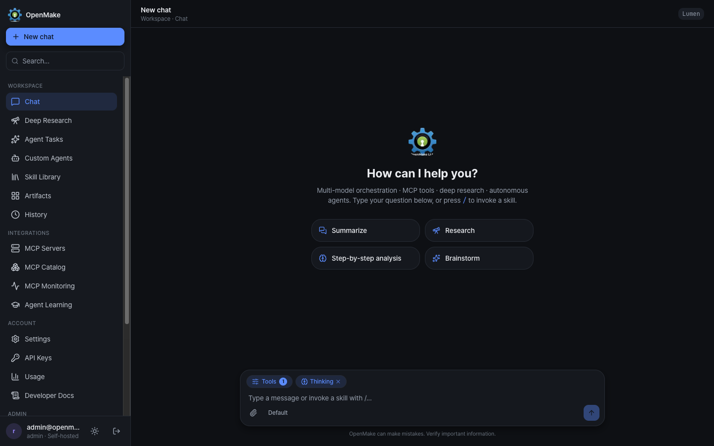
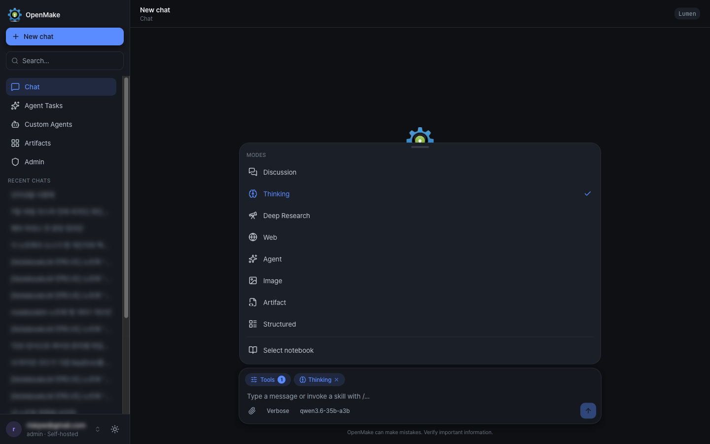
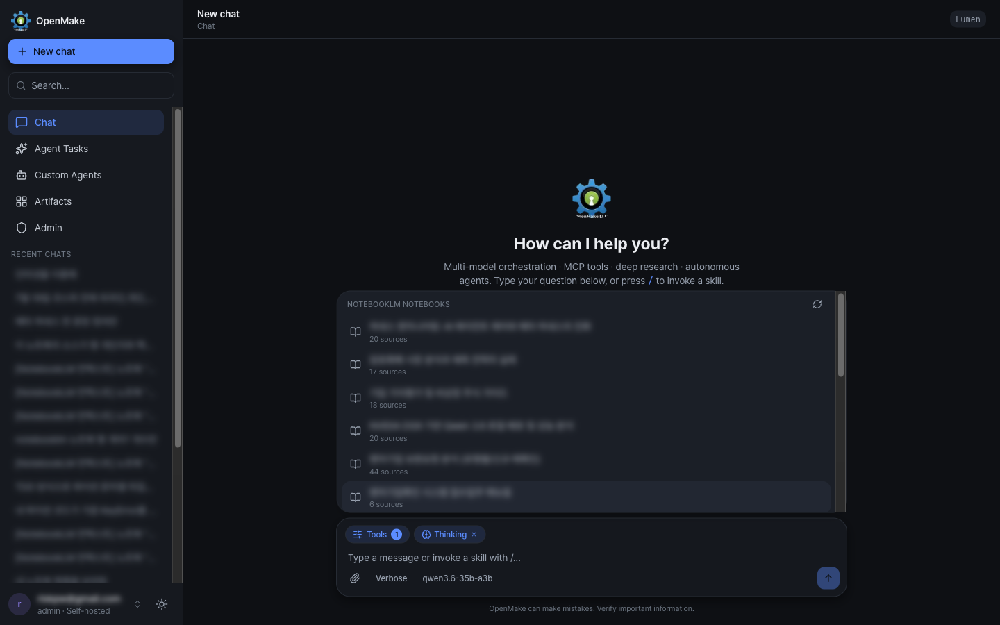
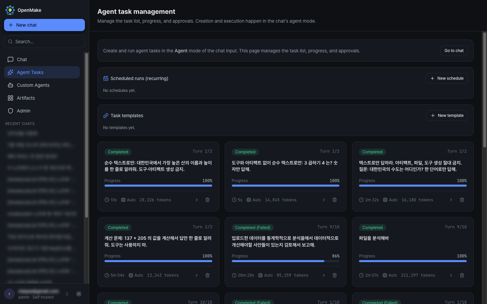
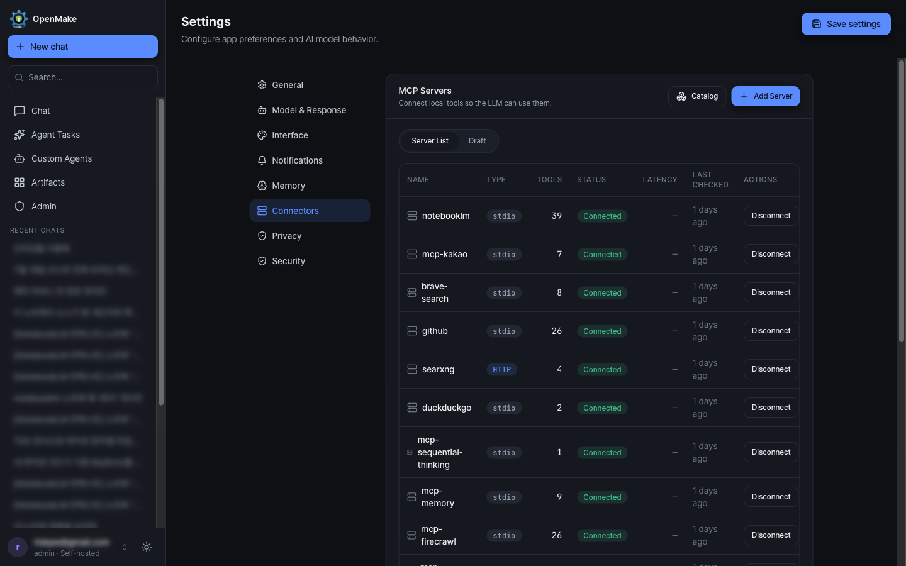
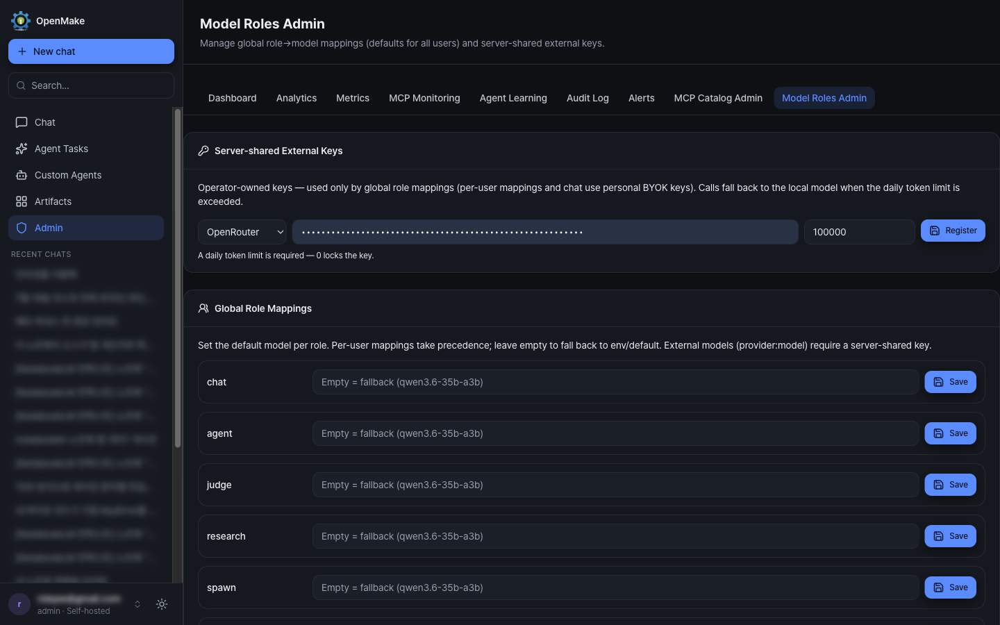
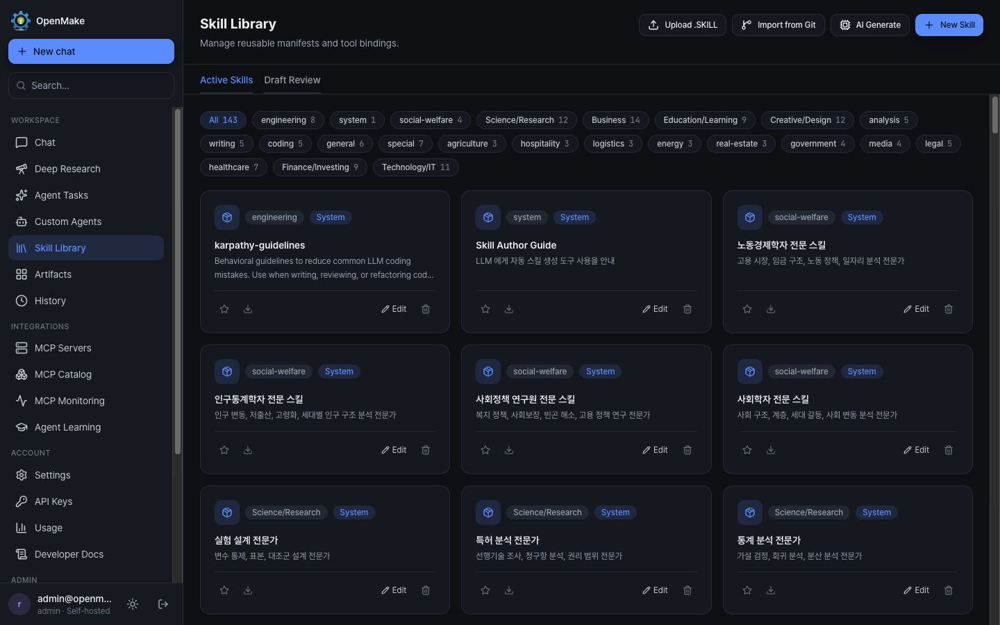
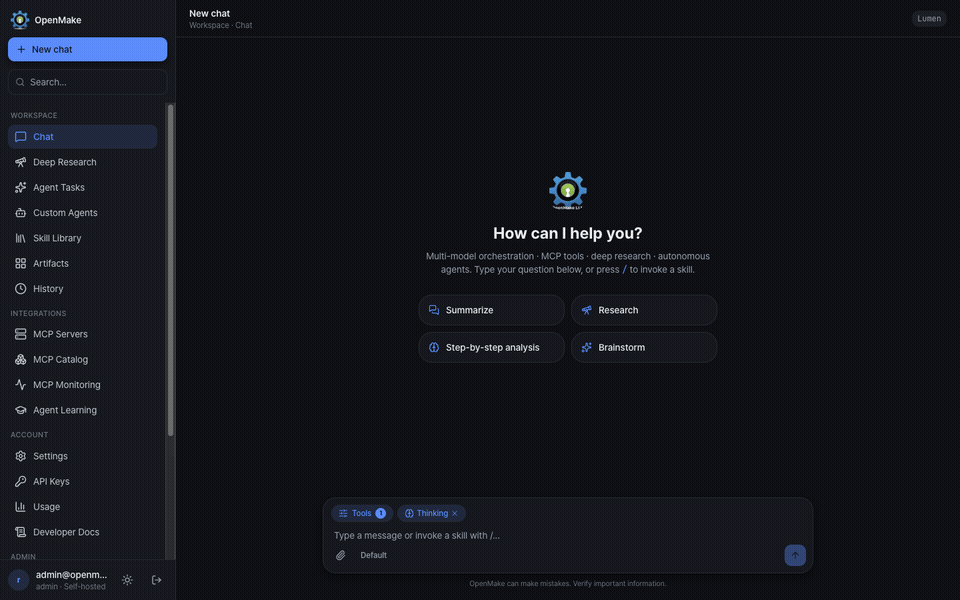

<h1 align="center">OpenMake LLM</h1>

<p align="center">
  <strong>A self-hosted, multi-model AI assistant platform.</strong><br/>
  Private vLLM/LiteLLM inference · autonomous agents · MCP tools · deep research.
</p>

<p align="center">
  <a href="https://github.com/openmake/openmake_llm/actions/workflows/ci.yml"></a>
  <a href="LICENSE"></a>
  
  =24 <25" />
  
  
</p>

---

## Overview

**OpenMake LLM** is a self-hosted AI assistant you run on your own hardware. It serves a local model through **vLLM** behind a **LiteLLM proxy** (OpenAI-compatible) and routes the *same* abstraction to external providers you register with your own keys (**OpenRouter, NVIDIA NIM, Ollama** local/cloud — all OpenAI-compatible; an Anthropic adapter is also built in) — so your data stays on your machine by default.

Every request flows through a lightweight, deterministic policy layer — **`ExecutionPlanBuilder`** (regex + fast-path classification) — that routes the single local model and assembles options *without* an extra LLM round-trip. Behavior is controlled by orthogonal axes only — **Model · Style · Mode toggles · Custom Agent** — instead of opaque presets. Power users can go further with **role-based model orchestration** — assigning a different model (local or external) to each functional role (agent, judge, research, parallel sub-agents, review, thinking-summary). Beyond chat, it adds autonomous agents, a deep-research pipeline, and an MCP tool system — all behind JWT auth and role-based access control.

> **Single-host design:** the application (API + web) runs under **PM2**, while stateful dependencies (PostgreSQL / Redis) and sandboxed agent / MCP / artifact processes run in **Docker** for isolation.

**At a glance**

| | |
|---|---|
| 🧠 **1 local model, routed per request** | `qwen3.6-35b-a3b` served via vLLM + LiteLLM, with a 262K context-fit safety net |
| 🎛️ **Role-based model orchestration** | Assign a different model (local or BYOK external) per functional role; per-user + admin-global mappings, server-shared keys with token budgets |
| 🤖 **Autonomous agents** | Manus-style multi-turn agent in a persistent Docker sandbox (shell · Python · browser · files), with human-in-the-loop approval |
| 🔬 **Deep research** | Fan-out web search → source fetch → claim verification → cited synthesis |
| 📓 **NotebookLM grounding** | Pin one of your Google NotebookLM notebooks as conversation context, straight from the composer |
| 🧩 **22 built-in MCP tools** + external MCP servers | Each external server isolated in Docker (`--cap-drop ALL`, non-root, network policy) |
| 👤 **Custom agents & skills** | Project-scoped personas (with optional per-agent model) + an auto-selectable skill library + 18 industry agents (100 specialists) |
| 💬 **Discord gateway bot** | Optional workspace relaying Discord messages to the OpenAI-compatible API, with role/mention access control |
| 🌐 **4-language UI** | 한국어 · English · 日本語 · 简体中文 (`next-intl`, cookie locale, browser auto-detect) |
| 🔒 **Security-first** | JWT (HttpOnly), Google OAuth 2.0, RBAC, per-route rate limiting, SSRF guard, Audit ↔ Alert |

---

## Screenshots

> Conversation titles, notebook names, and the account email are blurred — everything else is the running app.

**Chat workspace** — a five-item workspace nav, model selector, response style, and slash-invoked skills:

<p align="center">
  
</p>

| Mode menu — Discussion / Thinking / Deep Research / Web / Agent / Image / Artifact / Structured | NotebookLM picker — pin a notebook as conversation context |
|---|---|
|  |  |

**Agent tasks** — autonomous multi-turn runs with live progress, token accounting, recurring schedules, and reusable task templates:

<p align="center">
  
</p>

| Connectors — external MCP servers, each Docker-isolated | Model Roles Admin — global role→model mappings |
|---|---|
|  |  |

**Skill Library** — reusable manifests with tool bindings, importable from Git or generated by the model:

<p align="center">
  
</p>

**Multilingual UI (한국어 · English · 日本語 · 简体中文)** — switch the interface language in Settings, or let it follow your browser (`Accept-Language`). AI response language independently follows the message language:

<p align="center">
  
</p>

---

## Architecture

OpenMake separates **policy** (deciding *how* to answer) from **execution** (actually calling the model) — a SQL planner/executor split. The two layers are kept deliberately independent.

```
                       WebSocket / REST
                              │
                     ┌────────▼─────────┐
   Query ──────────► │ ExecutionPlanBuilder │  policy — once per request
                     │  (regex + fast-path  │  · classify intent
                     │   classification)    │  · resolve profile / custom agent
                     └────────┬─────────┘   │  · assemble system prompt & tools
                              │              (no extra LLM round-trip)
                     ┌────────▼─────────┐
                     │streamFromExternal- │  single path — local & external alike
                     │      Provider      │  · always-on MCP tool loop (5 turns)
                     └────────┬─────────┘   · Discussion / Deep Research intercept earlier
                     ┌────────▼─────────┐
                     │   LLMClient.chat   │  execution — per call
                     │  (context-fit net) │  · token estimate → truncate → cap
                     └────────┬─────────┘   · overflow → 413 + audit + alert
                              │
              vLLM serve → LiteLLM proxy (OpenAI-compatible)
```

- **One execution path** — the former per-strategy layer (generate-verify, agent-loop, thinking, direct) was retired: local and external models now share a single `streamFromExternalProvider` dispatch with an always-on MCP tool loop. Discussion and Deep Research remain separate modes intercepted before dispatch.
- **Context-fit safety net** — on entry, prompt tokens (images included) are estimated; if the effective **262K** window is exceeded, input is truncated → `max_tokens` reduced → in the extreme, a `ContextOverflowError` returns **HTTP 413** with an audit record and an automatic webhook alert.
- **User customization (4 orthogonal axes)** — **Model** (selector) · **Style** (Concise / Default / Verbose) · **Mode** (Discussion / Thinking / Deep Research / Web / Agent Task) · **Custom Instructions & Agents**. System-prompt assembly order: `memory + custom-instructions + style`.
- **Role-based model orchestration** — every LLM-calling subsystem resolves its model through a single role registry with a fail-open fallback chain: per-user mapping → admin-set global (DB) → global env → local default. External models per role run on the user's BYOK key, or on a server-shared operator key (with daily/monthly token budgets) for global roles. Custom agents can also pin their own model.
- **Cross-conversation memory** — explicit long-term memories are injected into the system prompt; a privacy toggle lets a user exclude them per session.
- **Thinking display (Claude-web style)** — when Thinking mode is on, the reasoning stream renders as a live timeline; a dedicated `summary`-role model generates a one-line headline (streaming interim → final), and both the reasoning and headline are persisted so re-opening a conversation restores the timeline.

---

## Features

**▸ Models & routing**
- Single local model routed per request by the `ExecutionPlanBuilder` policy layer; behavior controlled by orthogonal axes (Model · Style · Mode · Custom Agent).
- Self-hosted vLLM + LiteLLM (default `qwen3.6-35b-a3b`) with a context-fit safety net that protects output tokens and degrades gracefully on overflow.
- Bring-your-own external keys — **OpenRouter, NVIDIA NIM, Ollama** (local + cloud), all OpenAI-compatible (an Anthropic adapter is built into the provider abstraction) — AES-256-GCM encrypted at rest. **Guests use the default local model only** — external providers require sign-in.
- **Role-based model orchestration** — assign a different model (local or BYOK external) to each functional role (`agent`, `judge`, `research`, `spawn`, `review`, `summary`) via Settings; admins set org-wide defaults and register server-shared external keys with per-key token budgets in an admin console. Resolution is fail-open (falls back to the local default on any failure). Model lists filter down to what is actually reachable and role-capable.
- **Tail routing (opt-in, off by default)** — a lightweight gate scores each query's error likelihood; when it judges a query as *factual tail* (likely to be answered wrong, externally verifiable), `web_search` is deterministically forced on the first turn. Ships with a shadow mode (`TAIL_ROUTING_SHADOW_ENABLED`) that records gate decisions without changing behavior, so thresholds can be tuned on real traffic before `TAIL_ROUTING_STAGE2B_ENABLED` is switched on.

**▸ Agents & research**
- **Autonomous agent tasks** — a Manus-style agent pursues a goal across multiple tool-calling turns inside a **persistent Docker sandbox** (shell, Python, browser, file, planning tools) with human-in-the-loop approval. It records file attachments, injects images through a vision channel, produces deliverables including **Excel (.xlsx)** and **PDF** (with Korean/CJK fonts), and honestly reports non-achievement (`[GOAL_INCOMPLETE]` marker + goal judge) instead of falsely marking "done". Tasks can be saved as **reusable templates** or put on a **recurring schedule**.
- **Deep research** — fan-out web search → source fetch → claim verification → cited synthesis.
- **Custom agents & skills** — project-scoped agents (claude.ai Projects equivalent) selectable directly from the composer, each optionally pinned to its own model, plus an auto-selectable skill library and 18 built-in industry agents (100 specialists).

**▸ Tools & extensibility**
- **MCP tool system** — 22 built-in tools (web search, fact-check, web scrape/map/crawl, image analysis, agent-task control, skill/agent/MCP git-ingest, …) plus external MCP servers, each isolated in Docker (`--cap-drop ALL`, non-root, `--memory`+`--memory-swap`, network policy, realpath-guarded mounts). Install servers from the MCP catalog in **Settings → Connectors**; a catalog-level **tool allowlist** keeps chat auto-exposure focused (a 39-tool server need not dump 39 schemas into every prompt) while REST execution and the explicit tool picker keep full access.
- **NotebookLM grounding** — install the NotebookLM connector with your own Google session cookie (AES-256-GCM encrypted, injected only at spawn), then pin a notebook from the composer. The grounding prefix rides an LLM-only channel, so stored messages and sidebar titles stay clean, and the pin is scoped to one conversation.
- **Artifacts** — live sandboxed iframe rendering, optional Docker code execution (Python / JS), a resizable side panel, and a separate-origin strict-CSP shared viewer for publishing. The OpenAI-compatible API returns artifacts as a `message.artifacts` extension, and `publish_artifacts: true` makes the server mint share links for API-key clients that cannot publish themselves.
- **Memory & instructions** — persistent cross-conversation memory (with a per-session usage toggle) and always-on custom instructions.
- **Thinking display** — Claude-web-style reasoning timeline with a live one-line headline (generated by a dedicated summary model), persisted and restored on re-open.
- **Multilingual UI** — Korean, English, Japanese, and Simplified Chinese via `next-intl` (cookie-based locale, browser auto-detect, locale-aware date/number formatting).

**▸ Integrations**
- **Discord gateway bot** (`apps/discord-bot`) — an optional standalone workspace that relays Discord messages to `/api/v1/chat/completions`, with per-user session isolation (`/reset`), role/mention access control, and API-key auth. Generated images and artifacts come back as real Discord file attachments (with share links), since Discord cannot render the API's relative paths or placeholders. Runs as its own PM2 process.
- **NotebookLM** — `GET /api/mcp/notebooklm/notebooks` backs the composer picker (per-user cache, upstream failures converged to `502 NOTEBOOKLM_UPSTREAM` so the UI can prompt a reconnect when the Google cookie expires).

**▸ Security**
- JWT in HttpOnly cookies, Google OAuth 2.0, RBAC, per-user & per-route rate limiting, SSRF guard, Helmet headers, and a unified Audit ↔ Alert pipeline.

---

## Tech Stack

| Layer | Technologies |
|---|---|
| **Backend** | Node.js (≥24), Express 5, TypeScript (strict, CommonJS), Zod, Winston |
| **Frontend** | Next.js 16, React 19, Zustand 5, Tailwind CSS 4, `next-intl` |
| **Database** | PostgreSQL via `pg` — raw, parameterized SQL (no ORM) |
| **Realtime** | WebSocket (`ws`) streaming chat |
| **LLM backend** | vLLM + LiteLLM (OpenAI-compatible); `@anthropic-ai/sdk`, `openai` for external providers |
| **Agents / Tools** | Model Context Protocol (`@modelcontextprotocol/sdk`), Docker-isolated sandboxes |
| **Integrations** | Discord gateway bot (`discord.js`) — optional standalone workspace |
| **Auth / Security** | `jsonwebtoken`, Google OAuth 2.0, Helmet, AES-256-GCM |
| **Infra** | PM2 (API · web · Discord bot) + Docker (PostgreSQL/Redis, MCP / agent / artifact sandboxes) |
| **Testing / CI** | Jest/ts-jest, Playwright, ESLint, GitHub Actions (CI Gate) |

---

## Getting Started

### Prerequisites

- **Node.js** `>=24 <25`
- **Docker** (for PostgreSQL/Redis and the MCP/agent sandboxes)
- An OpenAI-compatible LLM endpoint: a local **vLLM + LiteLLM** stack, or an external provider key

### Setup

```bash
# 1. Clone & install (npm workspaces)
git clone https://github.com/openmake/openmake_llm.git
cd openmake_llm
npm install

# 2. Configure environment
cp .env.example .env      # then fill in the values below

# 3. Start PostgreSQL (schema auto-generates on first launch)
docker compose -f infra/docker-compose.yml up -d postgres
```

Minimum `.env` values (see `.env.example` for the full list):

| Variable | Purpose |
|---|---|
| `PORT` | API port (default `52416`) |
| `DATABASE_URL` | PostgreSQL connection string |
| `JWT_SECRET` | JWT signing secret |
| `TOKEN_ENCRYPTION_KEY` | AES-256-GCM key for external provider credentials |
| `LLM_BASE_URL` / `LLM_API_KEY` / `LLM_DEFAULT_MODEL` | LiteLLM proxy endpoint, master key, default model |
| `GOOGLE_CLIENT_ID` / `GOOGLE_CLIENT_SECRET` | Google OAuth |

### Run

```bash
# Development
npm run dev                 # API + frontend together
npm run dev:api             # backend only (ts-node)
npm run dev:frontend-next   # frontend only (next dev)

# Production
npm run build               # backend + frontend
npm start                   # node apps/api/dist/server.js
```

### Test & lint

```bash
npm test                    # Jest unit tests (apps/api)
npm run test:e2e            # Playwright (chromium + webkit)
npm run lint                # ESLint
```

### Database migrations

Files in `db/migrations/` are **not** auto-applied on boot (only `db/init/` schema is) — run migrations with the CLI:

```bash
npx ts-node apps/api/src/data/migrations/cli.ts status    # show pending
npx ts-node apps/api/src/data/migrations/cli.ts migrate   # apply
```

Rollback scripts live under `db/migrations/rollbacks/` (kept out of the forward-migration scan).

---

## Project Structure

```
openmake_llm/
├── apps/
│   ├── api/          # Express 5 + TypeScript API server (strict, CommonJS)
│   │   └── src/
│   │       ├── routes/ controllers/ services/   # REST + business logic
│   │       ├── chat/                            # ExecutionPlanBuilder, classifiers, prompts
│   │       ├── agents/                          # 18 industry agents, router, discussion engine
│   │       ├── llm/ providers/ cluster/         # LLM client, provider abstraction, node routing
│   │       ├── mcp/                             # MCP tool router, external client, Docker sandbox
│   │       ├── sockets/                         # WebSocket chat handler
│   │       ├── auth/ security/ middlewares/     # JWT/OAuth, SSRF guard, rate limiting
│   │       └── data/                            # PostgreSQL (raw SQL), migrations, repositories
│   ├── web/          # Next.js + React frontend (the operating UI)
│   ├── discord-bot/  # Optional Discord gateway bot (relays to /api/v1/chat/completions)
│   └── legacy-web/   # Static asset host (e.g. /generated) — legacy SPA retired
├── db/               # init schema + migrations (+ rollbacks/)
├── packages/         # shared-types, config, api-client (shared workspaces)
├── infra/            # Dockerfiles & compose (mcp-runtime, task-runtime, artifact-viewer, egress-proxy)
├── scripts/          # build, deploy, migration, CI scripts
└── tests/            # Playwright E2E
```

---

## Contributing

Contributions are welcome. Please:

- Use [Conventional Commits](https://www.conventionalcommits.org/) — `feat`, `fix`, `refactor`, `docs`, `test`, `chore`.
- Work on a feature/fix branch and open a PR against `main`.
- Follow the code conventions: TypeScript strict mode, Zod for input validation, Winston for logging, **raw parameterized SQL only** (no ORM), and externalized configuration (no hardcoded models, magic numbers, or inline prompts).

**Before opening a PR:**

- [ ] `npm run lint` passes
- [ ] `npm test` passes
- [ ] DB schema changes include a migration file (no sequence conflicts)
- [ ] New env vars documented in `.env.example`
- [ ] UI changes include screenshots; security changes describe their impact

CI runs a single **CI Gate** (Test → Build → Size → Lint) on every push and pull request.

---

## License

Released under the **MIT License** — see [LICENSE](LICENSE) for details.
