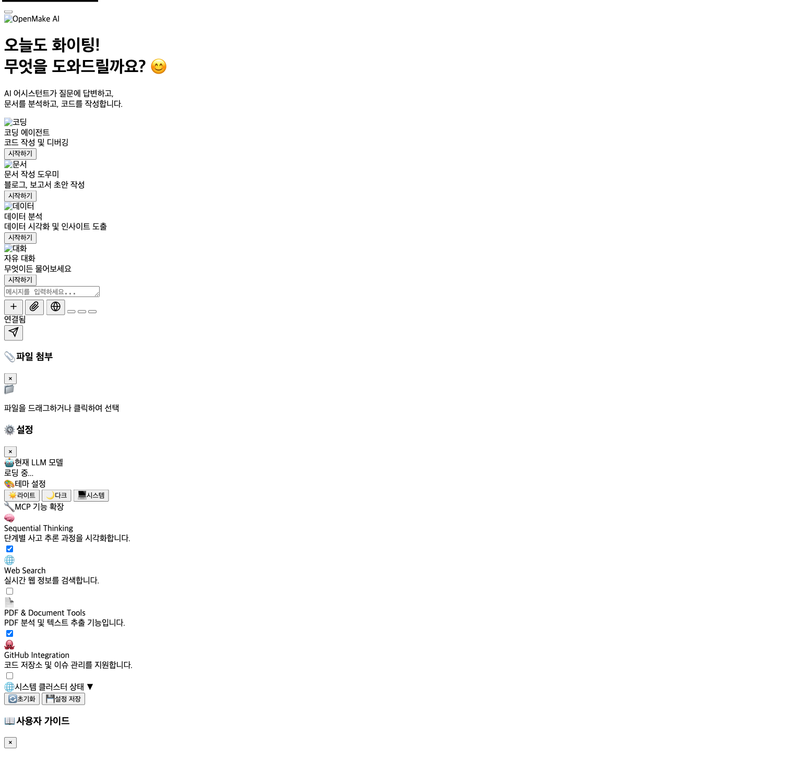
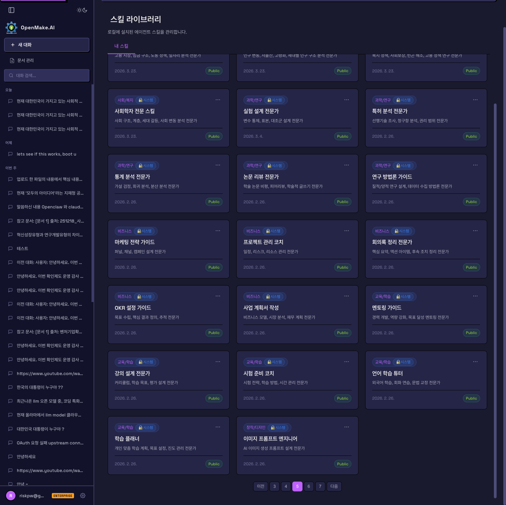

<p align="center">
  
</p>

<h1 align="center">OpenMake LLM</h1>

<p align="center">
  <strong>Self-hosted AI Assistant Platform with Multi-Model Orchestration</strong>
</p>

<p align="center">
  <a href="LICENSE"></a>
  
  
  
</p>

---

OpenMake LLM is a high-performance, self-hosted AI assistant platform designed for multi-model orchestration and advanced agentic workflows. It provides a lightweight, framework-free frontend paired with a robust TypeScript backend, supporting local and cloud LLM deployments with intelligent routing and semantic caching.

## Key Features

- **7 Brand Model Profiles** — `Default`, `Pro`, `Fast`, `Think`, `Code`, `Vision`, `Auto`, each mapped to different LLM engines via environment configuration
- **Intelligent Auto-Routing** — LLM classifier + 2-layer semantic cache (L1/L2) for optimized query handling via `openmake_llm_auto`
- **100+ Specialized Agents** — 18 industry categories with keyword routing, topic analysis, discussion engine, and skill management
- **Deep Research Engine** — Multi-step autonomous research with topic decomposition, web scraping, content synthesis, and report generation
- **MCP (Model Context Protocol)** — 10+ built-in tools with tier-based access (Free/Pro/Enterprise), user sandbox, and external MCP client support
- **A2A Multi-Model** — Parallel multi-model orchestration across different API keys and providers
- **Real-time Streaming** — Low-latency WebSocket-based chat with streaming responses
- **RAG & Knowledge Base** — Embedding service, document management, and retrieval-augmented generation
- **OpenAI-Compatible API** — Drop-in replacement endpoint for OpenAI API consumers
- **Ollama Cluster Management** — Multi-node cluster with load balancing and API key pool rotation (up to 5 keys)

<details>
<summary><b>View All 18 Agent Categories (100+ Agents)</b></summary>

| Category | Agents |
|----------|--------|
| 🖥️ Technology | Software Engineer, Data Scientist, Cybersecurity Expert, Cloud Architect, DevOps, AI/ML, Blockchain, Mobile, Frontend, Backend, QA |
| 💰 Finance | Financial Analyst, Investment Banker, Risk Manager, Accountant, Tax Advisor, Actuary, Quant, Crypto Analyst, Portfolio Manager |
| 🏥 Healthcare | Physician, Pharmacist, Nurse, Medical Researcher, Psychologist, Nutritionist, Biomedical Engineer |
| ⚖️ Legal | Corporate Lawyer, Criminal Lawyer, Patent Attorney, Labor Lawyer, Compliance Officer |
| 🏢 Business | Strategist, Marketing, Product, Project, HR, Operations, Supply Chain, Brand, Startup Advisor |
| 🎨 Creative | UI/UX Designer, Graphic Designer, Content Writer, Video Producer, Game Designer, Copywriter, Creative Director |
| ⚙️ Engineering | Mechanical, Electrical, Civil, Chemical, Industrial, Robotics, Automotive |
| 🔬 Science | Research Scientist, Physicist, Chemist, Biologist, Environmental, Materials, Data Analyst |
| 📚 Education | Educator, Curriculum Designer, EdTech Specialist, Academic Advisor |
| 📺 Media | Journalist, PR Specialist, Social Media Manager, Communications Strategist |
| 🤝 Social Welfare | Sociologist, Social Policy Researcher, Demographer, Labor Economist |
| 🏛️ Government | Policy Analyst, Urban Planner, Public Administrator, Diplomat |
| 🏠 Real Estate | Real Estate Analyst, Property Manager, Architecture Consultant |
| ⚡ Energy | Energy Analyst, Sustainability Consultant, Renewable Energy Engineer |
| 🚚 Logistics | Logistics Manager, Transportation Analyst, Warehouse Manager |
| 🏨 Hospitality | Hospitality Manager, Event Planner, Tourism Consultant |
| 🌾 Agriculture | Agricultural Scientist, Food Scientist, Agribusiness Consultant |
| 🌟 Special | Ethicist, Futurist, Systems Thinker, Behavioral Economist, Crisis Manager, Negotiation Expert, Fact Checker |

</details>

## Architecture

```
┌─────────────────────────────────────────────────────────────┐
│                    Frontend (Vanilla JS SPA)                 │
│              ES Modules · No Framework · Vite Dev            │
└────────────────────────┬────────────────────────────────────┘
                         │ REST + WebSocket
┌────────────────────────▼────────────────────────────────────┐
│                  Backend (Express 5 + TypeScript)            │
│  ┌──────────┐ ┌──────────┐ ┌──────────┐ ┌───────────────┐  │
│  │  Routes   │ │  Auth    │ │  MCP     │ │  WebSocket    │  │
│  │  (25+)    │ │  JWT/    │ │  Tools   │ │  Streaming    │  │
│  │          │ │  OAuth   │ │  Router  │ │               │  │
│  └────┬─────┘ └──────────┘ └──────────┘ └───────────────┘  │
│       │                                                      │
│  ┌────▼──────────────────────────────────────────────────┐  │
│  │              Chat Pipeline                             │  │
│  │  Query → Classifier → Semantic Cache → Model Selector  │  │
│  │       → Domain Router → Context Engineering → Stream   │  │
│  └───────────────────────────────────────────────────────┘  │
│  ┌──────────┐ ┌──────────┐ ┌──────────┐ ┌───────────────┐  │
│  │ 100+     │ │  Deep    │ │  RAG &   │ │  Monitoring   │  │
│  │ Agents   │ │ Research │ │  Memory  │ │  & Analytics  │  │
│  └──────────┘ └──────────┘ └──────────┘ └───────────────┘  │
└────────────────────────┬────────────────────────────────────┘
                         │
          ┌──────────────┼──────────────┐
          ▼              ▼              ▼
    ┌──────────┐  ┌──────────┐  ┌──────────┐
    │PostgreSQL│  │  Ollama  │  │  Ollama  │
    │          │  │  (Local) │  │  (Cloud) │
    └──────────┘  └──────────┘  └──────────┘
```

**Tech Stack:**
- **Backend**: Express 5, TypeScript (strict mode), CommonJS output, ES2022
- **Frontend**: Vanilla JS SPA with ES Modules — no framework, no JS build step
- **Database**: PostgreSQL via `pg` — raw parameterized SQL, auto-schema on launch, no ORM
- **Process Manager**: PM2
- **CI/CD**: GitHub Actions — 4 gates (Bun Test → TS Build → File Size Guard → ESLint)
- **Observability**: OpenTelemetry

## Quick Start

### Prerequisites

#### Required

| Dependency | Minimum | Tested With | Notes |
|:-----------|:--------|:------------|:------|
| **Git** | v2.0+ | — | Required for cloning the repository |
| **Node.js** | v20.0+ | v25.8.0 | Runtime |
| **npm** | v10.0+ | v11.11.0 | Required for npm workspaces |
| **PostgreSQL** | v14.0+ | v16.13 | Must be running with a configured `DATABASE_URL` |
| **Ollama** | v0.1.30+ | v0.18.3 | Orchestrates local embeddings and cloud LLM engines |

#### Optional

- **PM2** — Production process manager
  ```bash
  npm install -g pm2
  ```
- **Playwright** — Required only for E2E tests
  ```bash
  npx playwright install
  ```

### Tested Environment

| Component | Specification |
|:----------|:-------------|
| **OS** | macOS 26.3 (Tahoe) |
| **Processor** | Apple M4 |
| **Memory** | 16GB RAM |
| **Node.js** | v25.8.0 |
| **PostgreSQL** | v16.13 (Homebrew) |
| **Ollama** | v0.18.3 |
| **Playwright** | v1.58.0 |

### Installation

```bash
# Clone
git clone https://github.com/openmake/openmake-llm.git
cd openmake-llm

# Install dependencies
npm install

# Configure environment
cp .env.example .env
# Edit .env — set DATABASE_URL, OLLAMA_BASE_URL, JWT_SECRET at minimum

# Pull the local embedding model
ollama pull nomic-embed-text

# Start development server
npm run dev
```

The database schema is automatically created on first launch.

### Production

```bash
# Build
npm run build

# Start with PM2
pm2 start ecosystem.config.js

# Or start directly
npm start
```

## Configuration

All settings are managed via `.env`. See [`.env.example`](.env.example) for the full reference.

### Essential Variables

| Variable | Description | Default |
|----------|-------------|---------|
| `PORT` | Server port | `52416` |
| `DATABASE_URL` | PostgreSQL connection string | **Required** |
| `OLLAMA_BASE_URL` | Ollama server URL | `http://localhost:11434` |
| `JWT_SECRET` | Auth token secret (`openssl rand -hex 32`) | **Required** |
| `OLLAMA_API_KEY_1..5` | API key pool for rotation | Optional |

### Supported Models & Engine Mapping

Each brand profile routes queries to a specialized cloud model via Ollama:

| Brand Profile | Engine Variable | Cloud Model | Use Case |
|:--------------|:----------------|:------------|:---------|
| **Default** | `OMK_ENGINE_LLM` | `gpt-oss:120b-cloud` | Standard conversational tasks |
| **Pro** | `OMK_ENGINE_PRO` | `qwen3.5:397b-cloud` | High-complexity, large context |
| **Fast** | `OMK_ENGINE_FAST` | `gemini-3-flash-preview:cloud` | Low-latency responses |
| **Think** | `OMK_ENGINE_THINK` | `gpt-oss:120b-cloud` | Deep reasoning, problem solving |
| **Code** | `OMK_ENGINE_CODE` | `glm-5:cloud` | Programming, debugging, logic |
| **Vision** | `OMK_ENGINE_VISION` | `qwen3.5:397b-cloud` | Image analysis, multi-modal |
| **Auto** | — | *Intelligent Router* | LLM classifier selects the optimal model per query |

<details>
<summary><b>Additional Supported Cloud Models</b></summary>

The following models are available for A2A multi-model orchestration and can be assigned via `OLLAMA_MODEL_1..5`:

| Model | Description |
|:------|:------------|
| `deepseek-v3.2:cloud` | DeepSeek V3.2 — strong reasoning and coding |
| `minimax-m2.7:cloud` | MiniMax M2.7 — balanced general-purpose |
| `nemotron-3-super:cloud` | NVIDIA Nemotron 3 Super — instruction following |
| `kimi-k2.5:cloud` | Moonshot Kimi K2.5 — creative and analysis |
| `qwen3-coder-next:cloud` | Qwen3 Coder Next — code-specialized |
| `qwen3-vl:235b-cloud` | Qwen3 VL 235B — vision-language |

</details>

#### Local Embedding Model

- **`nomic-embed-text:latest`** (274 MB) — Used for vector embeddings in semantic search and RAG. Runs locally to keep embedding fast and private.
  ```bash
  ollama pull nomic-embed-text
  ```

### Optional Integrations

- **Google OAuth 2.0** — `GOOGLE_CLIENT_ID`, `GOOGLE_CLIENT_SECRET`
- **Google Custom Search** — `GOOGLE_API_KEY`, `GOOGLE_CSE_ID`
- **Language Policy** — `DEFAULT_RESPONSE_LANGUAGE` (20+ languages supported)

## Project Structure

```
backend/api/src/
├── routes/          # 25+ Express route modules (REST API)
├── services/        # Core: ChatService, DeepResearch, RAG, Memory, Embedding
├── chat/            # Pipeline: classifier, model-selector, domain-router, cache
├── agents/          # 100+ industry agents, keyword router, discussion engine
├── mcp/             # Tool router, tiers, external client, user sandbox
├── auth/            # JWT, OAuth, API keys, RBAC, scope middleware
├── data/            # PostgreSQL repositories, migrations
├── sockets/         # WebSocket streaming handler
├── config/          # Environment, constants, limits, model defaults
├── monitoring/      # Analytics, token tracking
├── ollama/          # Ollama client wrapper
└── cluster/         # Multi-node cluster management

frontend/web/public/
├── js/modules/      # 24 core modules (chat, auth, state, websocket, sanitize)
│   └── pages/       # 24 page modules (admin, analytics, research, documents)
└── css/             # Design tokens and styles
```

## Development

```bash
npm run dev              # API + Frontend (concurrent)
npm run dev:api          # Backend only
npm run dev:frontend     # Frontend only (Vite)
npm run build            # Full production build
npm run lint             # ESLint
```

## Testing

```bash
npm test                 # Jest unit tests
npm run test:e2e         # Playwright E2E (Chromium + WebKit)
npm run test:e2e:ui      # Playwright interactive UI mode
```

## API

OpenMake LLM provides an **OpenAI-compatible endpoint** (`/api/v1/chat/completions`), allowing it to serve as a drop-in replacement for applications using the OpenAI API.

Interactive API documentation is available at `http://localhost:52416/api/docs` when running in development mode.

### Skill Library

<p align="center">
  
</p>

## Security

- **Authentication**: JWT access/refresh tokens in HttpOnly cookies
- **OAuth**: Google OAuth 2.0 social login
- **API Keys**: HMAC-SHA-256 hashed, scope-based access control
- **Authorization**: Role-based access control (RBAC)
- **Rate Limiting**: Per-route rate limiting
- **XSS Defense**: Content sanitization via `sanitize.js`
- **CORS**: Configurable origin whitelist

## Contributing

Contributions are welcome! Please ensure:

1. Strict TypeScript — no `any` types in the backend
2. Vanilla JS only — no frontend frameworks
3. Parameterized SQL — no raw string concatenation in queries
4. Tests — unit tests for new services, E2E for user-facing features
5. File size — source files must stay under 600 lines (CI enforced)

## License

[MIT](LICENSE) © 2026 OpenMake Contributors
