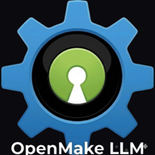

<p align="center">
  
</p>

<h1 align="center">OpenMake LLM</h1>

<p align="center">
  <strong>Self-hosted AI Assistant Platform with Multi-Model Orchestration</strong>
</p>

<p align="center">
  <a href="http://rasplay.tplinkdns.com:52416"><strong>Live Demo</strong></a> &bull;
  <a href="#our-story">Our Story</a> &bull;
  <a href="#features">Features</a> &bull;
  <a href="#architecture">Architecture</a> &bull;
  <a href="#quick-start">Quick Start</a> &bull;
  <a href="#configuration">Configuration</a> &bull;
  <a href="#api-reference">API Reference</a> &bull;
  <a href="#project-structure">Project Structure</a> &bull;
  <a href="#license">License</a>
</p>

<p align="center">
  
  
  
  
  
</p>

---

## Overview

**OpenMake LLM**은 Ollama 기반 셀프 호스팅 AI 어시스턴트 플랫폼입니다. 단일 노드부터 분산 클러스터까지 확장 가능하며, 7가지 브랜드 모델 프로파일과 자동 라우팅으로 질문 유형별 최적 응답을 제공합니다.

최근 버전에서는 API v1(`/api/v1`) 라우팅, 스킬 라이브러리/스킬 마켓플레이스, Chat Feedback API, 개발자 문서 API(`/api/docs/*`)가 강화되었습니다.

<p align="center">
  <a href="http://rasplay.tplinkdns.com:52416">
    
  </a>
</p>

<p align="center">
  <a href="http://rasplay.tplinkdns.com:52416"><strong>Live Demo</strong></a> &bull;
  <a href="https://imgur.com/a/WanS3dn">Screenshots</a>
</p>

### Why OpenMake LLM?

- **프라이버시**: 데이터 로컬 처리 중심의 셀프 호스팅 운영.
- **멀티모델 오케스트레이션**: 질문 유형 분석 + 모델 자동 라우팅.
- **확장성**: 단일 Ollama부터 멀티 노드 클러스터까지 수평 확장.
- **개발자 API**: API Key, 사용량 추적, v1 버전 API 제공.

---

## Features

### Core AI

| Feature | Description |
|---------|-------------|
| **Smart Auto-Routing** | 질문을 분석해 최적 모델/프로파일 자동 선택 (`openmake_llm_auto`) |
| **7 Brand Model Profiles** | `openmake_llm`, `_pro`, `_fast`, `_think`, `_code`, `_vision`, `_auto` |
| **Agent-to-Agent (A2A)** | 다중 모델 병렬 생성 후 응답 합성 |
| **Deep Research** | 다단계 리서치 에이전트 (분해/검색/종합) |
| **Discussion Mode** | 다중 모델 교차 검토 기반 응답 품질 향상 |
| **Sequential Thinking** | 단계적 추론 체인 |
| **Long-term Memory** | 사용자별 메모리 저장/재활용 |

### Platform

| Feature | Description |
|---------|-------------|
| **MCP Integration** | MCP 도구 라우팅 + 외부 MCP 서버 연동 |
| **Cluster Management** | 노드 헬스체크/로드밸런싱/레이턴시 모니터링 |
| **API Key Service** | API Key 발급/회전/사용량/Rate Limit 관리 |
| **OAuth & RBAC** | Google/GitHub OAuth + JWT 역할 제어 |
| **PWA Support** | 오프라인 캐시, 설치, 푸시 알림 |
| **Web Search** | 웹 검색 결과를 AI 컨텍스트로 주입 |
| **Document Analysis** | PDF/OCR 기반 문서 분석 |
| **Canvas** | 문서 공유/버전 이력 기반 협업 |
| **Skills Library** | 사용자 스킬 CRUD/카테고리/내보내기 (`/api/agents/skills/*`) |
| **Skills Marketplace** | GitHub Proxy 기반 스킬 검색/상세/가져오기 (`/api/skills-marketplace/*`) |

### Operations & Monitoring

| Feature | Description |
|---------|-------------|
| **Token Monitoring** | 토큰 사용량 추적 |
| **Audit System** | 시스템 감사 로그 |
| **Alerts** | 알림 및 경고 관리 |
| **Analytics** | 사용 패턴 대시보드 |
| **Agent Learning** | 피드백 기반 성능 추적 |
| **Chat Feedback API** | 채팅 응답 피드백 수집 (`/api/chat/feedback`) |

### Developer Experience

| Feature | Description |
|---------|-------------|
| **CLI Tools** | `chat`, `ask`, `review`, `generate`, `explain`, `models`, `connect`, `cluster`, `nodes`, `mcp`, `plugins` |
| **Swagger API Docs** | `/api-docs` 자동 문서 |
| **Developer Docs API** | `/api/docs/developer`, `/api/docs/api-reference`, `/api/docs/quickstart` |
| **API Versioning** | `/api/v1` 별도 라우터 + API Key 전용 제한 헤더/TPM |

---

## Architecture

```
Frontend (Vanilla JS SPA)
  └─ SPA Router + 22 page modules (chat/research/canvas/admin/skills ...)
       ↓ HTTP / WebSocket
Backend (Express v5 + TypeScript)
  ├─ REST Routes (25 route files)
  ├─ ChatService Pipeline (profile resolver, model selector, context engineering)
  ├─ MCP Tool Router + External MCP Registry
  ├─ Skills (Library + Marketplace)
  ├─ Monitoring / Audit / Analytics / Alerts
  └─ UnifiedDatabase (PostgreSQL, raw SQL)
       ↓
Ollama Cluster (local + cloud nodes)
```

### Chat Pipeline Flow

```
User Message
  -> PipelineProfile (7 profiles)
  -> ModelSelector (query classification + auto routing)
  -> ContextEngineering
  -> Agent Loop (A2A / tools / sequential-thinking)
  -> AI Response
```

### Brand Model Profiles

| Model Alias | Engine | A2A | Thinking | Discussion | Use Case |
|-------------|--------|:---:|:--------:|:----------:|----------|
| `openmake_llm` | LLM | Conditional | Medium | - | 일반 대화 |
| `openmake_llm_pro` | Pro | Always | High | Yes | 심층 분석/창작 |
| `openmake_llm_fast` | Fast | Off | Off | - | 빠른 응답 |
| `openmake_llm_think` | Think | Always | High | - | 수학/논리 |
| `openmake_llm_code` | Code | Conditional | Medium | - | 코딩/디버깅 |
| `openmake_llm_vision` | Vision | Conditional | Medium | - | 이미지/비전 |
| `openmake_llm_auto` | Dynamic | Auto | Auto | Auto | 질문 기반 자동 선택 |

### Ollama Models in Use

- `qwen3-vl:235b-cloud`
- `gpt-oss:120b-cloud`
- `kimi-k2.5:cloud`
- `qwen3-coder-next:cloud`
- `gemini-3-flash-preview:cloud`

---

## Quick Start

### Prerequisites

- **Node.js** >= 18
- **PostgreSQL** >= 14
- **Ollama** ([install](https://ollama.com))

### 1. Clone & Install

```bash
git clone https://github.com/openmake/openmake_llm.git
cd openmake_llm
npm install
```

### 2. Configure Environment

```bash
cp .env.example .env
# Edit .env with your settings
```

### 3. Setup Database

```bash
createdb openmake_llm
# Tables are auto-created on startup
```

### 4. Build & Run

```bash
npm run build
node backend/api/dist/cli.js cluster --port 52416
```

### 5. Access

- **Web UI**: `http://localhost:52416`
- **API Docs**: `http://localhost:52416/api-docs`
- **Developer Portal**: `http://localhost:52416/developer.html`

### CLI Usage

```bash
node backend/api/dist/cli.js chat
node backend/api/dist/cli.js ask "Explain quicksort"
node backend/api/dist/cli.js review ./src/app.ts
node backend/api/dist/cli.js generate "REST API with Express" -l typescript
node backend/api/dist/cli.js explain ./src/utils.ts
node backend/api/dist/cli.js models
node backend/api/dist/cli.js connect
node backend/api/dist/cli.js cluster --port 52416
node backend/api/dist/cli.js nodes
node backend/api/dist/cli.js mcp
node backend/api/dist/cli.js plugins --list
```

---

## Configuration

### Environment Variables (`.env`)

#### Server & Security

| Variable | Description | Default |
|----------|-------------|---------|
| `PORT` | Server port | `52416` |
| `NODE_ENV` | Environment | `development` |
| `SERVER_HOST` | Server hostname | `localhost` |
| `JWT_SECRET` | JWT signing key | - |
| `SESSION_SECRET` | Session signing key | - |
| `ADMIN_EMAILS` | Admin email list | - |
| `CORS_ORIGINS` | Allowed origins | `localhost:52416,...` |

#### Ollama & LLM

| Variable | Description | Default |
|----------|-------------|---------|
| `OLLAMA_HOST` | Ollama server URL | `http://localhost:11434` |
| `OLLAMA_BASE_URL` | Ollama API base URL | `http://localhost:11434` |
| `OLLAMA_MODEL` | Default model | - |
| `OLLAMA_API_KEY_1..5` | Cloud API keys | - |
| `OLLAMA_MODEL_1..5` | Per-key model assignment | - |
| `OLLAMA_HOURLY_LIMIT` | Requests/hour per key | `150` |
| `OLLAMA_TIMEOUT` | Timeout (ms) | `120000` |

#### Engine Mapping

| Variable | Description | Example |
|----------|-------------|---------|
| `OMK_ENGINE_LLM` | Default engine model | - |
| `OMK_ENGINE_PRO` | Pro engine model | - |
| `OMK_ENGINE_FAST` | Fast engine model | - |
| `OMK_ENGINE_THINK` | Think engine model | - |
| `OMK_ENGINE_CODE` | Code engine model | `qwen3-coder-next:cloud` |
| `OMK_ENGINE_VISION` | Vision engine model | `qwen3-vl:235b-cloud` |

#### Database

| Variable | Description | Default |
|----------|-------------|---------|
| `DATABASE_URL` | PostgreSQL connection string | `postgresql://.../openmake_llm` |

#### OAuth

| Variable | Description | Default |
|----------|-------------|---------|
| `GOOGLE_CLIENT_ID` | Google OAuth client ID | - |
| `GOOGLE_CLIENT_SECRET` | Google OAuth client secret | - |
| `GITHUB_CLIENT_ID` | GitHub OAuth client ID | - |
| `GITHUB_CLIENT_SECRET` | GitHub OAuth client secret | - |
| `OAUTH_REDIRECT_URI` | OAuth callback URL | `http://localhost:52416/api/auth/callback/google` |

#### Rate Limiting

| Variable | Description | Default |
|----------|-------------|---------|
| `RATE_LIMIT_WINDOW_MS` | Window size | `900000` |
| `RATE_LIMIT_MAX` | Global max requests | `100` |

> 전체 템플릿은 `.env.example`를 참고하세요.

---

## API Reference

### Authentication

```bash
# API Key
X-API-Key: omk_live_sk_xxxxxxxxxxxxxxxxxxxx

# Bearer Token
Authorization: Bearer <jwt_token>

# Cookie
auth_token=<jwt_token>
```

### Core Endpoints

#### Chat

```http
POST /api/chat
POST /api/chat/stream
POST /api/chat/feedback
```

#### Models / Versioned API

```http
GET /api/v1/models
GET /api/v1/usage
GET /api/v1/usage/daily
```

#### Skills

```http
GET    /api/agents/skills/categories
GET    /api/agents/skills
POST   /api/agents/skills
PUT    /api/agents/skills/:skillId
DELETE /api/agents/skills/:skillId
GET    /api/agents/skills/:skillId/export
```

#### Skills Marketplace

```http
GET  /api/skills-marketplace/search
GET  /api/skills-marketplace/detail
POST /api/skills-marketplace/import
```

#### Developer Docs

```http
GET /api/docs/developer
GET /api/docs/api-reference
GET /api/docs/quickstart
```

#### Other Major Domains

```http
/api/auth
/api/research
/api/documents
/api/canvas
/api/memory
/api/mcp
/api/api-keys
/api/metrics
/api/usage
/api/audit
/api/marketplace
```

> Full interactive API docs: `/api-docs`

---

## Project Structure

```
openmake_llm/
├── backend/
│   └── api/
│       └── src/
│           ├── agents/
│           ├── auth/
│           ├── chat/
│           ├── cluster/
│           ├── config/
│           ├── controllers/
│           ├── data/
│           ├── mcp/
│           ├── middlewares/
│           ├── monitoring/
│           ├── ollama/
│           ├── plugins/
│           ├── routes/                      # 25 route files
│           │   ├── skills.routes.ts
│           │   ├── skills-marketplace.routes.ts
│           │   ├── chat-feedback.routes.ts
│           │   ├── developer-docs.routes.ts
│           │   └── v1/index.ts
│           ├── services/
│           ├── sockets/
│           ├── utils/
│           ├── cli.ts
│           └── server.ts
├── frontend/
│   └── web/
│       └── public/
│           ├── app.js
│           ├── js/
│           │   ├── spa-router.js
│           │   ├── nav-items.js
│           │   └── modules/pages/          # 22 page modules
│           │       ├── skill-library.js
│           │       ├── custom-agents.js
│           │       ├── marketplace.js
│           │       ├── mcp-tools.js
│           │       ├── research.js
│           │       └── ...
│           └── css/
├── services/
├── ai/
├── docs/
├── tests/
├── package.json
└── AGENTS.md
```

---

## Tech Stack

| Layer | Technology |
|-------|------------|
| Runtime | Node.js 18+ |
| Language | TypeScript 5.3 |
| Backend Framework | Express v5.2 |
| Database | PostgreSQL + raw SQL (`pg`) |
| LLM Backend | Ollama (local + cloud keys) |
| WebSocket | ws |
| Authentication | JWT + Google OAuth + GitHub OAuth |
| Validation | Zod |
| MCP | `@modelcontextprotocol/sdk` |
| OCR / PDF | Tesseract.js / pdf-parse |
| API Docs | Swagger UI |
| Frontend | Vanilla JavaScript SPA |
| Testing | Jest + Playwright |

---

## AI Development Skills

프로젝트는 AI 코딩 에이전트 작업 품질을 위해 `.claude/skills/` 기반 스킬 시스템을 포함합니다.

### Project Skills (`.claude/skills/`)

| Skill | Domain |
|-------|--------|
| `llm-app-patterns` | LLM 에이전트/A2A/프롬프트 체인 |
| `postgres-raw-sql` | UnifiedDatabase/파라미터화 SQL |
| `mcp-integration` | MCP 서버/클라이언트/ToolRouter |
| `auth-security-patterns` | JWT/OAuth/API Key 보안 |
| `typescript-advanced` | strict 타입 안정성 |
| `vanilla-js-frontend` | IIFE 모듈/SPA/XSS 방어 |
| `context-engineering` | 컨텍스트 최적화 |
| `context-compactor` | 세션 요약/컴팩션 |
| `context-state-tracker` | 세션 상태 추적 |
| `memory-manager` | 장/단기 메모리 관리 |

---

## Development

### Workspace Structure

```yaml
workspaces:
  - backend/api
  - frontend/web
```

### Build Commands

```bash
npm run build
npm run build:backend
npm run build:frontend
npm run deploy:frontend
npm run dev
npm test
npm run test:e2e
npm run test:e2e:ui
npm run lint
npm run clean
```

### Database

DB 스키마는 PostgreSQL + `UnifiedDatabase` 기반으로 관리되며 서버 시작 시 필요한 테이블을 자동 생성합니다.

### Coding Standards

- TypeScript strict mode 유지 (`as any`, `@ts-ignore` 금지)
- SQL은 파라미터화 쿼리 사용
- 백엔드는 표준 API response 헬퍼 사용
- 프론트엔드는 Vanilla JS + sanitize 기반 XSS 방어

---

## Deployment

### Production

```bash
npm run build
NODE_ENV=production node backend/api/dist/cli.js cluster --port 52416
```

### Adding Ollama Nodes

```bash
node backend/api/dist/cli.js nodes
```

---

## Our Story

OpenMake LLM은 Raspberry Pi 메이커 커뮤니티(2013)에서 시작된 OpenMake 엔지니어링 흐름 위에서 발전한 AI 플랫폼입니다.

```
rasplay (2013) -> openmake (2016) -> openmake_llm (2026)
```

주요 링크:

- Live Demo: http://rasplay.tplinkdns.com:52416
- RaspberryPi Village: https://github.com/rasplay
- OpenMake Team: https://github.com/openmake
- Repository: https://github.com/openmake/openmake_llm

---

## Contributing

1. Fork the repository
2. Create a feature branch (`git checkout -b feature/amazing-feature`)
3. Commit your changes (`git commit -m 'Add amazing feature'`)
4. Push to the branch (`git push origin feature/amazing-feature`)
5. Open a Pull Request

### Guidelines

- Follow existing code patterns
- Keep backend in TypeScript
- Run tests before submitting
- Keep commits atomic and descriptive

---

## License

This project is licensed under the **MIT License** — see [LICENSE](LICENSE).

---

<p align="center">
  Built with <a href="https://ollama.com">Ollama</a> &bull;
  Powered by open-source LLMs
</p>
