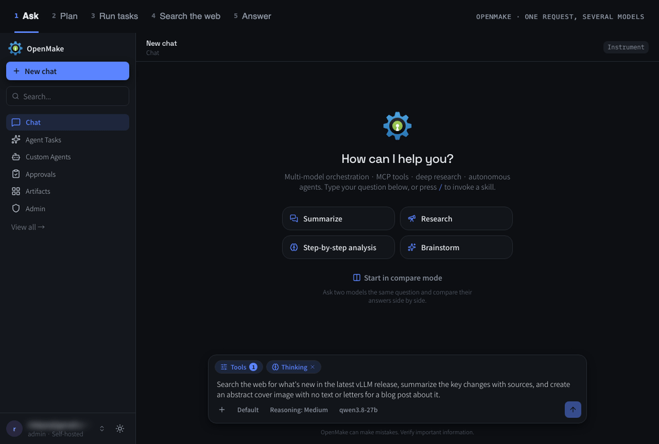
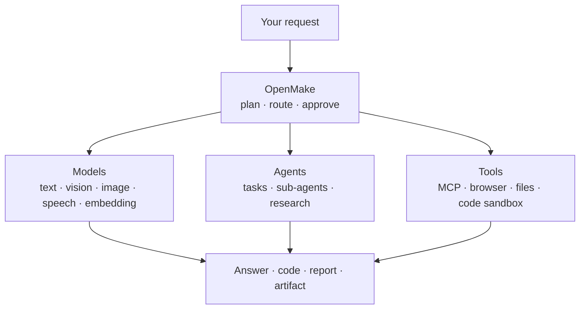
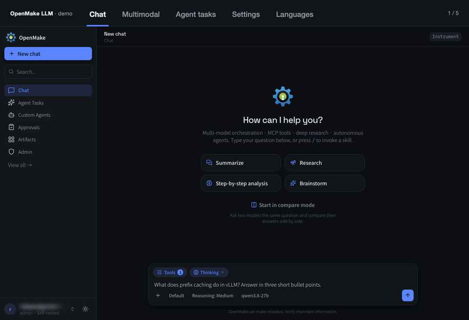
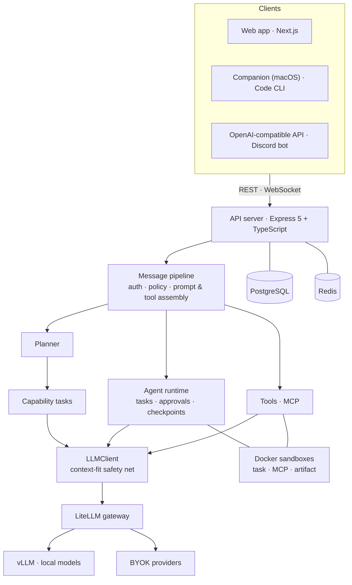

<h1 align="center">OpenMake</h1>

<p align="center">
  <strong>Open-source AI workspace and agent runtime for local, open-weight, and OpenAI-compatible models.</strong>
</p>

<p align="center">
  OpenMake orchestrates specialized models, agents, MCP tools, research, and sandboxed execution<br/>
  through a single self-hosted workspace.
</p>

<p align="center">
  <a href="https://chat.openmake.cc"><b>Live Demo</b></a> ·
  <a href="https://openmake.cc/en/docs/"><b>Documentation</b></a> ·
  <a href="https://openmake.cc/en/roadmap/"><b>Roadmap</b></a> ·
  <a href="https://openmake.cc/en/blog/"><b>Engineering Log</b></a>
</p>

<p align="center">
  Local-first · Self-hosted · Multi-model · Agents · MCP · BYOK
</p>

<p align="center">
  <a href="LICENSE"></a>
  <a href="https://github.com/openmake/openmake_llm/releases"></a>
  <a href="https://github.com/openmake/openmake_llm/actions/workflows/ci.yml"></a>
  <a href="https://github.com/openmake/openmake_llm"></a>
</p>

<p align="center">
  <a href="README.ko.md">한국어</a> · <a href="README.ja.md">日本語</a> · <a href="README.zh-CN.md">简体中文</a> · <a href="README.de.md">Deutsch</a>
</p>

<p align="center">
  
</p>

<p align="center">
  <sub>One request, several models: the Planner runs a web search, a reasoning task, and image generation; the chat model then checks the sources and answers with citations and the generated image. Recorded from the running app (sped up).</sub>
</p>

---

## Quick Start

```bash
curl -fsSL https://raw.githubusercontent.com/openmake/openmake_llm/main/install.sh | bash
```

The installer checks your toolchain (Node.js 24, Docker, PM2), writes a `.env` with fresh secrets, starts PostgreSQL and Redis, builds OpenMake, launches it under PM2, and runs a health check.

Then open the URL it prints, sign in as the administrator, and connect a model — a local vLLM or Ollama server, or any OpenAI-compatible endpoint.

Runs on Linux and macOS (Windows: inside WSL2). Add `bash -s -- --yes` for a non-interactive install. Manual setup, flags, updates, and reverse-proxy notes are in the **[self-hosting guide](https://openmake.cc/en/docs/)**.

---

## Why OpenMake?

Most self-hosted AI interfaces help you **talk to a model**. OpenMake is designed to **coordinate models, tools, and agents so they can do the work** — on infrastructure you control, with every step inspectable.

| Project | Primary role |
|---|---|
| Ollama / vLLM | Run models |
| Open WebUI | Use models through a self-hosted interface |
| Dify | Build AI apps and workflows |
| OpenHands | Agents for software development |
| **OpenMake** | **Orchestrate models, agents, and tools for general AI work** |

These projects sit at different layers, and they are not mutually exclusive: OpenMake serves local models through vLLM and can use an Ollama server as its model endpoint.

---

## How It Works


```mermaid
flowchart TB
    R["Your request"] --> O["OpenMake<br/>plan · route · approve"]
    O --> M["Models<br/>text · vision · image · speech · embedding"]
    O --> A["Agents<br/>tasks · sub-agents · research"]
    O --> T["Tools<br/>MCP · browser · files · code sandbox"]
    M --> X["Answer · code · report · artifact"]
    A --> X
    T --> X
```

A simple question goes straight to your chat model. A request that needs more — an image, a transcript, a web search, a multi-step task — is split into tasks that run on the models and tools you assigned, and your chat model writes the final answer around the results.

**You choose the models. OpenMake coordinates how they work together.**

---

## What You Can Do

- **Research a topic** across several search sources and get a cited report you can export to PDF or DOCX.
- **Chat with a local model** while a separate vision model reads the images you attach.
- **Ask for an image, a voice reading, or a transcript** — each request goes to the model assigned to that capability.
- **Hand an agent a goal** — it plans, browses, edits files, runs code in a Docker sandbox, and stops for approval before risky steps.
- **Connect external services through MCP** (Notion, Context7, Tavily, NotebookLM, and more) or install Claude Code–style plugins and skills.
- **Run agent work on a folder on your own machine** through the OpenMake Companion app or the OpenMake Code CLI.

| Domain | What it covers |
|---|---|
| **Models** | vLLM + LiteLLM gateway, Ollama or any OpenAI-compatible endpoint, BYOK providers, ChatGPT subscription login |
| **Orchestration** | Planner, model roles, per-capability models, parallel capability tasks |
| **Agents** | Multi-turn tasks, sub-agents, approvals, schedules, templates, local execution |
| **Research & Tools** | Deep research, 23 built-in tools, MCP catalog, skills, extensions |
| **Output** | Streaming answers, artifacts, HTML/PDF/DOCX reports, files, generated media |

The task-by-task guide lives in the **[user manual](https://openmake.cc/en/manual/)**.

<p align="center">
  
</p>

---

## Models & Routing

**OpenMake does not require one model to do everything.**

```
OpenMake
 ├── LiteLLM gateway (OpenAI-compatible)
 │    ├── vLLM ─────────── your local / open-weight models
 │    └── BYOK providers ─ OpenRouter · NVIDIA NIM · Ollama Cloud · Open AI Service Hub · B.AI
 ├── Direct ────────────── ChatGPT subscription login
 └── Specialized models, assigned per capability
      ├── Text & code
      ├── Vision & OCR
      ├── Image generation & editing
      ├── Speech-to-text · text-to-speech · video
      └── Embedding
```

- **Model roles** — pick a model for `agent`, `judge`, `research`, `spawn`, `review`, `summary`, and `planner`. Users choose their own; administrators set defaults and can share server keys with daily and monthly token budgets.
- **Model per capability** — assign the model that handles vision, image generation, speech, video, and code. Capabilities without an assignment are reported as unavailable instead of silently falling back.
- **Bring your own keys** — provider keys are stored AES-256-GCM encrypted and sent through the gateway per request. Rate limits, insufficient credit, and restricted models are reported as such, not as a generic upstream error.
- **Context-fit safety net** — prompts (images included) are measured against the model's context window; oversized input is trimmed before the call, and an impossible request returns `413` with an audit record.
- **Local model discovery** — models behind the gateway are discovered at boot, so swapping a model on the inference host does not require a code change.
- **Compare mode** — send one prompt to two models and read the answers side by side.

---

## Agent Runtime

An agent task pursues a goal across many tool-calling turns. Agents can:

- keep task state across turns, with a checkpoint at the end of each turn
- use tools under an approval policy — Manual, Auto, or Skip
- work with attached files and produce deliverables such as Excel and PDF files
- execute shell and Python code in an isolated Docker workspace
- browse the web from a separate browser container with an egress allowlist
- split independent work across parallel sub-agents
- report *not achieved* through a goal judge instead of a false "done"

**Available now**

- ✓ Persisted tasks with pause, resume, cancel, and recovery after a server restart
- ✓ An **Approvals** inbox for agent steps, skills, extensions, and MCP servers
- ✓ Templates, scheduled runs, and shareable task results
- ✓ Local execution through OpenMake Companion (macOS) or the OpenMake Code CLI — path-scoped, with a confirmation gate for commands and git-worktree isolation

**Opt-in** — these ship disabled. Enable them in `.env`:

| Setting | Enables | Prerequisite |
|---|---|---|
| `TASK_SANDBOX_ENABLED=true` | Persistent Docker workspace per task | Build `infra/mcp-runtime`, then `infra/task-runtime` |
| `LOCAL_EXECUTOR_ENABLED=true` | Tool calls on a user's own machine | OpenMake Companion or CLI with a `bridge`-scoped API key |
| `AGENT_TASK_QUEUE_ENABLED=true` | Global and per-user concurrency limits | — |

```bash
docker build -t openmake-mcp-runtime:latest infra/mcp-runtime
docker build -t openmake-task-runtime:latest infra/task-runtime
```

**Planned**

- ○ **Execution graph** — plan nodes that own their dependencies, permissions, retries, and completion criteria. Today the stored plan is a flat list of steps.
- ○ **Declarative policy engine** — server-enforced permission levels beyond today's approval gate.
- ○ **Sub-turn durability** — a per-tool-call journal so a turn interrupted mid-way can be replayed safely.
- ○ **Scoped memory** — working, episodic, and semantic memory with source and expiry.

---

## Research, Tools & Artifacts

**Deep Research** — breaks a question into sub-topics, searches them in parallel, reads the sources, summarizes in chunks, and writes a cited report. Wikipedia, Google News, and DuckDuckGo work without keys; SearXNG, Google Custom Search, Naver, and Kakao add coverage once configured.

**Built-in tools** — 23 tools for web search and fact-checking, page extraction and crawling, image analysis and OCR, planning, code and security review, skill loading, and Git importers. Most tools are offered only on turns that need them, which keeps prompts small.

**MCP** — install servers from the catalog (Tavily, Context7, Notion, NotebookLM, Kakao Map, OpenDART, and more) or register your own. Each stdio server can run in its own Docker container with dropped capabilities, a non-root user, and an optional read-only filesystem; remote servers sign in with OAuth.

**Skills & extensions** — install plugins, skills, custom agents, and MCP servers from Git, a zip, or a marketplace. Claude Code conventions — tool names, `$ARGUMENTS`, `commands/`, `agents/`, bundled scripts — are adapted on install, and anything that needs review lands in the Approvals inbox.

**Artifacts** — answers can render into sandboxed live previews; report requests become HTML artifacts exportable to PDF and DOCX, and a separate-origin viewer serves shared artifacts.

**Integrations** — an OpenAI-compatible API (`/api/v1/chat/completions`) with scoped API keys, a Discord gateway bot, and [OpenMake Bench](https://bench.openmake.cc) for comparing models before assigning them.

---

## Architecture


```mermaid
flowchart TB
    subgraph clients["Clients"]
        WEB["Web app · Next.js"]
        NATIVE["Companion (macOS) · Code CLI"]
        APIC["OpenAI-compatible API · Discord bot"]
    end
    clients -->|"REST · WebSocket"| API["API server · Express 5 + TypeScript"]
    API --> PIPE["Message pipeline<br/>auth · policy · prompt & tool assembly"]
    PIPE --> PLAN["Planner"]
    PLAN --> CAP["Capability tasks"]
    PIPE --> AGT["Agent runtime<br/>tasks · approvals · checkpoints"]
    PIPE --> TOOLS["Tools · MCP"]
    CAP --> LLM["LLMClient<br/>context-fit safety net"]
    AGT --> LLM
    TOOLS --> LLM
    LLM --> GW["LiteLLM gateway"]
    GW --> VLLM["vLLM · local models"]
    GW --> EXT["BYOK providers"]
    API --- PG[("PostgreSQL")]
    API --- RD[("Redis")]
    AGT --- SB["Docker sandboxes<br/>task · MCP · artifact"]
    TOOLS --- SB
```

- **One execution path** — local and external models share the same streaming dispatch and tool loop. Discussion and Deep Research are separate modes, intercepted before dispatch.
- **Planner → capabilities → synthesis** — a `simple` plan adds no extra model call. A `multi` plan is checked up front (assignments, key status, quotas), its tasks run by dependency level in parallel, and only successful media is attached to the answer.
- **Model resolution** — every model-calling subsystem resolves its model through a role or capability: user setting → administrator default → built-in default.
- **Resilient streaming** — if a browser tab goes to the background or a socket drops, generation keeps running and the client re-attaches to the same answer.
- **Single-host design** — the application runs under PM2; PostgreSQL, Redis, and every sandbox run in Docker.

| Layer | Technologies |
|---|---|
| Backend | Node.js 24, Express 5, TypeScript (strict), Zod, Winston |
| Frontend | Next.js 16, React 19, Zustand, Tailwind CSS 4, `next-intl` (ko · en · ja · zh · de) |
| Data | PostgreSQL through raw parameterized SQL (no ORM), Redis |
| LLM | vLLM, LiteLLM gateway, `openai` SDK |
| Agents & tools | Model Context Protocol client v2, Docker-isolated sandboxes |
| Native clients | SwiftUI (macOS Companion, iOS in progress), Node CLI — sharing `packages/local-bridge-core` |

### Design principles

**Calling a model is easy. Operating AI reliably is not.** The hard parts are keeping state, enforcing permissions, executing safely, recovering from failure, and proving what happened. OpenMake is built around those:

- **State** — tasks, steps, and checkpoints are persisted, so work survives a restart.
- **Permissions** — RBAC, scoped API keys, approval policies, and credential-file guards on agent tools.
- **Isolation** — agent code, MCP servers, and artifacts run in Docker with capability, memory, and network limits.
- **Recovery** — clear failure reasons, retries for transient errors, and resumable tasks.
- **Auditability** — an audit log wired to alerts, plus step-level task history.
- **Few extra calls before the answer** — the model picks tools inside the same turn instead of a separate classifier; the pre-answer calls that remain (the Planner and LLM agent routing) are measured and kept under review.

---

## Deployment

A reference deployment is a single application host plus an inference host:

```
Application host                                   Inference host (GPU)
┌──────────────────────────────────────────┐       ┌──────────────────────┐
│ PM2: API · web                           │       │ vLLM                 │
│ Docker: PostgreSQL · Redis · sandboxes   │ ────► │ chat · embedding ·   │
│ LiteLLM gateway (OpenAI-compatible)      │       │ image models         │
└──────────────────────────────────────────┘       └──────────────────────┘
```

Everything can also run on one machine, or the model endpoint can be a hosted provider.

Day-to-day operation goes through `openmake_llm.sh`:

```bash
./openmake_llm.sh start     # PostgreSQL → Redis → app, then stream logs
./openmake_llm.sh status    # ports, containers, and PM2 state
./openmake_llm.sh update    # git pull (fast-forward only) → build → migrate → restart
./openmake_llm.sh deploy    # build → migrate → restart
./openmake_llm.sh stop
```

The installer writes a working `.env`. The essentials:

| Variable | Purpose |
|---|---|
| `LLM_BASE_URL` · `LLM_API_KEY` · `LLM_DEFAULT_MODEL` | OpenAI-compatible model endpoint |
| `LLM_GATEWAY_PROVIDERS` | BYOK providers routed through the gateway |
| `DATABASE_URL` · `REDIS_URL` | Data stores |
| `JWT_SECRET` · `API_KEY_PEPPER` · `TOKEN_ENCRYPTION_KEY` | Secrets (generated on first boot if missing) |

`.env.example` is the full reference, and many operational settings can be changed at runtime in **Admin → System settings**. Database migrations apply automatically on boot. For a public address, pass `--public-url https://chat.example.com` to the installer; a Caddy configuration is included under `scripts/caddy/`.

---

## Development

```bash
git clone https://github.com/openmake/openmake_llm.git
cd openmake_llm
npm install

npm run dev                 # API + web
npm test                    # shared packages, then Jest unit tests
npm run test:e2e            # Playwright (chromium + webkit)
npm run lint                # ESLint
```

```
apps/
├── api/             Express 5 API — chat pipeline, orchestrator, agents, MCP, data
├── web/             Next.js web app
├── cli/             OpenMake Code — local bridge CLI
├── desktop-native/  OpenMake Companion — SwiftUI menu-bar app (macOS)
├── ios/             SwiftUI iOS client (in progress)
└── discord-bot/     Discord gateway bot
packages/            shared types, API contracts, config, API client, local-bridge core
db/                  baseline schema and migrations
infra/               Docker images and compose files for sandboxes and data stores
```

---

## Roadmap

| Current — shipped | Next | Later |
|---|---|---|
| Multi-model gateway with role and capability routing | Execution graph | Scoped memory |
| Durable task runtime: checkpoints, pause/resume, restart recovery | Declarative policy engine and approval waits | Organizations, projects, and multi-tenancy |
| Tools, MCP gateway, approvals, Docker sandboxes | Agent and skill manifests | SSO (OIDC, SAML), budgets, deployment approvals |
| Deep research, artifacts, local execution bridge | Sub-turn durability | Air-gapped installs, HA, Kubernetes |

The direction is set; the schedule is not a promise — if a capability is not in a [release](https://github.com/openmake/openmake_llm/releases), treat it as a plan. Details: **[openmake.cc/roadmap](https://openmake.cc/en/roadmap/)**.

---

## Engineering Log

OpenMake is built in the open. We publish implementation notes, failures, trade-offs, and production lessons as we go:

- [Six months serving vLLM on a DGX Spark](https://openmake.cc/en/blog/six-months-vllm-dgx-spark/)
- [We built isolation, and in production it did nothing](https://openmake.cc/en/blog/mcp-sandbox-docker/)
- [All four times, the tests were green](https://openmake.cc/en/blog/green-tests-four-gaps/)
- [Connecting the plan to the execution, in three increments](https://openmake.cc/en/blog/execution-graph-increments/)
- [Swapping the inference backend in a day, then paying for it](https://openmake.cc/en/blog/ollama-to-vllm-migration/)

Each week is also summarized in the [weekly development log](https://openmake.cc/en/blog/) — latest: [W37](https://openmake.cc/en/blog/weekly-log-2026-w37/).

---

## Contributing

Contributions are welcome — bug reports, fixes, documentation, and new skills or MCP integrations.

- Open a branch and send a pull request against `main` using [Conventional Commits](https://www.conventionalcommits.org/) (`feat`, `fix`, `refactor`, `docs`, `test`, `chore`).
- Follow the conventions: TypeScript strict mode, Zod validation, raw parameterized SQL (no ORM), and externalized configuration — no hardcoded model names, magic numbers, or inline prompts.
- Before opening a PR: `npm run lint` and `npm test` pass; schema changes include a migration; new environment variables are documented in `.env.example`; UI changes include a screenshot.

CI runs a single **CI Gate** (test → build → size → lint) on every push and pull request.

**Community & contact** — questions and self-hosting help: support@openmake.cc · maintainers: riskpw@openmake.cc, rockyhan@openmake.cc. If OpenMake is useful to you, a star helps other developers find it.

## License

Released under the [MIT License](LICENSE).
