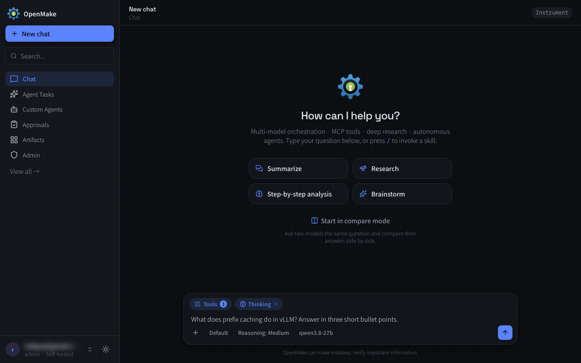
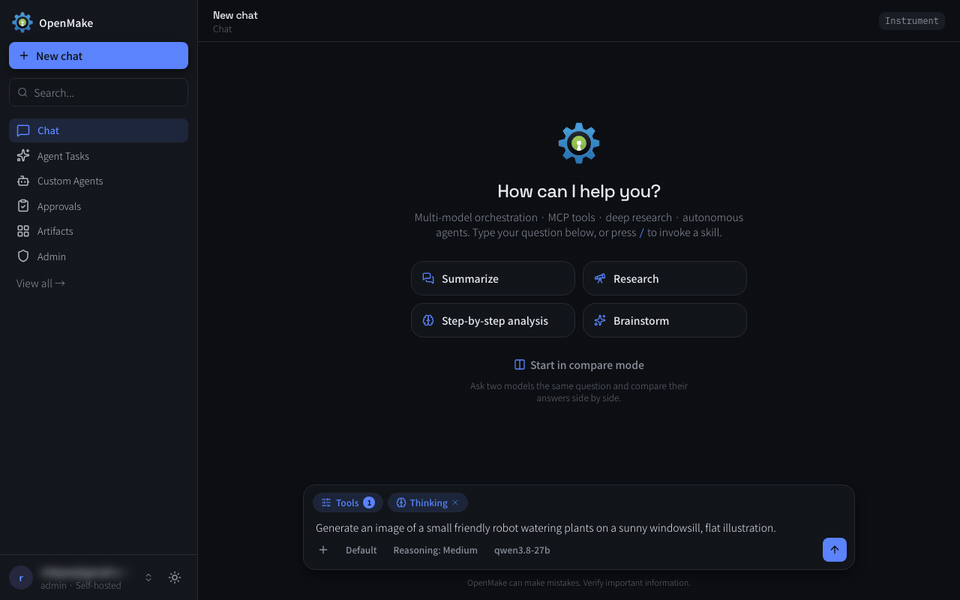
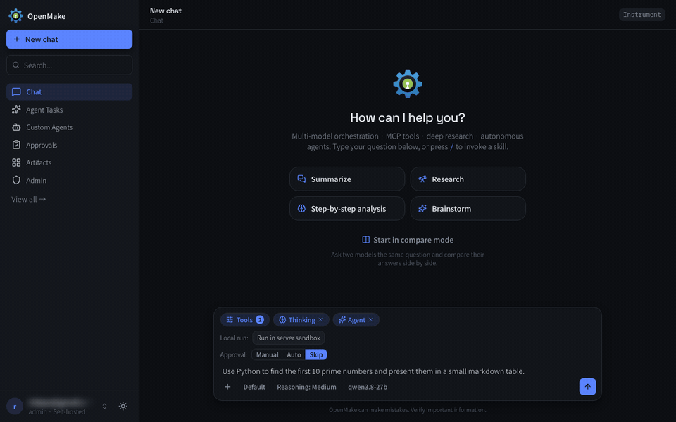
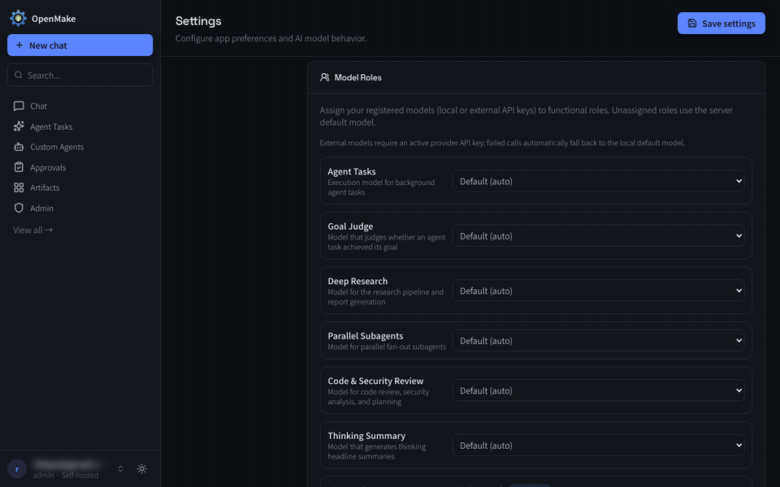

<h1 align="center">OpenMake LLM</h1>

<p align="center">
  <strong>An open-source, local-first, self-hosted AI workspace for open-weight and BYOK models.</strong><br/>
  vLLM/LiteLLM inference · multimodal orchestration · autonomous agents · MCP tools · deep research · Docker sandboxes.
</p>

<p align="center">
  <a href="https://github.com/openmake/openmake_llm/actions/workflows/ci.yml"></a>
  <a href="LICENSE"></a>
  
  =24 <25" />
  
  
</p>

<p align="center">
  <a href="https://openmake.cc/en/">Homepage</a> ·
  <a href="https://chat.openmake.cc">Live demo</a> ·
  <a href="https://bench.openmake.cc">Bench</a> ·
  <a href="https://openmake.cc/en/docs/">Self-hosting guide</a><br/>
  <a href="README.ko.md">한국어</a> ·
  <a href="README.ja.md">日本語</a> ·
  <a href="README.zh-CN.md">简体中文</a>
</p>

---

## Overview

**OpenMake LLM** is a self-hosted AI assistant you run on your own hardware. It serves a local model through **vLLM** behind a **LiteLLM gateway** (OpenAI-compatible) and routes the *same* gateway to external providers you register with your own keys — **OpenRouter, NVIDIA NIM, Ollama Cloud, Open AI Service Hub (hasa), B.AI** — plus a **ChatGPT subscription login**. Your data stays on your machine by default.

Every chat turn goes through a lightweight **message pipeline** (provider gate, security and language policy, prompt and tool assembly) and a single execution path shared by local and external models. When a request needs more than text — *draw this, read it aloud, transcribe this clip, make a short video* — a **Planner** writes a small plan, the matching **capabilities** run in parallel on the models you assigned, and your chat model writes the final answer around the results. Behavior is controlled by orthogonal axes only — **Model · Style · Mode toggles · Custom Agent** — instead of opaque presets.

Beyond chat you get autonomous agent tasks in Docker sandboxes (or on your own machine through a local bridge), deep research, an MCP tool system with a one-click catalog, and an extension system that installs Claude Code–style plugins and skills — all behind JWT auth and role-based access control.

> **Single-host design:** the application (API + web) runs under **PM2**, while stateful dependencies (PostgreSQL / Redis) and sandboxed agent / MCP / artifact processes run in **Docker** for isolation.

**At a glance**

| | |
|---|---|
| 🧠 **Local model + BYOK gateway** | `qwen3.8-27b` served by vLLM behind LiteLLM, with a 262K context-fit safety net; external providers ride the same gateway with your own keys |
| 🎨 **Multimodal orchestrator** | A Planner splits a request into capability tasks — image generation/editing, speech-to-text, text-to-speech, video, vision/OCR — runs them in parallel, and the chat model synthesizes the answer |
| 🎛️ **Model roles & capabilities** | Pick a model per role (agent, judge, research, sub-agents, review, summary, planner) and per capability; per-user settings plus admin-wide defaults |
| 🤖 **Autonomous agents** | Multi-turn agent tasks in a persistent Docker sandbox (shell · Python · browser · files) or in a local folder via **OpenMake Companion** / **OpenMake Code** CLI, with human-in-the-loop approval |
| 🔬 **Deep research & reports** | Fan-out web search → source fetch → cited synthesis; report requests render into HTML artifacts exportable to **PDF/DOCX** |
| 🧩 **23 built-in tools + MCP** | Web search, scraping, vision, planning, code/security review, skill loading, and more; external MCP servers each isolated in Docker, with OAuth login for remote servers |
| 📦 **Extensions & skills** | Install plugins, skills, agents, and MCP servers from Git or a marketplace — Claude Code conventions are adapted on install — and approve them in one **Approvals** inbox |
| ⚖️ **Compare mode** | Ask two models the same question and read the answers side by side |
| 🖥️ **Native clients** | OpenMake Companion (SwiftUI menu-bar app, macOS), OpenMake Code CLI, and a SwiftUI iOS client in progress — chat itself stays in the web app |
| 🌐 **4-language UI** | 한국어 · English · 日本語 · 简体中文 (`next-intl`, browser auto-detect); answers follow the language you write in |
| 🔒 **Security-first** | JWT (HttpOnly), Google OAuth 2.0, RBAC, per-route rate limiting, SSRF guard, AES-256-GCM key storage, Audit ↔ Alert |

---

## Demos

> These GIFs are recorded from the running app. Recent conversation titles and the account name are hidden.

**Chat** — ask a question and the answer streams in, with the model, response style, and reasoning effort right in the composer:

<p align="center">
  
</p>

**Multimodal orchestration** — "generate an image of …" is planned into an image-generation task, run on the model assigned to that capability, and shown inline:

<p align="center">
  
</p>

**Agent tasks** — switch the composer to Agent mode, choose an approval policy, and hand over a goal; the task runs in a sandbox with live progress and returns its result:

<p align="center">
  
</p>

**Settings** — model roles, per-capability model assignment, the MCP catalog, and the skill library:

<p align="center">
  
</p>

**Multilingual UI** — the interface follows your browser language or the Settings choice:

<p align="center">
  
</p>

---

## Architecture

OpenMake keeps **deciding what to run** separate from **calling the model**. Special modes are intercepted first; everything else goes through one path.

```
                             WebSocket / REST
                                     │
                       ┌─────────────▼─────────────┐
   Query ─────────────►│     message-pipeline      │  provider gate · security & language policy
                       └─────────────┬─────────────┘  prompt & tool assembly · custom agent
                                     │
                       ┌─────────────▼─────────────┐
                       │          Planner          │  one small JSON plan per turn
                       └──────┬──────────────┬─────┘
                        simple│              │multi
                              │   ┌──────────▼──────────┐
                              │   │  capability tasks   │  image · speech · video · vision
                              │   │  (run in parallel)  │  on the models you assigned
                              │   └──────────┬──────────┘
                       ┌──────▼──────────────▼─────┐
                       │ streamFromExternalProvider│  one path for local & external models
                       │   (always-on tool loop)   │  chat model writes the final answer
                       └─────────────┬─────────────┘
                                     │
                       ┌─────────────▼─────────────┐
                       │       LLMClient.chat      │  context-fit safety net
                       └─────────────┬─────────────┘  truncate → cap → 413 + audit
                                     │
                  LiteLLM gateway → vLLM (local) · BYOK external providers
```

- **One execution path** — local and external models share `streamFromExternalProvider` and its MCP tool loop. Discussion and Deep Research are separate modes intercepted before dispatch.
- **Planner → capabilities → synthesis** — a `simple` plan adds no extra model calls. A `multi` plan is checked up front (assignment, key status, gateway support, quotas), its tasks run by dependency level in parallel, and only successful media is attached to the answer. Unfinished video jobs are kept and picked up again on your next message instead of being resubmitted.
- **Model resolution** — every model-calling subsystem resolves its model through a role or capability registry: per-user setting → admin-wide default → built-in default, falling back to the local model on failure.
- **Context-fit safety net** — prompt tokens (images included) are estimated on entry; when the effective **262K** window would be exceeded, input is trimmed, `max_tokens` is reduced, and as a last resort the request returns **HTTP 413** with an audit record and an alert.
- **User customization** — **Model** · **Style** (Concise / Default / Verbose) · **Mode** (Discussion / Thinking / Verify answer / Deep Research / Agent) · **Custom Instructions & Agents**, plus opt-in cross-conversation memory.
- **Resilient streaming** — if a tab goes to the background or the app loses its socket, generation keeps running and the client re-attaches to the same answer when it reconnects.

---

## Features

**▸ Models & routing**
- Self-hosted vLLM + LiteLLM (default `qwen3.8-27b`) with a context-fit safety net that protects output tokens and degrades gracefully.
- **Bring your own keys** for OpenRouter, NVIDIA NIM, Ollama Cloud, Open AI Service Hub (hasa), and B.AI — all routed through the LiteLLM gateway, with keys AES-256-GCM encrypted at rest — plus a ChatGPT subscription login. Guests use the local model only.
- **Model roles** — assign a different model to `agent`, `judge`, `research`, `spawn`, `review`, `summary`, and `planner`; admins set org-wide defaults and can register server-shared keys with daily/monthly token budgets.
- **Model per capability** — choose the model for text, code, vision/OCR, image generation/editing, speech-to-text, text-to-speech, and video; grouped in Settings with per-capability overrides.
- **Clear failure reasons** — rate limits, insufficient credit, restricted models, and unsupported tool definitions are reported as such instead of a generic upstream error, and per-provider concurrency limits back off on `429`.
- **Compare mode** — run two models on the same prompt side by side.

**▸ Multimodal**
- **Planner-driven orchestration** — image generation and editing (with the previous image as reference), speech-to-text on audio or video attachments, text-to-speech, video generation, and vision description/OCR, all as capability tasks that can run in parallel.
- If the chat model cannot see images, a vision model describes them first and the chat model answers from those notes.
- Generated media is served from `/generated` with automatic retention cleanup; usage and plan timings are recorded for cost review.

**▸ Agents & research**
- **Autonomous agent tasks** — pursue a goal across many tool-calling turns in a **persistent Docker sandbox** (shell, Python, browser, files, planning, code navigation) with **Manual / Auto / Skip** approval policies. Attach files and images, get deliverables such as **Excel** and **PDF**, and see honest non-achievement (goal judge) instead of a false "done". Save tasks as **templates**, run them on a **schedule**, or **share** a run.
- **Local execution** — **OpenMake Companion** (macOS menu-bar app) or the **OpenMake Code** CLI connects a folder on your machine; tool calls run there with path scoping, a confirmation gate for commands, and git-worktree isolation.
- **Parallel sub-agents** — split independent sub-tasks across sub-agents and combine the results.
- **Deep research** — decomposition, fan-out web search (SearXNG, Naver, Daum, and more), chunked summarization, and a cited report.
- **Report pipeline** — report requests produce structured data that the server renders through a fixed template into an HTML artifact, exportable to **PDF** and **DOCX**.
- **Custom agents** — project-style personas selectable from the composer, each optionally pinned to its own model, alongside 18 built-in industry agents (100 specialists).

**▸ Tools & extensibility**
- **23 built-in tools** — web search, fact-check, page extraction, scrape/map/crawl, image analysis and OCR, agent-task lookup, planning, code and security review, skill creation and loading, Git importers for skills/agents/MCP servers/extensions, MCP meta tools, and an admin-only ops metrics tool. Tools are exposed only on turns that need them to keep prompts small.
- **External MCP servers** — stdio servers run in Docker when the sandbox is enabled (the generated config turns it on): `--cap-drop ALL`, non-root, memory and network limits, and an optional read-only root filesystem. Install from the **MCP catalog** (Tavily, Context7, Notion, NotebookLM, Kakao Map, OpenDART, Korean public-data APIs, and more); remote servers can sign in with **OAuth**.
- **Extensions** — install a plugin, skill, custom agent, or MCP server from Git, a zip, or the marketplace. Claude Code conventions (tool names, `$ARGUMENTS`, `commands/`, `agents/`, bundled scripts) are adapted on install, and everything that needs review lands in the **Approvals** inbox.
- **Skills** — reusable manifests with tool bindings, invoked with `/skill-name` or picked by the model when relevant.
- **Artifacts** — sandboxed live preview, optional Docker code execution, and a separate-origin viewer for publishing.
- **NotebookLM grounding** — pin one of your notebooks as conversation context from the composer.
- **Memory, instructions, and notifications** — opt-in cross-conversation memory, always-on custom instructions, and web push notifications when agent tasks need approval or finish.

**▸ Integrations**
- **OpenAI-compatible API** (`/api/v1/chat/completions`) with API keys and scopes.
- **Discord gateway bot** (`apps/discord-bot`) relaying messages to the API with per-user sessions and file attachments.
- **OpenMake Bench** — [bench.openmake.cc](https://bench.openmake.cc) signs in through web SSO; a model picked there can be applied to your model roles.

**▸ Security**
- JWT in HttpOnly cookies, Google OAuth 2.0, RBAC, per-user and per-route rate limiting, SSRF guard, Helmet headers, credential-file guards for agent tools, and a unified Audit ↔ Alert pipeline.

---

## Tech Stack

| Layer | Technologies |
|---|---|
| **Backend** | Node.js (≥24), Express 5, TypeScript (strict, CommonJS), Zod 4, Winston |
| **Frontend** | Next.js 16, React 19, Zustand 5, Tailwind CSS 4, `next-intl`; Instrument design system |
| **Database** | PostgreSQL via `pg` — raw, parameterized SQL (no ORM) |
| **Realtime** | WebSocket (`ws`) streaming with detach/resume |
| **LLM backend** | vLLM + LiteLLM gateway (OpenAI-compatible); `openai` SDK for external providers |
| **Agents / Tools** | Model Context Protocol (`@modelcontextprotocol/client` v2), Docker-isolated sandboxes |
| **Native clients** | SwiftUI (macOS Companion, iOS), Node CLI (`apps/cli`) sharing `packages/local-bridge-core` |
| **Integrations** | Discord gateway bot (`discord.js`); OpenMake Bench via web SSO |
| **Auth / Security** | `jsonwebtoken`, Google OAuth 2.0, Helmet, AES-256-GCM |
| **Infra** | PM2 (API · web · Discord bot) + Docker (PostgreSQL/Redis, MCP / agent / artifact sandboxes) |
| **Testing / CI** | Jest/ts-jest, Playwright, ESLint, GitHub Actions (CI Gate) |

---

## Getting Started

Supported platforms: **Linux** and **macOS** (Intel & Apple Silicon).

### Install (one command)

```bash
curl -fsSL https://raw.githubusercontent.com/openmake/openmake_llm/main/install.sh | bash
```

No clone needed — when the installer detects it is running outside the repo, it fetches
the source into `~/.openmake/chat` (override with `OMK_HOME=...`; `OMK_REF=...` picks a
branch or tag) and re-enters itself there. To run a second copy next to it on the same
host, add `--instance NAME` (`... | bash -s -- --instance NAME`): it installs into
`~/.openmake/chat-NAME` with its own ports (52417/3010), database, Redis and PM2 names
(`openmake-llm-NAME`). `--public-url https://chat.example.com` writes the public address
into `.env` and switches to secure cookies when it is HTTPS. Piped runs still prompt you interactively via
`/dev/tty`; in a non-terminal context (CI) prompts are auto-approved. Prefer the classic
way? It works exactly as before:

```bash
git clone https://github.com/openmake/openmake_llm.git
cd openmake_llm
./install.sh
```

On **Windows**, run the same one-liner inside **WSL2** (Ubuntu) — the installer detects
native Windows shells and prints the WSL2 setup steps instead.

That's it. The installer checks your toolchain (Node 24, Docker, PM2 — installing what's
missing, without `sudo` where possible), generates a `.env` with freshly random secrets,
installs dependencies, starts PostgreSQL + Redis, applies all migrations, builds both apps,
launches them under PM2, and waits for `/health`. It prints your web URL and the generated
admin password at the end.

It asks one question — which OpenAI-compatible LLM endpoint to use (Ollama / OpenRouter /
custom / decide later). To skip every prompt:

```bash
# flags pass straight through the one-liner too:
curl -fsSL https://raw.githubusercontent.com/openmake/openmake_llm/main/install.sh | bash -s -- --yes

./install.sh --yes                                    # placeholder LLM, fill in .env later
./install.sh --yes \
  --llm-base-url https://openrouter.ai/api/v1 \
  --llm-api-key  sk-or-... \
  --llm-model    qwen/qwen3-235b-a22b
```

Re-running `./install.sh` is safe — it repairs rather than overwrites. Useful flags:
`--skip-docker` (you run Postgres/Redis yourself), `--skip-build`, `--no-start`,
`--force-env`, and the port overrides below. See `./install.sh --help`.

Already running Postgres or Redis on the default ports? Move the containers instead of
fighting over 5432/6379 — the ports land in `.env`, and `openmake_llm.sh` reads them back:

```bash
./install.sh --yes --postgres-port 55432 --redis-port 56379
```

On macOS the installer works with Docker Desktop, OrbStack, or **Colima**
(`brew install colima docker docker-compose` — headless, no GUI). If Homebrew's compose
plugin isn't registered with the docker CLI, the installer adds `cliPluginsExtraDirs` to
`~/.docker/config.json` for you.

If no admin account exists yet, the web app opens a one-time **setup page** where you create
the administrator and, optionally, point it at your LLM gateway.

### Updating an installed instance

```bash
./openmake_llm.sh update            # git pull (ff-only) → build → migrate → restart
./openmake_llm.sh update --yes      # skip the migration confirmation (non-interactive)
```

`update` refuses to touch a tree with uncommitted changes or diverged local commits — it
never overwrites your edits. If nothing new was pulled it skips the redeploy (`--force` to
redeploy anyway). Tarball installs (no git) should re-run `install.sh` instead, which
repairs in place.

To pin an install to a release instead of `main`, set `OMK_REF` on the one-liner:

```bash
curl -fsSL https://raw.githubusercontent.com/openmake/openmake_llm/main/install.sh \
  | OMK_REF=v1.62.3 bash -s -- --yes
```

### Prerequisites (handled by the installer)

- **git** — on a fresh macOS, the very first `git clone` triggers the Xcode Command
  Line Tools install dialog; approve it once (or download the source as a zip instead).
  `install.sh` itself tolerates a missing git (build metadata falls back to `unknown`)
- **Node.js** `>=24 <25` — provisioned via `mise`/`fnm`/`nvm`, Homebrew, or a local
  `~/.openmake/node` tarball if none of those exist
- **Docker** — required for PostgreSQL/Redis and the MCP/agent sandboxes. On Linux the
  installer offers to run the official `get.docker.com` script; on macOS you need
  Docker Desktop, OrbStack, or Colima. Note: Docker Desktop's **first launch** may ask for GUI
  approval (privileged helper) and can outlast the installer's ~60s daemon wait — if
  that happens, wait for Docker to finish starting and re-run `./install.sh` (safe to
  repeat)
- An OpenAI-compatible LLM endpoint: a local **vLLM + LiteLLM** stack, **Ollama**, or an
  external provider key

### Manual setup

If you'd rather wire it up yourself, `install.sh` is a readable transcript of these steps:

```bash
npm install
node scripts/setup/gen-env.mjs        # minimal .env with generated secrets
docker compose --env-file .env -f infra/docker-compose.yml up -d postgres redis
npm run build && pm2 start ecosystem.config.js   # migrations apply automatically on boot
```

> The `--env-file .env` is not optional: Compose resolves its default `.env` relative to the
> compose file's directory (`infra/`), so without it `POSTGRES_PASSWORD` is empty and startup fails.

`gen-env.mjs` writes only the keys required to boot (the server also generates missing
`JWT_SECRET` / `API_KEY_PEPPER` / `TOKEN_ENCRYPTION_KEY` on first start). `.env.example` is the
full reference — copy optional blocks (OAuth, web search, MCP sandbox, Discord bot) out of it
as you need them:

| Variable | Purpose |
|---|---|
| `PORT` | API port (default `52416`) |
| `DATABASE_URL` | PostgreSQL connection string (password must match `POSTGRES_PASSWORD`) |
| `JWT_SECRET` | JWT signing secret (≥32 chars) |
| `API_KEY_PEPPER` | API-key hashing pepper |
| `TOKEN_ENCRYPTION_KEY` | AES-256-GCM key for external provider credentials (exactly 64 hex) |
| `ADMIN_PASSWORD` | Optional bootstrap admin password — leave it empty to create the admin on the setup page |
| `LLM_BASE_URL` / `LLM_API_KEY` / `LLM_DEFAULT_MODEL` | LiteLLM gateway endpoint, master key, default model |
| `LLM_GATEWAY_PROVIDERS` | External providers routed through the gateway (comma-separated ids) |
| `GOOGLE_CLIENT_ID` / `GOOGLE_CLIENT_SECRET` | Google OAuth (optional) |

Many operational settings can also be changed at runtime in **Admin → System settings**
(database values take precedence over `.env`).

### Run

Day-to-day operation goes through `openmake_llm.sh`, which sequences the three layers
(PostgreSQL → Redis → app) on both Linux and macOS:

```bash
./openmake_llm.sh start     # bring everything up, then stream logs
./openmake_llm.sh status    # port + docker + PM2 state for every layer
./openmake_llm.sh logs      # live PM2 logs
./openmake_llm.sh health    # GET /health
./openmake_llm.sh deploy    # build + migrate + restart (apply code changes)
./openmake_llm.sh stop      # reverse-order shutdown
```

Or drive the pieces directly:

```bash
# Development
npm run dev                 # API + frontend together
npm run dev:api             # backend only (ts-node)
npm run dev:frontend-next   # frontend only (next dev)

# Production
npm run build               # shared packages + backend + frontend
npm start                   # node apps/api/dist/server.js
```

To survive reboots, register PM2 with your init system — `pm2 startup` (prints a command to
run: `launchd` on macOS, `systemd` on Linux), then `pm2 save`.

### Test & lint

```bash
npm test                    # builds shared packages, then Jest unit tests (apps/api)
npm run test:e2e            # Playwright (chromium + webkit)
npm run lint                # ESLint
```

### Database migrations

Files in `db/migrations/` are applied **automatically on boot** — after the `db/init/` baseline schema, pending migrations run under a PostgreSQL advisory lock (serializing multi-instance startups) and failures fail fast. Set `DB_AUTO_MIGRATE=false` to opt out and run them manually with the CLI:

```bash
npx ts-node apps/api/src/data/migrations/cli.ts status    # show pending
npx ts-node apps/api/src/data/migrations/cli.ts migrate   # apply
```

Rollback scripts live under `db/migrations/rollbacks/` (kept out of the forward-migration scan).

---

## Project Structure

```
openmake_llm/
├── apps/
│   ├── api/          # Express 5 + TypeScript API server (strict, CommonJS)
│   │   └── src/
│   │       ├── routes/ controllers/ services/   # REST + business logic
│   │       ├── services/orchestrator/           # Planner, capability executors, preflight
│   │       ├── chat/                            # pipeline helpers, classifiers, prompts
│   │       ├── agents/                          # industry agents, discussion engine, skills, git ingest
│   │       ├── llm/ providers/ cluster/         # LLM client, provider abstraction, node routing
│   │       ├── mcp/                             # MCP tool router, external client, Docker sandbox
│   │       ├── sockets/                         # WebSocket chat and local-bridge handlers
│   │       ├── auth/ security/ middlewares/     # JWT/OAuth, SSRF guard, rate limiting
│   │       └── data/                            # PostgreSQL (raw SQL), migrations, repositories
│   ├── web/          # Next.js + React frontend (the operating UI)
│   ├── cli/          # OpenMake Code — local bridge CLI (build from source, see apps/cli/README.md)
│   ├── desktop-native/ # OpenMake Companion — SwiftUI menu-bar app (macOS)
│   ├── ios/          # SwiftUI iOS client (in progress)
│   ├── discord-bot/  # Optional Discord gateway bot (relays to /api/v1/chat/completions)
│   └── legacy-web/   # Static asset host for /generated media
├── db/               # init schema + migrations (+ rollbacks/) — read at runtime
├── packages/         # shared-types, api-contracts, config, api-client, local-bridge-core
├── infra/            # Dockerfiles & compose (mcp-runtime, task-runtime, artifact-viewer, egress-proxy)
├── scripts/          # setup/ (gen-env.mjs), LLM backend host setup (vLLM/LiteLLM), Caddy, diagnostics
├── tests/            # Playwright E2E
├── assets/           # README demo GIFs
├── install.sh        # one-shot installer (Linux/macOS): toolchain → .env → DB → build → PM2
├── openmake_llm.sh   # service manager: start/stop/restart/deploy/update/status/logs/health
└── ecosystem.config.js  # PM2 process definitions (API, Next frontend, optional Discord bot)
```

**What the running server actually needs:** the built `apps/api/dist` + `apps/web/.next`, `db/` (the boot path applies `db/init/` and pending `db/migrations/`), and `infra/` for the Docker-isolated sandboxes. `scripts/` and `tests/` are *not* loaded by any runtime code — but `scripts/vllm/` and `scripts/caddy/` are the deployment artifacts for the inference backend and reverse proxy, so keep them with the repo.

---

## Contributing

Contributions are welcome. Please:

- Use [Conventional Commits](https://www.conventionalcommits.org/) — `feat`, `fix`, `refactor`, `docs`, `test`, `chore`.
- Work on a feature/fix branch and open a PR against `main`.
- Follow the code conventions: TypeScript strict mode, Zod for input validation, Winston for logging, **raw parameterized SQL only** (no ORM), and externalized configuration (no hardcoded models, magic numbers, or inline prompts).

**Before opening a PR:**

- [ ] `npm run lint` passes
- [ ] `npm test` passes
- [ ] DB schema changes include a migration file (no sequence conflicts)
- [ ] New env vars documented in `.env.example`
- [ ] UI changes include screenshots or a short GIF; security changes describe their impact

CI runs a single **CI Gate** (Test → Build → Size → Lint) on every push and pull request.

---

## Contact

| | |
|---|---|
| General questions & self-hosting help | support@openmake.cc |
| Maintainers | riskpw@openmake.cc · rockyhan@openmake.cc |

---

## License

Released under the **MIT License** — see [LICENSE](LICENSE) for details.
