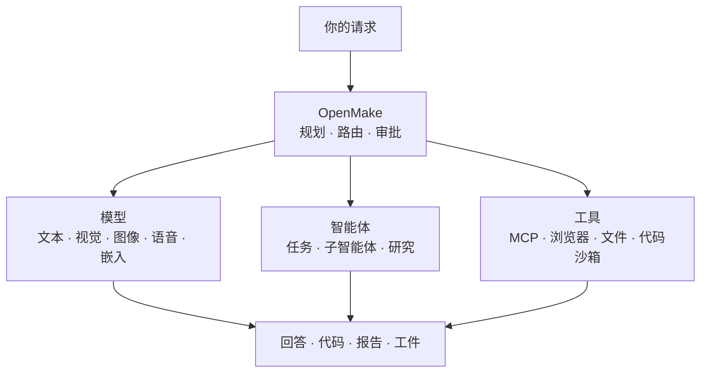
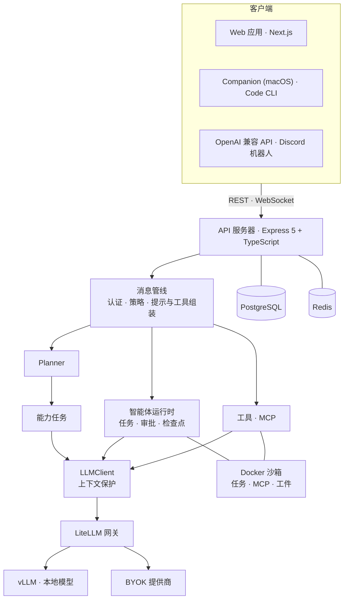

<h1 align="center">OpenMake</h1>

<p align="center">
  <strong>面向本地模型、开源权重模型和 OpenAI 兼容模型的开源 AI 工作台与智能体运行时。</strong>
</p>

<p align="center">
  OpenMake 在一个自托管工作台中，协调专用模型、智能体、MCP 工具、研究与沙箱执行。
</p>

<p align="center">
  <a href="https://chat.openmake.cc"><b>在线演示</b></a> ·
  <a href="https://openmake.cc/zh/docs/"><b>文档</b></a> ·
  <a href="https://openmake.cc/zh/roadmap/"><b>路线图</b></a> ·
  <a href="https://openmake.cc/zh/blog/"><b>工程日志</b></a>
</p>

<p align="center">
  Local-first · Self-hosted · Multi-model · Agents · MCP · BYOK
</p>

<p align="center">
  <a href="LICENSE"></a>
  <a href="https://github.com/openmake/openmake_llm/releases"></a>
  <a href="https://github.com/openmake/openmake_llm/actions/workflows/ci.yml"></a>
  <a href="https://github.com/openmake/openmake_llm"></a>
</p>

<p align="center">
  <a href="README.md">English</a> · <a href="README.ko.md">한국어</a> · <a href="README.ja.md">日本語</a> · <strong>简体中文</strong> · <a href="README.de.md">Deutsch</a>
</p>

<p align="center">
  
</p>

<p align="center">
  <sub>一次请求，多个模型：Planner 执行网络搜索、推理和图像生成，聊天模型再核对来源，给出带引用和生成图像的回答。录制自运行中的应用（已加速）。</sub>
</p>

> 本文是英文 [README.md](README.md) 的简体中文翻译。若内容不一致，以英文版和代码为准。

---

## 快速开始

```bash
curl -fsSL https://raw.githubusercontent.com/openmake/openmake_llm/main/install.sh | bash
```

在全新的机器上，安装脚本会安装前置条件和完整技术栈（见下文）。加上 `bash -s -- --minimal` 则只安装应用：检查工具链（Node.js 24、Docker、PM2），用新生成的密钥写入 `.env`，启动 PostgreSQL 和 Redis，构建 OpenMake，用 PM2 启动，并执行健康检查。

然后打开它输出的地址，以管理员身份登录并连接模型——本地 vLLM 或 Ollama 服务器，或任何 OpenAI 兼容端点均可。

支持 Linux 和 macOS（Windows 请在 WSL2 中运行）。手动安装、参数、更新和反向代理说明见 **[自托管指南](https://openmake.cc/zh/docs/)**。

这条命令会转交给对应操作系统的安装脚本——Linux 和 WSL2 使用 `install_linux.sh`，macOS 使用 `install_mac.sh`。在全新的机器上，它会先一次性提问，然后安装前置条件（macOS：Xcode 命令行工具、Homebrew、Docker Desktop · Linux：发行版软件包、Docker Engine）以及完整技术栈（`scripts/env/omk.sh`——LiteLLM 网关、SearXNG、沙箱镜像、内网 HTTPS、备份、重启后自动启动）。进行非交互安装时，还需指定模型后端：`--yes --dgx-host <host> --vllm-api-key <key>` 或 `--yes --llm-provider <name> --llm-model <id> --llm-api-key <key>`。

---

## 为什么选择 OpenMake？

大多数自托管 AI 界面帮助你 **与模型对话**。OpenMake 的设计目标是 **协调模型、工具和智能体，让它们真正完成工作**——运行在你掌控的基础设施上，并且每一步都可以查看。

| 项目 | 主要角色 |
|---|---|
| Ollama / vLLM | 运行模型 |
| Open WebUI | 通过自托管界面使用模型 |
| Dify | 构建 AI 应用与工作流 |
| OpenHands | 面向软件开发的智能体 |
| **OpenMake** | **为通用 AI 工作协调模型、智能体和工具** |

这些项目处在不同的层次，并不互斥：OpenMake 通过 vLLM 提供本地模型，也可以把 Ollama 服务器用作模型端点。

---

## 工作原理



简单的问题直接交给聊天模型。需要更多能力的请求——生成图像、语音转写、网络搜索、多步骤任务——会被拆分为在你指定的模型和工具上运行的任务，再由聊天模型根据结果写出最终回答。

**模型由你选择，模型之间如何协作由 OpenMake 负责。**

---

## 你可以做什么

- **研究一个主题**，基于多个搜索来源得到带引用的报告，并导出为 PDF 或 DOCX。
- **与本地模型聊天**，同时由另一个视觉模型读取你附加的图片。
- **请求生成图像、朗读或语音转写**——每个请求都会交给该能力所指定的模型。
- **把目标交给智能体**——它会制定计划、浏览网页、编辑文件、在 Docker 沙箱中运行代码，并在高风险步骤前等待审批。
- **通过 MCP 连接外部服务**（Notion、Context7、Tavily、NotebookLM 等），或安装 Claude Code 风格的插件和技能。
- **在你自己电脑的文件夹中运行智能体工作**——通过 OpenMake Companion 应用或 OpenMake Code CLI。

| 领域 | 涵盖内容 |
|---|---|
| **模型** | vLLM + LiteLLM 网关、Ollama 或任意 OpenAI 兼容端点、BYOK 提供商、ChatGPT 订阅登录 |
| **编排** | Planner、模型角色、按能力指定模型、并行能力任务 |
| **智能体** | 多轮任务、子智能体、审批、定时运行、模板、本地执行 |
| **研究与工具** | 深度研究、23 个内置工具、MCP 目录、技能、扩展 |
| **产出** | 流式回答、工件、HTML/PDF/DOCX 报告、文件、生成的媒体 |

按任务划分的使用说明见 **[用户手册](https://openmake.cc/zh/manual/)**。

<p align="center">
  
</p>

---

## 模型与路由

**OpenMake 不要求一个模型包揽所有事情。**

```
OpenMake
 ├── LiteLLM 网关 (OpenAI 兼容)
 │    ├── vLLM ─────────── 本地 / 开源权重模型
 │    └── BYOK 提供商 ──── OpenRouter · NVIDIA NIM · Ollama Cloud · Open AI Service Hub · B.AI
 ├── 直连 ──────────────── ChatGPT 订阅登录
 └── 按能力指定的专用模型
      ├── 文本 · 代码
      ├── 视觉 · OCR
      ├── 图像生成 · 编辑
      ├── 语音识别 · 语音合成 · 视频
      └── 嵌入
```

- **模型角色**——为 `agent`、`judge`、`research`、`spawn`、`review`、`summary`、`planner` 分别选择模型。用户各自设置；管理员设定默认值，并可共享带有每日和每月 token 预算的服务器共用密钥。
- **按能力指定模型**——为视觉、图像生成、语音、视频和代码指定处理模型。未指定的能力会明确提示不可用，而不是悄悄换成其他模型。
- **自带密钥（BYOK）**——提供商密钥以 AES-256-GCM 加密存储，并在每次请求时经网关转发。速率限制、额度不足和受限模型会如实报告，而不是笼统的上游错误。
- **上下文保护**——将提示（含图片）与模型的上下文窗口比对，超出的输入在调用前裁剪，确实无法容纳的请求会返回 `413` 并留下审计记录。
- **本地模型自动发现**——启动时自动发现网关后面的模型，因此在推理主机上更换模型无需修改代码。
- **对比模式**——把同一个提示发给两个模型，并排查看回答。

---

## 智能体运行时

智能体任务会在多轮工具调用中推进一个目标。智能体可以：

- 在每一轮结束时保存检查点，延续任务状态
- 在审批策略（手动、自动、跳过）下使用工具
- 处理附件，并产出 Excel、PDF 等交付物
- 在隔离的 Docker 工作区中执行 shell 和 Python 代码
- 通过独立的浏览器容器访问网络，出站访问受白名单限制
- 把相互独立的工作拆给并行的子智能体
- 未达成目标时，由目标评判如实报告 *未达成*，而不是虚假的“完成”

**现已可用**

- ✓ 可暂停、恢复、取消，并能在服务器重启后恢复的持久任务
- ✓ 集中处理智能体步骤、技能、扩展和 MCP 服务器的 **审批** 页面
- ✓ 模板、定时运行和任务结果分享
- ✓ 通过 OpenMake Companion（macOS）或 OpenMake Code CLI 本地执行——路径范围受限、命令需确认、使用 git worktree 隔离

**按需启用**——以下功能默认关闭，请在 `.env` 中开启：

| 设置 | 启用的功能 | 前提条件 |
|---|---|---|
| `TASK_SANDBOX_ENABLED=true` | 每个任务一个持久 Docker 工作区 | 先构建 `infra/mcp-runtime`，再构建 `infra/task-runtime` |
| `LOCAL_EXECUTOR_ENABLED=true` | 在用户自己的电脑上执行工具调用 | 使用 `bridge` 权限 API 密钥连接的 OpenMake Companion 或 CLI |
| `AGENT_TASK_QUEUE_ENABLED=true` | 全局和每用户并发上限 | — |

```bash
docker build -t openmake-mcp-runtime:latest infra/mcp-runtime
docker build -t openmake-task-runtime:latest infra/task-runtime
```

**计划中**

- ○ **执行图**——每个节点自带依赖、权限、重试和完成条件的计划。目前保存的计划是扁平的步骤列表。
- ○ **声明式策略引擎**——在现有审批关卡之外，由服务器强制执行的权限级别。
- ○ **轮内持久性**——按工具调用记录日志，使中途中断的一轮可以安全重放。
- ○ **作用域记忆**——带来源和过期时间的工作记忆、情景记忆和语义记忆。

---

## 研究、工具与工件

**深度研究**——把问题拆成子主题并行搜索，阅读来源，分块总结，再写出带引用的报告。Wikipedia、Google News 和 DuckDuckGo 无需密钥即可使用；配置 SearXNG、Google 自定义搜索、Naver 和 Kakao 后覆盖范围更广。

**内置工具**——共 23 个，涵盖网络搜索与事实核查、网页提取与抓取、图像分析与 OCR、规划、代码与安全审查、技能加载以及从 Git 导入。大多数工具只在需要的轮次提供，以保持提示精简。

**MCP**——从目录（Tavily、Context7、Notion、NotebookLM、Kakao 地图、OpenDART 等）安装服务器，或自行注册。每个 stdio 服务器都可以在各自的 Docker 容器中运行，去除特权、使用非 root 用户，并可选只读文件系统；远程服务器通过 OAuth 登录。

**技能与扩展**——从 Git、zip 或市场安装插件、技能、自定义智能体和 MCP 服务器。Claude Code 的约定（工具名、`$ARGUMENTS`、`commands/`、`agents/`、附带脚本）会在安装时自动适配，需要审核的内容都会进入审批页面。

**工件**——回答可以渲染为沙箱化的实时预览；报告请求会生成可导出为 PDF 和 DOCX 的 HTML 工件，共享的工件由独立源的查看器提供。

**集成**——使用带权限范围 API 密钥的 OpenAI 兼容 API（`/api/v1/chat/completions`）、Discord 网关机器人，以及在指定模型前用于比较模型的 [OpenMake Bench](https://bench.openmake.cc)。

---

## 架构



- **单一执行路径**——本地模型和外部模型共用同一套流式分发与工具循环。讨论和深度研究是在分发前分流的独立模式。
- **Planner → 能力任务 → 汇总**——`simple` 计划不会增加模型调用。`multi` 计划在执行前先做检查（指定情况、密钥状态、配额），任务按依赖层级并行运行，只有成功生成的媒体才会附加到回答中。
- **模型解析**——所有调用模型的子系统都通过角色或能力确定模型：用户设置 → 管理员默认值 → 内置默认值。
- **断线可续的流式输出**——浏览器标签页转到后台或连接断开时，生成仍会继续，客户端重新连接后会接回同一个回答。
- **单主机设计**——应用由 PM2 运行；PostgreSQL、Redis 和所有沙箱都运行在 Docker 中。

| 层 | 技术 |
|---|---|
| 后端 | Node.js 24、Express 5、TypeScript（strict）、Zod、Winston |
| 前端 | Next.js 16、React 19、Zustand、Tailwind CSS 4、`next-intl`（ko · en · ja · zh · de） |
| 数据 | 通过参数化原生 SQL 访问 PostgreSQL（不使用 ORM）、Redis |
| LLM | vLLM、LiteLLM 网关、`openai` SDK |
| 智能体与工具 | Model Context Protocol 客户端 v2、Docker 隔离沙箱 |
| 原生客户端 | SwiftUI（macOS Companion，iOS 开发中）、Node CLI——共用 `packages/local-bridge-core` |

### 设计原则

**调用模型很容易，可靠地运营 AI 却不容易。** 难点在于保持状态、强制执行权限、安全执行、从失败中恢复，以及证明发生了什么。OpenMake 正是围绕这些构建的：

- **状态**——任务、步骤和检查点都会持久化，工作可以跨越重启继续。
- **权限**——RBAC、带权限范围的 API 密钥、审批策略，以及智能体工具对凭据文件的保护。
- **隔离**——智能体代码、MCP 服务器和工件在限制了权限、内存和网络的 Docker 中运行。
- **恢复**——清晰的失败原因、对临时错误的重试，以及可恢复的任务。
- **可审计**——与告警联动的审计日志，以及按步骤记录的任务历史。
- **尽量减少回答前的额外调用**——由模型在同一轮中选择工具，而不是另设分类器；仍保留的回答前调用（Planner 和 LLM 智能体路由）会持续测量并复查。

---

## 部署

参考部署由一台应用主机和一台推理主机组成：

```
Application host                                   Inference host (GPU)
┌──────────────────────────────────────────┐       ┌──────────────────────┐
│ PM2: API · web                           │       │ vLLM                 │
│ Docker: PostgreSQL · Redis · sandboxes   │ ────► │ chat · embedding ·   │
│ LiteLLM gateway (OpenAI-compatible)      │       │ image models         │
└──────────────────────────────────────────┘       └──────────────────────┘
```

也可以全部运行在一台机器上，或者把模型端点换成托管的提供商。

日常运维通过 `openmake_llm.sh` 完成：

```bash
./openmake_llm.sh start     # PostgreSQL → Redis → 应用，随后输出日志
./openmake_llm.sh status    # 端口、容器和 PM2 状态
./openmake_llm.sh update    # git pull（仅 fast-forward）→ 构建 → 迁移 → 重启
./openmake_llm.sh deploy    # 构建 → 迁移 → 重启
./openmake_llm.sh stop
```

安装脚本会生成可直接使用的 `.env`。核心项：

| 变量 | 用途 |
|---|---|
| `LLM_BASE_URL` · `LLM_API_KEY` · `LLM_DEFAULT_MODEL` | OpenAI 兼容的模型端点 |
| `LLM_GATEWAY_PROVIDERS` | 经网关路由的 BYOK 提供商 |
| `DATABASE_URL` · `REDIS_URL` | 数据存储 |
| `JWT_SECRET` · `API_KEY_PEPPER` · `TOKEN_ENCRYPTION_KEY` | 密钥（缺失时首次启动自动生成） |

完整列表见 `.env.example`，许多运维设置也可以在 **管理 → 系统设置** 中在运行时修改。数据库迁移在启动时自动执行。如需公网地址，安装时传入 `--public-url https://chat.example.com`；`scripts/caddy/` 中附带 Caddy 配置。

---

## 开发

```bash
git clone https://github.com/openmake/openmake_llm.git
cd openmake_llm
npm install

npm run dev                 # API + Web
npm test                    # 先构建共享包，再运行 Jest 单元测试
npm run test:e2e            # Playwright (chromium + webkit)
npm run lint                # ESLint
```

```
apps/
├── api/             Express 5 API — 聊天管线、编排器、智能体、MCP、数据
├── web/             Next.js Web 应用
├── cli/             OpenMake Code — 本地桥接 CLI
├── desktop-native/  OpenMake Companion — SwiftUI 菜单栏应用 (macOS)
├── ios/             SwiftUI iOS 客户端 (开发中)
└── discord-bot/     Discord 网关机器人
packages/            共享类型、API 契约、配置、API 客户端、本地桥接核心
db/                  基础 schema 与迁移
infra/               沙箱和数据存储的 Docker 镜像与 compose 文件
```

---

## 路线图

| 当前——已提供 | 下一步 | 之后 |
|---|---|---|
| 支持角色与能力路由的多模型网关 | 执行图 | 作用域记忆 |
| 持久任务运行时：检查点、暂停/恢复、重启后恢复 | 声明式策略引擎与审批等待 | 组织、项目与多租户 |
| 工具、MCP 网关、审批、Docker 沙箱 | 智能体与技能清单 | SSO（OIDC、SAML）、预算、部署审批 |
| 深度研究、工件、本地执行桥接 | 轮内持久性 | 离线（气隙）安装、高可用、Kubernetes |

方向已经确定，但时间表不是承诺——如果某项能力没有出现在 [发布说明](https://github.com/openmake/openmake_llm/releases) 中，请把它视为计划。详情见 **[openmake.cc/roadmap](https://openmake.cc/zh/roadmap/)**。

---

## 工程日志

OpenMake 是公开开发的。我们会持续公开实现笔记、失败经历、取舍和生产环境中的经验（以下文章为英文）：

- [Six months serving vLLM on a DGX Spark](https://openmake.cc/zh/blog/six-months-vllm-dgx-spark/)
- [We built isolation, and in production it did nothing](https://openmake.cc/zh/blog/mcp-sandbox-docker/)
- [All four times, the tests were green](https://openmake.cc/zh/blog/green-tests-four-gaps/)
- [Connecting the plan to the execution, in three increments](https://openmake.cc/zh/blog/execution-graph-increments/)
- [Swapping the inference backend in a day, then paying for it](https://openmake.cc/zh/blog/ollama-to-vllm-migration/)

每周进展也会整理在 [每周开发日志](https://openmake.cc/zh/blog/) 中——最新：[W37](https://openmake.cc/zh/blog/weekly-log-2026-w37/)。

---

## 参与贡献

欢迎提交缺陷报告、修复、文档，以及新的技能或 MCP 集成。

- 创建分支并向 `main` 提交 Pull Request，提交信息遵循 [Conventional Commits](https://www.conventionalcommits.org/)（`feat`、`fix`、`refactor`、`docs`、`test`、`chore`）。
- 约定：TypeScript strict 模式、Zod 校验、参数化原生 SQL（不使用 ORM）、配置外置——不硬编码模型名、魔法数字或内联提示。
- 提交 PR 前：`npm run lint` 和 `npm test` 通过；schema 变更包含迁移文件；新增环境变量写入 `.env.example`；UI 变更附上截图。

CI 会在每次推送和 Pull Request 时运行一个 **CI Gate**（测试 → 构建 → 体积 → lint）。

**社区与联系方式**——问题和自托管帮助：support@openmake.cc · 维护者：riskpw@openmake.cc、rockyhan@openmake.cc。如果 OpenMake 对你有帮助，点一个 Star 能让更多开发者发现它。

## 许可证

基于 [MIT 许可证](LICENSE) 发布。
