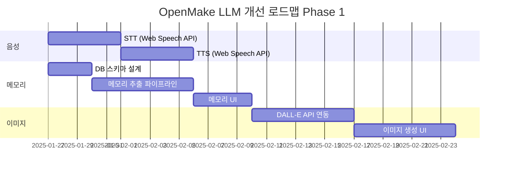

# OpenMake LLM 경쟁력 분석 및 개선 제안 보고서

> **작성일**: 2025년 1월 25일  
> **분석 대상**: ChatGPT (OpenAI), Claude (Anthropic), Gemini (Google), 기타 주요 AI 서비스  
> **목적**: OpenMake LLM의 시장 경쟁력 강화를 위한 기능 갭 분석 및 로드맵 제안

---

## 1. 경쟁사 주요 기능 현황 (2025년 기준)

### 1.1 ChatGPT (OpenAI) - GPT-5.2

| 기능 | 상세 |
|------|------|
| **모델** | GPT-5.2 (최신), GPT-4o (무료) |
| **컨텍스트 윈도우** | 400K 토큰 |
| **음성 모드** | Advanced Voice Mode (실시간 음성 대화, 9가지 음성) |
| **이미지 생성** | DALL-E 3 통합 |
| **Deep Research** | 다단계 웹 리서치 + 인용 출처 제공 |
| **Canvas** | 문서/코드 협업 편집 도구 |
| **Codex Agent** | 코드베이스 분석 및 자동 디버깅 |
| **Memory** | 세션 간 사용자 정보 기억 |
| **MCP 서버** | 원격 MCP 서버 연결 지원 |
| **커넥터** | Google Workspace, Dropbox, SharePoint, GitHub 연동 |
| **Custom GPTs** | 사용자 정의 AI 에이전트 생성 |
| **요금** | Free / Plus ($20) / Pro ($200) |

### 1.2 Claude (Anthropic) - Claude 4 Opus

| 기능 | 상세 |
|------|------|
| **모델** | Claude 4 Opus/Sonnet |
| **컨텍스트 윈도우** | 200K (기본), 1M (베타) |
| **Extended Thinking** | 복잡한 다단계 추론 모드 |
| **Artifacts** | 코드 실행 샌드박스 |
| **Projects** | 프로젝트별 지식 베이스 관리 |
| **Memory** | 세션 간 대화 기억 (Enterprise) |
| **코딩 성능** | SWE-bench 80.9% (업계 최고) |
| **자율 실행** | 30시간+ 자율 작업 수행 |
| **MCP 지원** | MCP 클라이언트/서버 네이티브 지원 |
| **보안** | 사용자 데이터로 학습 안 함 |
| **요금** | Free / Pro ($20) / Team ($30) / Enterprise |

### 1.3 Gemini (Google) - Gemini 3 Pro

| 기능 | 상세 |
|------|------|
| **모델** | Gemini 3 Pro, Gemini 3 Deep Think |
| **컨텍스트 윈도우** | 1M 토큰 |
| **멀티모달** | 텍스트, 이미지, 비디오, 오디오 통합 분석 |
| **이미지 생성** | Imagen 3 통합 |
| **실시간 웹** | Google 검색 네이티브 통합 |
| **Google Workspace** | Docs, Sheets, Gmail, Drive 직접 연동 |
| **Deep Think** | 복잡한 문제에 대한 심층 추론 |
| **Gemini Code Assist** | IDE 통합 코드 어시스턴트 |
| **NotebookLM** | 문서 기반 AI 노트북 |
| **요금** | Free / Advanced ($20) / Enterprise |

---

## 2. OpenMake LLM 현재 기능 현황

### 2.1 보유 기능 ✅

| 카테고리 | 기능 | 구현 상태 |
|----------|------|----------|
| **채팅** | 실시간 스트리밍 응답 | ✅ 완료 |
| **채팅** | 대화 히스토리 관리 | ✅ 완료 |
| **채팅** | 세션별 메모리 (최대 20턴) | ✅ 완료 |
| **에이전트** | 96개 산업별 전문 에이전트 | ✅ 완료 |
| **에이전트** | LLM 기반 의도 라우팅 | ✅ 완료 |
| **에이전트** | 멀티 에이전트 토론 모드 | ✅ 완료 |
| **에이전트** | 커스텀 에이전트 빌더 | ✅ 완료 |
| **문서** | PDF 텍스트 추출 | ✅ 완료 |
| **문서** | OCR 폴백 (Tesseract) | ✅ 완료 |
| **문서** | 이미지 업로드 및 분석 | ✅ 완료 |
| **웹 검색** | Google/DuckDuckGo/Firecrawl | ✅ 완료 |
| **웹 검색** | Ollama Web Search API | ✅ 완료 |
| **MCP** | 파일 읽기/쓰기 | ✅ 완료 |
| **MCP** | 셸 명령어 실행 | ✅ 완료 |
| **MCP** | 코드 검색 | ✅ 완료 |
| **MCP** | Vision OCR | ✅ 완료 |
| **인증** | JWT 토큰 인증 | ✅ 완료 |
| **인증** | OAuth (Google/GitHub) | ✅ 완료 |
| **인프라** | 클러스터 로드 밸런싱 | ✅ 완료 |
| **인프라** | API 키 로테이션 | ✅ 완료 |
| **인프라** | 사용량 추적 | ✅ 완료 |
| **UI** | PWA 지원 | ✅ 완료 |
| **UI** | 다크/라이트 테마 | ✅ 완료 |
| **UI** | 모바일 반응형 | ✅ 완료 |
| **추론** | Thinking 모드 (심층 추론) | ✅ 완료 |
| **추론** | Sequential Thinking | ✅ 완료 |

### 2.2 미구현/부족 기능 ❌

| 카테고리 | 기능 | 경쟁사 현황 |
|----------|------|------------|
| **음성** | 실시간 음성 입력 | ChatGPT, Gemini |
| **음성** | 음성 출력 (TTS) | ChatGPT |
| **이미지** | 이미지 생성 | ChatGPT (DALL-E), Gemini (Imagen) |
| **비디오** | 비디오 분석 | Gemini |
| **협업** | Canvas/Artifacts | ChatGPT, Claude |
| **리서치** | Deep Research (다단계) | ChatGPT |
| **메모리** | 세션 간 장기 기억 | ChatGPT, Claude |
| **프로젝트** | 프로젝트별 지식 베이스 | Claude Projects |
| **통합** | Google Workspace 연동 | Gemini, ChatGPT |
| **통합** | Microsoft 365 연동 | ChatGPT |
| **커스텀** | Custom GPTs 마켓플레이스 | ChatGPT |
| **코드** | 코드 실행 샌드박스 | Claude Artifacts |
| **엔터프라이즈** | SAML SSO | ChatGPT, Claude |
| **엔터프라이즈** | 감사 로그 | ChatGPT, Claude |
| **모바일** | 네이티브 앱 | ChatGPT, Claude, Gemini |

---

## 3. 갭 분석 및 우선순위

### 3.1 Critical Gap (시급) 🔴

경쟁력에 직접적인 영향을 미치는 핵심 기능 부재

| 순위 | 기능 | 영향도 | 구현 난이도 | 권장 일정 |
|------|------|--------|------------|----------|
| 1 | **세션 간 장기 메모리** | 매우 높음 | 중간 | 2주 |
| 2 | **음성 입력 (STT)** | 높음 | 낮음 | 1주 |
| 3 | **음성 출력 (TTS)** | 높음 | 낮음 | 1주 |
| 4 | **이미지 생성** | 높음 | 중간 | 2주 |
| 5 | **코드 실행 샌드박스** | 높음 | 높음 | 3주 |

### 3.2 High Priority Gap 🟠

사용자 경험과 활용도를 크게 향상시키는 기능

| 순위 | 기능 | 영향도 | 구현 난이도 | 권장 일정 |
|------|------|--------|------------|----------|
| 6 | **Deep Research 모드** | 높음 | 중간 | 2주 |
| 7 | **Canvas (협업 편집)** | 중간 | 높음 | 4주 |
| 8 | **프로젝트 지식 베이스** | 중간 | 중간 | 3주 |
| 9 | **Google Drive 연동** | 중간 | 중간 | 2주 |
| 10 | **비디오 분석** | 중간 | 높음 | 4주 |

### 3.3 Medium Priority Gap 🟡

차별화 및 확장성을 위한 기능

| 순위 | 기능 | 영향도 | 구현 난이도 | 권장 일정 |
|------|------|--------|------------|----------|
| 11 | **Custom Agent 마켓플레이스** | 중간 | 높음 | 6주 |
| 12 | **플러그인/확장 시스템** | 중간 | 높음 | 6주 |
| 13 | **네이티브 모바일 앱** | 중간 | 높음 | 8주 |
| 14 | **Slack/Teams 통합** | 낮음 | 중간 | 3주 |
| 15 | **SAML SSO** | 낮음 | 중간 | 2주 |

---

## 4. 상세 구현 제안

### 4.1 🔴 세션 간 장기 메모리 (최우선)

**현재 상태**: 세션 내 20턴 메모리만 유지

**목표**: 사용자별 장기 기억 저장 및 활용

**구현 방안**:
```
1. 메모리 데이터 모델 설계
   - user_memories 테이블: user_id, key, value, category, created_at, updated_at
   - 카테고리: preferences, facts, projects, relationships

2. 메모리 추출 파이프라인
   - 대화 종료 시 LLM으로 중요 정보 추출
   - 자동 분류 및 저장

3. 메모리 주입
   - 채팅 시작 시 관련 메모리 조회
   - 시스템 프롬프트에 컨텍스트로 주입

4. 메모리 관리 UI
   - 저장된 메모리 조회/수정/삭제 기능
```

**예상 작업량**: 2주 (1명 기준)

---

### 4.2 🔴 음성 기능 (STT/TTS)

**현재 상태**: 텍스트 입력만 지원

**목표**: 실시간 음성 대화 지원

**구현 방안**:
```
Option A: Web Speech API 활용 (빠른 구현)
- 브라우저 네이티브 STT/TTS
- 추가 비용 없음
- 한국어 지원 양호

Option B: 외부 API 활용 (고품질)
- STT: Google Cloud Speech-to-Text, Whisper API
- TTS: Google Cloud TTS, ElevenLabs, OpenAI TTS
- 더 자연스러운 음성

권장: Option A로 MVP 구현 후 Option B로 업그레이드
```

**프론트엔드 변경**:
```javascript
// 음성 입력 버튼 추가
<button id="voiceInputBtn" onclick="toggleVoiceInput()">🎤</button>

// Web Speech API 활용
const recognition = new webkitSpeechRecognition();
recognition.lang = 'ko-KR';
recognition.onresult = (event) => {
    const transcript = event.results[0][0].transcript;
    document.getElementById('chatInput').value = transcript;
};
```

**예상 작업량**: 1주

---

### 4.3 🔴 이미지 생성

**현재 상태**: 이미지 분석만 지원

**목표**: 텍스트 → 이미지 생성 기능

**구현 방안**:
```
Option A: 외부 API 연동
- DALL-E 3 API (OpenAI)
- Stable Diffusion API (Stability AI)
- Midjourney API (비공식)

Option B: 로컬 모델 (Ollama + Stable Diffusion)
- ComfyUI 또는 Automatic1111 연동
- 비용 절감, 프라이버시 보장

권장: Option A (DALL-E 3)로 시작 → 비용 고려 시 Option B 전환
```

**백엔드 추가**:
```typescript
// backend/api/src/services/ImageGenerationService.ts
export class ImageGenerationService {
    async generate(prompt: string, options: ImageOptions): Promise<string> {
        const response = await openai.images.generate({
            model: "dall-e-3",
            prompt: prompt,
            n: 1,
            size: options.size || "1024x1024",
        });
        return response.data[0].url;
    }
}
```

**예상 작업량**: 2주

---

### 4.4 🔴 코드 실행 샌드박스

**현재 상태**: 코드 생성만 가능

**목표**: 안전한 환경에서 코드 실행 및 결과 반환

**구현 방안**:
```
Option A: Docker 기반 샌드박스
- 격리된 컨테이너에서 코드 실행
- Python, Node.js, Go 등 다중 언어 지원
- 리소스 제한 (CPU, 메모리, 시간)

Option B: WebContainer (Stackblitz)
- 브라우저 내 Node.js 런타임
- 프론트엔드만으로 구현 가능
- 백엔드 부하 없음

Option C: E2B (Code Interpreter SDK)
- 클라우드 기반 샌드박스 서비스
- 빠른 구현, 관리 불필요
- 사용량 기반 과금
```

**권장**: E2B로 MVP → Docker 기반으로 자체 구축

**예상 작업량**: 3주

---

### 4.5 🟠 Deep Research 모드

**현재 상태**: 단순 웹 검색

**목표**: 다단계 리서치 + 인용 + 종합 보고서

**구현 방안**:
```typescript
// backend/api/src/services/DeepResearchService.ts
export class DeepResearchService {
    async research(topic: string, depth: 'quick' | 'standard' | 'deep'): Promise<ResearchResult> {
        // 1단계: 주제 분해
        const subTopics = await this.decomposeTopics(topic);
        
        // 2단계: 병렬 검색
        const searchResults = await Promise.all(
            subTopics.map(t => this.searchWithSources(t))
        );
        
        // 3단계: 콘텐츠 스크래핑
        const contents = await this.scrapeContents(searchResults);
        
        // 4단계: 분석 및 종합
        const analysis = await this.synthesize(contents, topic);
        
        // 5단계: 보고서 생성
        return this.generateReport(analysis);
    }
}
```

**예상 작업량**: 2주

---

## 5. 추천 로드맵

### Phase 1: 핵심 갭 해소 (1-2개월)



### Phase 2: 사용자 경험 강화 (2-3개월)

- Deep Research 모드
- 코드 실행 샌드박스
- Canvas 협업 도구
- 프로젝트 지식 베이스

### Phase 3: 생태계 확장 (3-6개월)

- Custom Agent 마켓플레이스
- 외부 서비스 통합 (Google, Microsoft)
- 네이티브 모바일 앱
- 엔터프라이즈 기능 (SSO, 감사 로그)

---

## 6. 경쟁 우위 전략

### 6.1 OpenMake LLM만의 차별점 강화

현재 보유한 강점을 더욱 강화:

| 강점 | 강화 방안 |
|------|----------|
| **96개 산업별 에이전트** | 에이전트 품질 향상 + 사용자 피드백 반영 |
| **멀티 에이전트 토론** | 토론 결과 시각화 + 합의점/분쟁점 명확화 |
| **온프레미스 지원** | 보안이 중요한 기업 타겟 마케팅 |
| **MCP 통합** | MCP 서버 마켓플레이스 구축 |

### 6.2 틈새 시장 공략

대형 경쟁사가 취약한 영역:

1. **한국어 특화**: 한국 법률, 세무, 의료 등 로컬 전문성
2. **중소기업 맞춤**: 합리적 가격 + 쉬운 온프레미스 설치
3. **프라이버시**: 데이터가 외부로 나가지 않는 완전 로컬 옵션
4. **커스터마이징**: 기업별 맞춤 에이전트 구축 서비스

---

## 7. 결론 및 권장 사항

### 즉시 실행 (1주 내)
1. ✅ 음성 입력/출력 기능 추가 (Web Speech API)
2. ✅ 장기 메모리 DB 스키마 설계

### 단기 실행 (1개월 내)
3. 이미지 생성 API 연동 (DALL-E 3)
4. 장기 메모리 시스템 구현
5. Deep Research 모드 MVP

### 중기 실행 (3개월 내)
6. 코드 실행 샌드박스
7. Canvas 협업 도구
8. Google Drive 연동

### 장기 실행 (6개월 내)
9. 네이티브 모바일 앱
10. Custom Agent 마켓플레이스
11. 엔터프라이즈 기능

---

## 부록: 경쟁사 가격 비교

| 서비스 | Free | Standard | Pro/Enterprise |
|--------|------|----------|----------------|
| **ChatGPT** | 제한적 GPT-4o | $20/월 (Plus) | $200/월 (Pro) |
| **Claude** | Claude 3.5 Sonnet | $20/월 (Pro) | 문의 (Enterprise) |
| **Gemini** | Gemini 1.5 | $20/월 (Advanced) | 문의 (Enterprise) |
| **OpenMake** | ??? | ??? | ??? |

**권장 가격 전략**:
- Free: 일 10회 제한
- Standard: $10-15/월 (경쟁사 대비 저렴)
- Enterprise: 사용량 기반 또는 고정 요금

---

*본 보고서는 2025년 1월 기준 웹 검색 결과를 바탕으로 작성되었습니다.*
