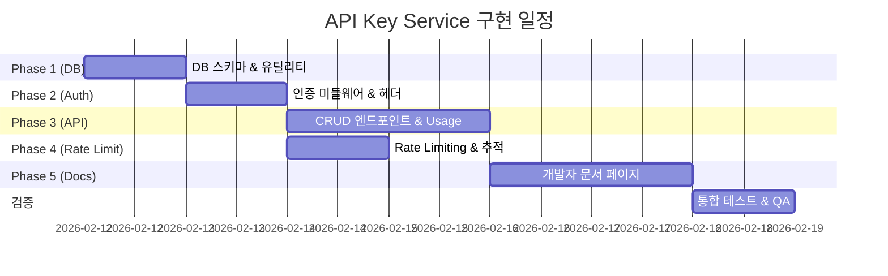

# OpenMake.Ai — 외부 사용자 API Key 서비스 고도화 계획

> **문서 버전**: v2.0  
> **작성일**: 2026-02-11  
> **최종 수정**: 2026-02-11 (§9 파이프라인 기반 모델 추상화 전면 재설계)  
> **상태**: 📋 검토 완료 / 구현 대기  
> **참조**: [Anthropic Claude API](https://platform.claude.com/docs/ko/api/overview) · [OpenAI API](https://platform.openai.com/docs/api-reference) · [Google Gemini API](https://ai.google.dev/gemini-api/docs/api-key)

---

## 목차

1. [[#1. 개요|개요]]
2. [[#2. 참조 서비스 분석|참조 서비스 분석 (Claude · OpenAI · Gemini)]]
3. [[#3. Phase 1-4 수정사항|Phase 1-4 수정사항]]
4. [[#4. 수정된 구현 계획|수정된 구현 계획]]
5. [[#5. API Documentation 페이지 설계|API Documentation 페이지 설계]]
6. [[#6. API 레퍼런스 (엔드포인트 명세)|API 레퍼런스]]
7. [[#7. 보안 체크리스트|보안 체크리스트]]
8. [[#8. 마일스톤 및 일정|마일스톤 및 일정]]
9. [[#9. 파이프라인 기반 모델 추상화 (Profile-driven Orchestration)|파이프라인 기반 모델 추상화]]

---

## 1. 개요

### 1.1 목표
OpenMake.Ai 플랫폼의 AI 기능(채팅, 에이전트, 문서 분석 등)을 **외부 개발자가 프로그래밍 방식으로** 사용할 수 있도록 API Key 기반 인증 서비스를 추가한다.

### 1.2 범위
- API Key 생성 · 관리 · 폐기 시스템
- Key 기반 인증 미들웨어
- 사용량 추적 · Rate Limiting · 과금 기반
- 개발자 문서 (Docs) 웹페이지
- 관리자 대시보드 연동

### 1.3 현재 상태
| 항목 | 상태 |
|------|------|
| JWT 인증 시스템 | ✅ 구축 완료 |
| OAuth (Google/GitHub) | ✅ 구축 완료 |
| Role/Tier 시스템 | ✅ 구축 완료 (admin/user/guest · free/pro/enterprise) |
| `api_usage` 테이블 | ✅ 존재 (`api_key_id` 컬럼 포함) |
| `audit_logs` 테이블 | ✅ 존재 |
| API 버전 관리 (`/api/v1`) | ✅ 구축 완료 |
| Swagger API 문서 | ✅ 기본 구축 |
| **사용자 API Key 테이블** | ❌ 없음 |
| **Key 기반 인증 미들웨어** | ❌ 없음 |
| **개발자 문서 페이지** | ❌ 없음 |

---

## 2. 참조 서비스 분석

### 2.1 인증 헤더 비교

| 서비스 | 인증 방식 | 헤더 |
|--------|----------|------|
| **Anthropic Claude** | 커스텀 헤더 | `x-api-key: sk-ant-...` |
| **OpenAI** | Bearer 토큰 | `Authorization: Bearer sk-...` |
| **Google Gemini** | 쿼리 파라미터 / 헤더 | `?key=AIza...` 또는 `x-goog-api-key` |

> **결정**: OpenMake는 **3가지 모두** 지원한다.
> 1. `X-API-Key: omk_live_...` (Claude 방식 — 권장)
> 2. `Authorization: Bearer omk_live_...` (OpenAI 방식 — 호환)
> 3. `?api_key=omk_live_...` (Gemini 방식 — 간편 테스트용, GET 전용)

### 2.2 API 버전 관리 비교

| 서비스 | 버전 관리 방식 |
|--------|---------------|
| **Claude** | 필수 헤더 `anthropic-version: 2023-06-01` |
| **OpenAI** | URL 경로 (`/v1/`) + 모델명으로 버전 관리 |
| **Gemini** | URL 경로 (`/v1beta/`) |

> **결정**: URL 경로 방식 유지 (`/api/v1/`), 선택적 `x-omk-version` 헤더 추가

### 2.3 Rate Limit 응답 헤더 비교

| 서비스 | 응답 헤더 |
|--------|----------|
| **Claude** | `anthropic-ratelimit-requests-limit`, `requests-remaining`, `requests-reset`, `tokens-limit`, `tokens-remaining`, `tokens-reset`, `retry-after` |
| **OpenAI** | `x-ratelimit-limit-requests`, `x-ratelimit-remaining-requests`, `x-ratelimit-reset-requests`, `x-ratelimit-limit-tokens`, `x-ratelimit-remaining-tokens` |

> **결정**: OpenAI 스타일 채택 (더 표준적)
> ```
> x-ratelimit-limit-requests: 60
> x-ratelimit-remaining-requests: 55
> x-ratelimit-reset-requests: 45s
> x-ratelimit-limit-tokens: 100000
> x-ratelimit-remaining-tokens: 98500
> ```

### 2.4 응답 구조 비교

| 서비스 | 응답에 포함되는 메타데이터 |
|--------|------------------------|
| **Claude** | `id`, `model`, `usage: {input_tokens, output_tokens}`, `stop_reason` |
| **OpenAI** | `id`, `model`, `usage: {prompt_tokens, completion_tokens, total_tokens}`, `finish_reason` |
| **Gemini** | `candidates[]`, `usageMetadata: {promptTokenCount, candidatesTokenCount}` |

> **결정**: OpenAI 호환 구조 채택 (업계 표준) + **모델 추상화 적용** ([[#9. 모델 추상화 전략 (Model Abstraction)|§9 참조]])
> ```json
> {
>   "id": "msg_abc123",
>   "model": "openmake_llm",          // ← 브랜드 별칭 노출 (실제 엔진명 미노출)
>   "usage": {
>     "prompt_tokens": 25,
>     "completion_tokens": 150,
>     "total_tokens": 175
>   },
>   "choices": [{
>     "message": { "role": "assistant", "content": "..." },
>     "finish_reason": "stop"
>   }]
> }
> ```

### 2.5 문서 구조 비교

| 섹션 | Claude | OpenAI | Gemini | **OpenMake (계획)** |
|------|--------|--------|--------|-------------------|
| Quick Start | ✅ | ✅ | ✅ | ✅ |
| 인증 가이드 | ✅ | ✅ | ✅ | ✅ |
| API 레퍼런스 | ✅ | ✅ | ✅ | ✅ |
| 코드 예제 (curl/Python/TS) | ✅ | ✅ | ✅ | ✅ |
| Rate Limits 설명 | ✅ | ✅ | ✅ | ✅ |
| 에러 코드 | ✅ | ✅ | ✅ | ✅ |
| SDK 제공 | ✅ | ✅ | ✅ | 🔜 (v2) |
| 프로덕션 가이드 | ✅ | ✅ | — | ✅ |
| Playground/Console | ✅ | ✅ | ✅ | ✅ (기존 채팅 UI) |

---

## 3. Phase 1-4 수정사항

참조 서비스 분석 결과, 기존 Phase 1-4 계획에서 다음 항목들을 **추가/수정** 해야 한다.

### 3.1 Phase 1 수정 (DB & 인프라)

| 항목 | 기존 계획 | 수정 내용 | 근거 |
|------|----------|----------|------|
| 인증 헤더 | `X-API-Key` + `Bearer` | **`?api_key=` 쿼리 파라미터 추가** | Gemini 방식 — 브라우저 테스트 편의성 |
| Key 메타데이터 | `name`, `scopes` | **`description`, `allowed_models` 추가** | OpenAI의 키별 모델 접근 제어 |
| 응답 포맷 | 기존 자체 포맷 | **OpenAI 호환 응답 구조 옵션** | 업계 표준 호환성 (LangChain 등) |

**수정된 DB 스키마:**
```sql
CREATE TABLE IF NOT EXISTS user_api_keys (
    id TEXT PRIMARY KEY,
    user_id TEXT NOT NULL REFERENCES users(id) ON DELETE CASCADE,
    key_hash TEXT NOT NULL UNIQUE,
    key_prefix TEXT NOT NULL,           -- 'omk_live_'
    last_4 TEXT NOT NULL,
    name TEXT NOT NULL,
    description TEXT,                    -- 🆕 키 설명 (Claude Console 참고)
    scopes JSONB DEFAULT '["*"]',
    allowed_models JSONB DEFAULT '["*"]', -- 🆕 허용 모델 목록 — 브랜드 별칭 사용 (§9 참조)
    -- 예: ["openmake_llm", "openmake_llm_pro"] 또는 ["*"] (전체 허용)
    rate_limit_tier TEXT DEFAULT 'standard',
    is_active BOOLEAN DEFAULT TRUE,
    last_used_at TIMESTAMPTZ,
    expires_at TIMESTAMPTZ,
    created_at TIMESTAMPTZ DEFAULT NOW(),
    -- 🆕 사용 통계 (빠른 조회용 비정규화)
    total_requests INTEGER DEFAULT 0,
    total_tokens INTEGER DEFAULT 0
);
```

### 3.2 Phase 2 수정 (인증 통합)

| 항목 | 기존 계획 | 수정 내용 | 근거 |
|------|----------|----------|------|
| Rate Limit 헤더 | 없음 | **모든 응답에 Rate Limit 헤더 포함** | Claude/OpenAI 공통 패턴 |
| Request ID | 없음 | **모든 응답에 `x-request-id` 헤더** | Claude/OpenAI 공통 패턴 |
| Usage 응답 | 없음 | **API 응답 body에 `usage` 필드 포함** | 과금 투명성 (3사 공통) |
| 쿼리 파라미터 인증 | 없음 | **GET 요청에 `?api_key=` 지원** | Gemini 간편 인증 |

**추가 미들웨어:**
```
api-key-auth.ts      — API Key 인증 (3가지 방식)
rate-limit-headers.ts — Rate Limit 응답 헤더 주입
request-id.ts         — x-request-id 생성/주입
```

### 3.3 Phase 3 수정 (CRUD API)

| 항목 | 기존 계획 | 수정 내용 | 근거 |
|------|----------|----------|------|
| 키 생성 응답 | raw key 반환 | **+ 간단 사용 예제 코드 포함** | Claude Console UX |
| 키 목록 조회 | 마스킹된 키 | **+ 사용 통계 요약 포함** | OpenAI Dashboard |
| 사용량 API | 없음 | **`GET /api/v1/usage` 추가** | 3사 공통 — 과금 투명성 |

**추가 엔드포인트:**
```
GET  /api/v1/usage                 — 전체 사용량 통계
GET  /api/v1/usage/daily           — 일별 사용량
GET  /api/v1/api-keys/:id/usage    — 특정 키 사용량
```

### 3.4 Phase 4 수정 (Rate Limiting)

| 항목 | 기존 계획 | 수정 내용 | 근거 |
|------|----------|----------|------|
| 제한 기준 | RPM만 | **RPM + TPM (토큰/분) 이중 제한** | Claude/OpenAI 공통 |
| Tier 승급 | 수동 | **사용량 기반 자동 승급 경로** | Claude 자동 Tier 승급 |
| 429 응답 | 기본 메시지 | **`retry-after` 헤더 + 상세 에러 바디** | 3사 공통 |

**수정된 Tier 구조:**

| Tier | RPM | TPM | 일일 한도 | 월간 한도 | 자동 승급 조건 |
|------|-----|-----|---------|---------|-------------|
| **Tier 0 (Free)** | 10 | 10,000 | 100 req | 1,000 req | — |
| **Tier 1 (Starter)** | 30 | 50,000 | 500 req | 10,000 req | 첫 결제 후 |
| **Tier 2 (Standard)** | 60 | 100,000 | 3,000 req | 100,000 req | 누적 $10 사용 |
| **Tier 3 (Enterprise)** | 300 | 1,000,000 | 무제한 | 무제한 | 수동 승급 |

### 3.5 Phase 5 추가 (API Documentation 페이지)

> **신규 Phase** — 참조 서비스 분석 결과 필수로 판단됨

외부 개발자를 위한 API 문서 웹페이지를 추가한다. 기존 SPA 구조에 `/docs` 또는 `/api-docs` 경로로 마운트.

---

## 4. 수정된 구현 계획

### Phase 1: 데이터베이스 & 핵심 인프라 (3~4h)

#### 신규 파일
| 파일 | 설명 |
|------|------|
| `services/database/init/004-user-api-keys.sql` | API Key 테이블 + 인덱스 마이그레이션 |
| `backend/api/src/auth/api-key-utils.ts` | 키 생성(`omk_live_*`) + HMAC-SHA-256 해싱 |

#### 수정 파일
| 파일 | 변경 내용 |
|------|----------|
| `backend/api/src/config/env.ts` | `apiKeyPepper: string` 환경변수 추가 |
| `backend/api/src/data/models/unified-database.ts` | `user_api_keys` 스키마를 `SCHEMA` 상수에 추가 |

#### 핵심 함수
```typescript
// api-key-utils.ts
function generateApiKey(): { rawKey: string; hash: string; prefix: string; last4: string }
function hashApiKey(rawKey: string): string  // HMAC-SHA-256 + pepper
function verifyApiKey(rawKey: string, storedHash: string): boolean
function maskApiKey(rawKey: string): string  // omk_live_****...Ab3d
```

---

### Phase 2: 인증 통합 & 미들웨어 (4~5h)

#### 신규 파일
| 파일 | 설명 |
|------|------|
| `backend/api/src/services/ApiKeyService.ts` | API Key CRUD + 검증 서비스 |
| `backend/api/src/middlewares/api-key-auth.ts` | API Key 인증 미들웨어 (3가지 방식) |
| `backend/api/src/middlewares/rate-limit-headers.ts` | Rate Limit 응답 헤더 주입 |
| `backend/api/src/middlewares/request-id.ts` | `x-request-id` 생성/주입 |
| `backend/api/src/auth/scope-middleware.ts` | Scope 검증 미들웨어 |

#### 수정 파일
| 파일 | 변경 내용 |
|------|----------|
| `backend/api/src/auth/middleware.ts` | `requireAuth`에 API Key 감지 로직 추가 |
| `backend/api/src/types/express.d.ts` | `req.authMethod`, `req.apiKeyId`, `req.requestId` 추가 |

#### 인증 흐름 (수정 버전)
```
Request 수신
    │
    ├─ X-API-Key 헤더?          → API Key 인증
    ├─ Authorization: Bearer omk_*? → API Key 인증
    ├─ ?api_key= 쿼리 (GET only)?  → API Key 인증  🆕
    ├─ Authorization: Bearer (JWT)?  → JWT 인증
    └─ auth_token 쿠키?           → JWT 인증
    │
    ▼
x-request-id 생성 & 주입
    │
    ▼
Scope 검증 (API Key인 경우)
    │
    ▼
Rate Limit 체크 + 헤더 주입
    │
    ▼
Route Handler 실행
    │
    ▼
응답에 usage, x-request-id, rate-limit 헤더 포함
```

---

### Phase 3: API 엔드포인트 — Key CRUD + Usage (4~5h)

#### 신규 파일
| 파일 | 설명 |
|------|------|
| `backend/api/src/routes/api-keys.routes.ts` | API Key CRUD 라우터 |

#### 수정 파일
| 파일 | 변경 내용 |
|------|----------|
| `backend/api/src/routes/v1/index.ts` | `v1Router.use('/api-keys', apiKeysRouter)` 마운트 |
| `backend/api/src/server.ts` | 레거시 호환 마운트 |
| `backend/api/src/swagger.ts` | API Key 관련 스펙 추가 |

#### 엔드포인트 명세

##### Key 관리
```
POST   /api/v1/api-keys              — 새 키 생성
GET    /api/v1/api-keys              — 내 키 목록 (마스킹)
GET    /api/v1/api-keys/:id          — 특정 키 상세 정보
PATCH  /api/v1/api-keys/:id          — 키 정보 수정 (이름, 설명, scopes)
DELETE /api/v1/api-keys/:id          — 키 폐기 (soft delete)
POST   /api/v1/api-keys/:id/rotate   — 키 교체 (원자적)
```

##### 사용량 조회 (🆕)
```
GET    /api/v1/usage                 — 전체 사용량 요약
GET    /api/v1/usage/daily           — 일별 사용량
GET    /api/v1/api-keys/:id/usage    — 특정 키 사용량
```

#### 키 생성 응답 (수정)
```json
{
  "id": "key_abc123",
  "name": "My Production App",
  "key": "omk_live_7A9x...4f8a",       // ← 이 값은 다시 볼 수 없습니다
  "key_preview": "omk_live_****...4f8a",
  "created_at": "2026-02-11T07:00:00Z",
  "scopes": ["*"],
  "allowed_models": ["*"],
  "rate_limit_tier": "standard",
  "quick_start": {                       // 🆕 Claude Console 참고
    "curl": "curl https://api.openmake.ai/v1/chat -H 'X-API-Key: omk_live_7A9x...4f8a' -H 'Content-Type: application/json' -d '{\"message\": \"Hello\"}'"
  }
}
```

---

### Phase 4: Rate Limiting & 사용량 추적 (4~5h)

#### 신규 파일
| 파일 | 설명 |
|------|------|
| `backend/api/src/middlewares/api-key-limiter.ts` | Key별 RPM + TPM 이중 Rate Limiter |

#### 수정 파일
| 파일 | 변경 내용 |
|------|----------|
| `backend/api/src/ollama/api-usage-tracker.ts` | 외부 API Key 사용량 기록 확장 |
| `backend/api/src/config/constants.ts` | Tier별 Rate Limit 상수 정의 |

#### 429 에러 응답 (🆕 수정)
```json
{
  "error": {
    "type": "rate_limit_error",
    "message": "요청 한도를 초과했습니다. 45초 후 다시 시도하세요.",
    "tier": "standard",
    "limits": {
      "requests_per_minute": 60,
      "tokens_per_minute": 100000
    }
  }
}
```
**헤더:**
```
Retry-After: 45
x-ratelimit-limit-requests: 60
x-ratelimit-remaining-requests: 0
x-ratelimit-reset-requests: 2026-02-11T07:01:00Z
```

---

### Phase 5: API Documentation 페이지 (🆕 신규)

> 참조 서비스 3사의 문서 구조를 기반으로 OpenMake 전용 개발자 문서 웹페이지를 구축한다.

#### 5.1 구현 방식

기존 프론트엔드 SPA 구조(`frontend/web/public/`)에 **`/developer` 경로로 개발자 문서 페이지**를 추가한다.

| 파일 | 설명 |
|------|------|
| `frontend/web/public/js/modules/pages/developer.js` | 개발자 문서 SPA 모듈 |
| `backend/api/src/routes/developer-docs.routes.ts` | 문서 API (마크다운 → HTML 변환) |

#### 5.2 문서 페이지 구조

```
/developer
├── #getting-started     — 빠른 시작 가이드
├── #authentication      — 인증 방법 (API Key 발급 & 사용)
├── #api-reference       — 엔드포인트 레퍼런스
│   ├── Chat API
│   ├── Agents API
│   ├── Documents API
│   └── Usage API
├── #rate-limits         — 사용 등급 & 제한
├── #errors              — 에러 코드 & 처리
├── #examples            — 코드 예제 (curl, Python, TypeScript)
└── #best-practices      — 프로덕션 가이드
```

#### 5.3 주요 섹션 콘텐츠

##### Getting Started (빠른 시작)

> Claude의 "시작하기" 페이지 패턴 참고

```markdown
## 빠른 시작

### 1. API Key 발급
OpenMake 대시보드 → 설정 → API Keys에서 새 키를 생성하세요.

### 2. 첫 번째 API 호출

#### cURL
curl https://api.openmake.ai/v1/chat \
  -H "X-API-Key: omk_live_your_key_here" \
  -H "Content-Type: application/json" \
  -d '{
    "message": "안녕하세요, OpenMake!",
    "model": "openmake_llm"
  }'

#### Python
import requests

response = requests.post(
    "https://your-server.com/api/v1/chat",
    headers={"X-API-Key": "omk_live_your_key_here"},
    json={"message": "안녕하세요, OpenMake!"}
)
print(response.json())

#### TypeScript
const response = await fetch("https://your-server.com/api/v1/chat", {
  method: "POST",
  headers: {
    "X-API-Key": "omk_live_your_key_here",
    "Content-Type": "application/json",
  },
  body: JSON.stringify({ message: "안녕하세요, OpenMake!" }),
});
const data = await response.json();
```

##### Authentication (인증)

```markdown
## 인증

모든 API 요청에는 API Key가 필요합니다.

### 인증 방법 (3가지)

| 방법 | 사용 예시 | 권장 |
|------|----------|------|
| X-API-Key 헤더 | `X-API-Key: omk_live_...` | ✅ 권장 |
| Bearer 토큰 | `Authorization: Bearer omk_live_...` | ✅ 호환 |
| 쿼리 파라미터 | `?api_key=omk_live_...` | ⚠️ GET 전용 |

### 보안 권장사항
- API Key는 **절대 클라이언트 사이드(브라우저)에 노출하지 마세요**
- 환경 변수로 관리하세요: `export OMK_API_KEY='omk_live_...'`
- 키가 유출되면 즉시 대시보드에서 폐기하고 새 키를 발급하세요
```

##### Error Codes (에러 코드)

| HTTP 코드 | 타입 | 설명 |
|-----------|------|------|
| `400` | `invalid_request_error` | 잘못된 요청 파라미터 |
| `401` | `authentication_error` | 유효하지 않은 API Key |
| `403` | `permission_error` | 권한 부족 (scope 미달) |
| `404` | `not_found_error` | 리소스를 찾을 수 없음 |
| `429` | `rate_limit_error` | 요청 한도 초과 |
| `500` | `internal_error` | 서버 내부 오류 |
| `503` | `overloaded_error` | 서버 과부하 |

```json
{
  "error": {
    "type": "authentication_error",
    "message": "유효하지 않은 API Key입니다.",
    "code": "invalid_api_key"
  }
}
```

---

## 6. API 레퍼런스 (엔드포인트 명세)

### 6.1 Chat API

#### `POST /api/v1/chat`

AI에게 메시지를 전송하고 응답을 받습니다.

**요청:**
```json
{
  "message": "서울의 날씨를 알려주세요",
  "model": "openmake_llm",             // ← 브랜드 별칭 사용 (§9 참조)
  "session_id": "sess_abc123",
  "options": {
    "temperature": 0.7,
    "max_tokens": 2048,
    "stream": false
  }
}
```

**응답:**
```json
{
  "id": "msg_abc123",
  "model": "openmake_llm",             // ← 브랜드 별칭 반환 (실제 엔진명 미노출)
  "message": {
    "role": "assistant",
    "content": "서울의 현재 날씨는..."
  },
  "usage": {
    "prompt_tokens": 15,
    "completion_tokens": 120,
    "total_tokens": 135
  },
  "finish_reason": "stop",
  "session_id": "sess_abc123"
}
```

**헤더 (응답):**
```
x-request-id: req_abc123
x-ratelimit-limit-requests: 60
x-ratelimit-remaining-requests: 55
x-ratelimit-limit-tokens: 100000
x-ratelimit-remaining-tokens: 99865
```

### 6.2 Agents API

#### `GET /api/v1/agents`
사용 가능한 AI 에이전트 목록을 조회합니다.

#### `POST /api/v1/chat` (agent 지정)
```json
{
  "message": "이 코드를 리뷰해주세요",
  "agent": "reviewer"
}
```

### 6.3 Documents API

#### `POST /api/v1/documents/upload`
문서를 업로드하고 AI 분석 컨텍스트에 추가합니다.

#### `POST /api/v1/documents/analyze`
업로드된 문서에 대해 질문합니다.

### 6.4 API Keys Management

#### `POST /api/v1/api-keys`
**인증**: JWT 필수 (API Key로는 새 키를 생성할 수 없음)

```json
// 요청
{ "name": "My App", "description": "Production server", "scopes": ["chat:*", "agents:read"] }

// 응답 (201)
{
  "id": "key_abc123",
  "key": "omk_live_7A9x...4f8a",
  "key_preview": "omk_live_****...4f8a",
  "name": "My App",
  "scopes": ["chat:*", "agents:read"],
  "created_at": "2026-02-11T07:00:00Z"
}
```

### 6.5 Usage API

#### `GET /api/v1/usage`
현재 청구 기간의 사용량 요약을 반환합니다.

```json
{
  "period": { "start": "2026-02-01", "end": "2026-02-28" },
  "total_requests": 1523,
  "total_tokens": 456789,
  "by_model": {
    "openmake_llm": { "requests": 1200, "tokens": 350000 },
    "openmake_llm_pro": { "requests": 323, "tokens": 106789 }
  },
  "by_key": [
    { "key_id": "key_abc", "name": "My App", "requests": 800, "tokens": 240000 }
  ]
}
```

---

## 7. 보안 체크리스트

| # | 항목 | 상태 |
|---|------|------|
| 1 | Raw API Key는 HMAC-SHA-256 해시로만 DB 저장 | ⬜ |
| 2 | Key는 생성 응답에서 **1회만** 반환, 이후 조회 불가 | ⬜ |
| 3 | 요청 로그에서 `Authorization`, `X-API-Key` 헤더 마스킹 | ⬜ |
| 4 | `API_KEY_PEPPER`는 `JWT_SECRET`과 별도 관리 | ⬜ |
| 5 | 비활성/만료 키 → 401 반환 + `audit_logs` 기록 | ⬜ |
| 6 | 키 생성/폐기/교체 → `audit_logs` 기록 | ⬜ |
| 7 | Free tier 키 → 30일 자동 만료 강제 | ⬜ |
| 8 | 쿼리 파라미터 `?api_key=`는 GET 요청만 허용 | ⬜ |
| 9 | Rate Limit 초과 → `429` + `Retry-After` 헤더 | ⬜ |
| 10 | 모든 API 응답에 `x-request-id` 포함 | ⬜ |
| 11 | 에러 응답에 내부 스택트레이스 미노출 | ⬜ |

---

## 8. 마일스톤 및 일정



| Phase | 예상 공수 | 우선순위 | 선행 조건 |
|-------|---------|---------|----------|
| Phase 1: DB & 인프라 | 3~4h | 🔴 필수 | 없음 |
| Phase 2: 인증 통합 | 4~5h | 🔴 필수 | Phase 1 |
| Phase 3: CRUD API | 4~5h | 🔴 필수 | Phase 2 |
| Phase 4: Rate Limiting | 4~5h | 🟡 중요 | Phase 2 (Phase 3과 병렬) |
| Phase 5: Docs 페이지 | 4~6h | 🟡 중요 | Phase 3 |
| 통합 테스트 & QA | 3~4h | 🔴 필수 | Phase 3~5 |
| **합계** | **~25h (3~4일)** | | |

---

## 부록 A: 기존 계획 대비 변경 요약

| 변경 항목 | 사유 | 영향 Phase |
|----------|------|-----------|
| `?api_key=` 쿼리 인증 추가 | Gemini 방식 — 브라우저 테스트 편의 | 2 |
| `allowed_models` 컬럼 추가 | OpenAI의 키별 모델 접근 제어 | 1, 3 |
| `description` 컬럼 추가 | Claude Console의 키 설명 기능 | 1, 3 |
| Rate Limit 응답 헤더 | Claude/OpenAI 공통 패턴 | 2, 4 |
| `x-request-id` 헤더 | Claude/OpenAI 디버깅 표준 | 2 |
| `usage` 응답 필드 | 3사 공통 — 과금 투명성 | 2, 3 |
| RPM + TPM 이중 제한 | Claude/OpenAI 공통 | 4 |
| Tier 자동 승급 | Claude 패턴 | 4 |
| `429` + `Retry-After` | 3사 공통 에러 처리 | 4 |
| **Phase 5 (Docs 페이지)** 신규 | 3사 모두 개발자 문서 제공 | 5 (신규) |
| OpenAI 호환 응답 구조 옵션 | 업계 표준 호환 (LangChain 등) | 3 |

## 부록 B: 파일 변경 목록 (전체)

### 신규 파일 (10개)
```
services/database/init/004-user-api-keys.sql
backend/api/src/auth/api-key-utils.ts
backend/api/src/services/ApiKeyService.ts
backend/api/src/middlewares/api-key-auth.ts
backend/api/src/middlewares/rate-limit-headers.ts
backend/api/src/middlewares/request-id.ts
backend/api/src/auth/scope-middleware.ts
backend/api/src/routes/api-keys.routes.ts
backend/api/src/middlewares/api-key-limiter.ts
frontend/web/public/js/modules/pages/developer.js
```

### 수정 파일 (8개)
```
backend/api/src/config/env.ts
backend/api/src/data/models/unified-database.ts
backend/api/src/auth/middleware.ts
backend/api/src/types/express.d.ts
backend/api/src/routes/v1/index.ts
backend/api/src/server.ts
backend/api/src/swagger.ts
backend/api/src/config/constants.ts
```

---

## 9. 파이프라인 기반 모델 추상화 (Profile-driven Orchestration)

> **문서 버전**: v2.0 (v1.1 전면 재설계)
> **변경 사유**: v1.1의 `별칭 → 모델명` 1:1 단순 치환은 차별화 불가. 각 브랜드 모델이 **고유한 처리 파이프라인 조합**을 갖도록 재설계.
> **핵심 전환**: `Model Abstraction` → `Profile-driven Orchestration`

### 9.1 왜 파이프라인 기반인가?

#### v1.1의 한계 (단순 매핑)

```
openmake_llm      → gemini-3-flash-preview:cloud    ← 모델명만 다름, 행동은 동일
openmake_llm_pro  → gpt-oss:120b-cloud              ← 모델명만 다름, 행동은 동일
openmake_llm_fast → gemini-3-flash-preview:cloud     ← openmake_llm과 뭐가 다른지?
```

#### v2.0의 접근 (파이프라인 조합)

```
openmake_llm      → [auto prompt + 조건부 A2A + medium thinking + full context]
openmake_llm_pro  → [reasoning prompt + 항상 A2A + high thinking + 토론 모드 + 전체 도구]
openmake_llm_fast → [assistant prompt 고정 + A2A OFF + thinking OFF + lite context]
```

> **핵심**: 브랜드 차이를 "모델명"이 아니라 **"행동 정책(PipelineProfile)"**으로 정의하여 사용자 체감을 극대화한다.

| 관점 | v1.1 (단순 매핑) | v2.0 (파이프라인) |
|------|:---:|:---:|
| **차별화** | 모델명만 다름 | 프롬프트 전략 + A2A + 도구 + 사고 모드 등 10개 요소 조합이 다름 |
| **비즈니스** | 브랜드 명칭 보호만 | **기능/경험 차등 → 가격 정당화** |
| **유연성** | 엔진 교체만 가능 | 엔진 교체 + 행동 정책 전체 교체 |
| **보안** | 원천 모델명 미노출 | 원천 모델명 + 내부 오케스트레이션 로직 모두 미노출 |
| **운영** | 튜닝 포인트 없음 | profileId 단위 KPI 수집 → 주기적 파라미터 튜닝 |

---

### 9.2 파이프라인 요소 10종 (현재 코드 기반)

코드베이스 분석 결과, 현재 백엔드에 **10개의 독립적인 파이프라인 요소**가 존재한다.

| # | 파이프라인 요소 | 코드 위치 | 설정 가능 파라미터 |
|---|---------------|----------|------------------|
| 1 | **시스템 프롬프트 전략** | `chat/prompt.ts` | PromptType 12종, temperature, top_p |
| 2 | **모델 선택** | `chat/model-selector.ts` | MODEL_PRESETS 6종, 선택 전략 (auto/fixed/quality/latency) |
| 3 | **A2A 병렬 합성** | `services/ChatService.ts` | primary/secondary/synthesizer 모델, 활성화 전략 |
| 4 | **Thinking 모드** | Ollama native + `sequential-thinking.ts` | native level (off/low/medium/high), sequential prompt (off/conditional/always) |
| 5 | **에이전트 라우팅** | `agents/index.ts` + `agents/llm-router.ts` | semantic routing vs keyword fallback, 96개 산업 에이전트, AgentPhase |
| 6 | **도구 접근** | `mcp/tool-tiers.ts` | free/pro/enterprise 등급, allowList/denyList |
| 7 | **토론 모드** | `agents/discussion-engine.ts` | maxAgents, maxRounds, enableCrossReview, enableDeepThinking |
| 8 | **Deep Research** | `services/DeepResearchService.ts` | depth(quick/standard/deep), maxLoops, maxTotalSources |
| 9 | **컨텍스트 엔지니어링** | `chat/context-engineering.ts` | 4-Pillar, Soft Interlock, Epistemic Gradient, Positional Engineering |
| 10 | **Agent Loop** | `ollama/agent-loop.ts` | maxIterations, 도구 호출 턴 수 |

---

### 9.3 `PipelineProfile` 인터페이스 설계

```typescript
// ============================================================
// pipeline-profile.ts — 파이프라인 프로파일 정의
// ============================================================

import { PromptType } from '../chat/prompt';
import { ModelOptions } from '../ollama/types';

// --- 브랜드 별칭 ---

export type BrandModel =
    | 'openmake_llm'
    | 'openmake_llm_pro'
    | 'openmake_llm_fast'
    | 'openmake_llm_think'
    | 'openmake_llm_code'
    | 'openmake_llm_vision';

// --- 토글 유틸리티 ---

type Toggle<T> = { enabled: boolean; config: T };

// --- 파이프라인 프로파일 ---

export interface PipelineProfile {
    /** 브랜드 모델 ID */
    id: BrandModel;
    /** 외부 표시명 */
    displayName: string;
    /** 설명 */
    description: string;
    /** 지연 시간 예산 (ms). fast=3000, pro=30000 등 */
    latencyBudgetMs: number;
    /** 비용 예산. fast=low, pro=high 등 */
    costBudget: 'low' | 'medium' | 'high';

    // ========================================
    // 10개 파이프라인 요소
    // ========================================

    /** [1] 시스템 프롬프트 전략 */
    prompt: Toggle<{
        /** auto: 질문 분석 후 자동 선택, fixed: 고정 타입 */
        mode: 'auto' | 'fixed';
        /** fixed 모드일 때 사용할 PromptType */
        fixedType?: PromptType;
        /** 타입별 온도 오버라이드 */
        presets: Partial<Record<PromptType, { temperature: number; top_p: number }>>;
    }>;

    /** [2] 모델 선택 */
    modelSelection: Toggle<{
        /** auto: 질문 분류 기반, fixed: 단일 모델 고정, quality_first: 품질 우선, latency_first: 속도 우선 */
        strategy: 'auto' | 'fixed' | 'quality_first' | 'latency_first';
        /** fixed 전략일 때 사용할 모델 */
        fixedModel?: string;
        /** .env 오버라이드 키 (엔진 Hot-Swap용) */
        envOverrideKey?: string;
        /** 허용되는 MODEL_PRESETS 키 목록 */
        allowedPresets: string[];
        /** 모델 옵션 기본값 */
        defaultOptions: ModelOptions;
    }>;

    /** [3] A2A 병렬 합성 */
    a2a: Toggle<{
        /** off: 비활성, conditional: 복잡 질의만, always: 항상 */
        strategy: 'off' | 'conditional' | 'always';
        /** 커스텀 모델 구성 (미지정 시 시스템 기본값 사용) */
        primary?: string;
        secondary?: string;
        synthesizer?: string;
        /** conditional 트리거 조건 */
        trigger: { minComplexity: number; minQuestionLength?: number };
        /** A2A 타임아웃 */
        timeoutMs: number;
    }>;

    /** [4] Thinking 모드 */
    thinking: Toggle<{
        /** Ollama native thinking level */
        native: 'off' | 'low' | 'medium' | 'high';
        /** Sequential thinking 프롬프트 주입 */
        sequentialPrompt: 'off' | 'conditional' | 'always';
    }>;

    /** [5] 에이전트 라우팅 */
    agentRouting: Toggle<{
        /** LLM 의미 기반 라우팅 사용 */
        semanticRouting: boolean;
        /** 키워드 폴백 사용 */
        keywordFallback: boolean;
        /** 선호 AgentPhase */
        preferredPhases?: Array<'planning' | 'build' | 'optimization'>;
    }>;

    /** [6] 도구 접근 */
    toolAccess: Toggle<{
        /** inherit_user_plan: 사용자 티어 따름, force_free/force_pro: 강제 */
        tierPolicy: 'inherit_user_plan' | 'force_free' | 'force_pro';
        /** 추가 허용 도구 */
        allowList?: string[];
        /** 차단 도구 */
        denyList?: string[];
    }>;

    /** [7] 토론 모드 */
    discussion: Toggle<{
        maxAgents: number;
        maxRounds: number;
        enableCrossReview: boolean;
        enableDeepThinking: boolean;
    }>;

    /** [8] Deep Research */
    deepResearch: Toggle<{
        /** off: 비활성, quick/standard/deep: 기본 depth */
        defaultDepth: 'off' | 'quick' | 'standard' | 'deep';
        maxLoops: number;
    }>;

    /** [9] 컨텍스트 엔지니어링 */
    contextEngineering: Toggle<{
        /** lite: 최소 컨텍스트, full: 4-Pillar 전체 적용 */
        mode: 'lite' | 'full';
        /** Epistemic Gradient (확실/추측/모름 명시) */
        useEpistemicGradient: boolean;
        /** Positional Engineering (중요 제약 하단 배치) */
        usePositionalEngineering: boolean;
    }>;

    /** [10] Agent Loop (도구 호출 루프) */
    agentLoop: Toggle<{
        /** 최대 도구 호출 반복 횟수 */
        maxIterations: number;
        /** 도구 에러 시 즉시 중단 */
        stopOnToolError: boolean;
    }>;

    // ========================================
    // 외부 노출 정보 (API)
    // ========================================

    /** 외부에 공개할 기능 매트릭스 */
    capabilities: {
        toolCalling: boolean;
        thinking: boolean;
        vision: boolean;
        streaming: boolean;
        maxContext: number;
        discussion: boolean;
        deepResearch: boolean;
    };
}
```

---

### 9.4 브랜드 모델별 파이프라인 프로파일 (6종)

#### 9.4.1 `openmake_llm` — 범용 균형 (기본)

> **포지셔닝**: 대부분의 작업에 적합한 만능형. 복잡도에 따라 자동으로 기능을 스케일업/다운.

| # | 요소 | 설정 | 근거 |
|---|------|------|------|
| 1 | 프롬프트 | `auto` (자동 감지) | 질문 유형에 맞는 프롬프트 자동 선택 |
| 2 | 모델 선택 | `auto` / 전체 프리셋 허용 | 질문별 최적 모델 자동 라우팅 |
| 3 | A2A | **`conditional`** (복잡 질의만) | 간단한 질문은 단일 모델, 복잡한 질문은 A2A 합성 |
| 4 | Thinking | native=`medium`, seq=`conditional` | 일반 질문은 가볍게, 추론이 필요하면 자동 활성화 |
| 5 | 에이전트 라우팅 | semantic + keyword fallback | 의도 기반 라우팅 + 폴백 |
| 6 | 도구 접근 | `inherit_user_plan` | 사용자 플랜(free/pro/enterprise)에 따름 |
| 7 | 토론 모드 | **OFF** (복잡 질의만 1라운드) | 기본은 비활성, 복잡한 질문에만 한정적 토론 |
| 8 | Deep Research | `quick`만 허용 | 기본 리서치는 빠른 모드만 |
| 9 | 컨텍스트 | `full` (4-Pillar 전체) | 풍부한 컨텍스트로 정확도 확보 |
| 10 | Agent Loop | maxIterations=`4` | 적당한 도구 호출 깊이 |

```typescript
const PROFILE_DEFAULT: PipelineProfile = {
    id: 'openmake_llm',
    displayName: 'OpenMake LLM',
    description: '범용 균형 모델 — 대부분의 작업에 최적화된 만능형',
    latencyBudgetMs: 15000,
    costBudget: 'medium',
    prompt: { enabled: true, config: {
        mode: 'auto',
        presets: { assistant: { temperature: 0.7, top_p: 0.9 } }
    }},
    modelSelection: { enabled: true, config: {
        strategy: 'auto',
        envOverrideKey: 'OMK_ENGINE_DEFAULT',
        allowedPresets: ['gemini-flash', 'gpt-oss', 'kimi', 'qwen-coder', 'qwen-vl', 'math-reasoning'],
        defaultOptions: { temperature: 0.7, top_p: 0.9, num_ctx: 32768 }
    }},
    a2a: { enabled: true, config: {
        strategy: 'conditional',
        trigger: { minComplexity: 0.6, minQuestionLength: 100 },
        timeoutMs: 20000
    }},
    thinking: { enabled: true, config: {
        native: 'medium', sequentialPrompt: 'conditional'
    }},
    agentRouting: { enabled: true, config: {
        semanticRouting: true, keywordFallback: true
    }},
    toolAccess: { enabled: true, config: { tierPolicy: 'inherit_user_plan' }},
    discussion: { enabled: false, config: {
        maxAgents: 4, maxRounds: 1, enableCrossReview: false, enableDeepThinking: false
    }},
    deepResearch: { enabled: true, config: { defaultDepth: 'quick', maxLoops: 1 }},
    contextEngineering: { enabled: true, config: {
        mode: 'full', useEpistemicGradient: true, usePositionalEngineering: true
    }},
    agentLoop: { enabled: true, config: { maxIterations: 4, stopOnToolError: false }},
    capabilities: {
        toolCalling: true, thinking: true, vision: true, streaming: true,
        maxContext: 32768, discussion: false, deepResearch: true
    }
};
```

#### 9.4.2 `openmake_llm_pro` — 고성능 추론/창작

> **포지셔닝**: 품질 최우선. A2A 항상 활성, 토론 모드 기본 ON, 전체 도구 적극 사용. 지연 시간은 길어도 최고 품질 보장.

| # | 요소 | 설정 | 근거 |
|---|------|------|------|
| 1 | 프롬프트 | `auto` (reasoning 가중) | 추론/분석 프롬프트에 높은 가중치 |
| 2 | 모델 선택 | `quality_first` | 품질 우선 모델 선택 (gpt-oss, kimi 등 대형 모델 우선) |
| 3 | A2A | **`always`** | 항상 병렬 합성 → 상호 검증 + 보완 |
| 4 | Thinking | native=`high`, seq=`always` | 모든 응답에 깊은 사고 과정 포함 |
| 5 | 에이전트 라우팅 | semantic 강제 | LLM 의미 기반 라우팅만 사용 (정확도 우선) |
| 6 | 도구 접근 | `force_pro` + 적극 사용 | 프리미엄 도구 전체 활성화 |
| 7 | 토론 모드 | **ON** (maxAgents=8, rounds=3) | 멀티 에이전트 토론으로 심층 분석 |
| 8 | Deep Research | `standard`~`deep` 허용 | 필요시 심층 리서치 자동 활성화 |
| 9 | 컨텍스트 | `full` + Epistemic Gradient 강화 | 4-Pillar + 확실성 수준 명시 강제 |
| 10 | Agent Loop | maxIterations=`6` | 충분한 도구 호출 → 완성도 높은 답변 |

```typescript
const PROFILE_PRO: PipelineProfile = {
    id: 'openmake_llm_pro',
    displayName: 'OpenMake LLM Pro',
    description: '고성능 추론 — 복잡한 분석, 창작, 심층 연구에 최적',
    latencyBudgetMs: 60000,
    costBudget: 'high',
    prompt: { enabled: true, config: {
        mode: 'auto',
        presets: {
            reasoning: { temperature: 0.6, top_p: 0.9 },
            consultant: { temperature: 0.5, top_p: 0.9 }
        }
    }},
    modelSelection: { enabled: true, config: {
        strategy: 'quality_first',
        envOverrideKey: 'OMK_ENGINE_PRO',
        allowedPresets: ['gpt-oss', 'kimi', 'gemini-flash'],
        defaultOptions: { temperature: 0.8, top_p: 0.95, num_ctx: 32768 }
    }},
    a2a: { enabled: true, config: {
        strategy: 'always',
        trigger: { minComplexity: 0 },
        timeoutMs: 45000
    }},
    thinking: { enabled: true, config: {
        native: 'high', sequentialPrompt: 'always'
    }},
    agentRouting: { enabled: true, config: {
        semanticRouting: true, keywordFallback: false
    }},
    toolAccess: { enabled: true, config: {
        tierPolicy: 'force_pro',
        allowList: ['firecrawl_*', 'sequential_thinking', 'web_search', 'fact_check']
    }},
    discussion: { enabled: true, config: {
        maxAgents: 8, maxRounds: 3, enableCrossReview: true, enableDeepThinking: true
    }},
    deepResearch: { enabled: true, config: { defaultDepth: 'standard', maxLoops: 5 }},
    contextEngineering: { enabled: true, config: {
        mode: 'full', useEpistemicGradient: true, usePositionalEngineering: true
    }},
    agentLoop: { enabled: true, config: { maxIterations: 6, stopOnToolError: false }},
    capabilities: {
        toolCalling: true, thinking: true, vision: false, streaming: true,
        maxContext: 32768, discussion: true, deepResearch: true
    }
};
```

#### 9.4.3 `openmake_llm_fast` — 속도 최적화 (저지연)

> **포지셔닝**: 3초 이내 응답. 모든 무거운 파이프라인 OFF. 단일 모델 직접 호출. 간단한 질문에 최적.

| # | 요소 | 설정 | 근거 |
|---|------|------|------|
| 1 | 프롬프트 | `fixed` (assistant) | 프롬프트 감지 비용 절약 |
| 2 | 모델 선택 | `latency_first` / 좁은 후보 | 저지연 모델만 허용 |
| 3 | A2A | **`off`** | 3배 비용/지연 제거 |
| 4 | Thinking | native=`low`, seq=`off` | 사고 과정 최소화 |
| 5 | 에이전트 라우팅 | keyword 우선 | 빠른 키워드 매칭 (LLM 라우팅 비용 절약) |
| 6 | 도구 접근 | `force_free` 중심 | 시간 예산 초과 시 도구 생략 |
| 7 | 토론 모드 | **OFF** | 완전 비활성 |
| 8 | Deep Research | **OFF** | 완전 비활성 (명시 요청 시 quick만) |
| 9 | 컨텍스트 | `lite` | 최소 컨텍스트 → 빠른 처리 |
| 10 | Agent Loop | maxIterations=`2` | 최소 도구 호출 |

```typescript
const PROFILE_FAST: PipelineProfile = {
    id: 'openmake_llm_fast',
    displayName: 'OpenMake LLM Fast',
    description: '속도 최적화 — 빠른 응답이 필요한 간단한 작업에 최적',
    latencyBudgetMs: 3000,
    costBudget: 'low',
    prompt: { enabled: true, config: {
        mode: 'fixed', fixedType: 'assistant',
        presets: { assistant: { temperature: 0.3, top_p: 0.85 } }
    }},
    modelSelection: { enabled: true, config: {
        strategy: 'latency_first',
        envOverrideKey: 'OMK_ENGINE_FAST',
        allowedPresets: ['gemini-flash'],
        defaultOptions: { temperature: 0.3, top_p: 0.85, num_ctx: 16384 }
    }},
    a2a: { enabled: false, config: {
        strategy: 'off', trigger: { minComplexity: 1 }, timeoutMs: 5000
    }},
    thinking: { enabled: true, config: {
        native: 'low', sequentialPrompt: 'off'
    }},
    agentRouting: { enabled: true, config: {
        semanticRouting: false, keywordFallback: true
    }},
    toolAccess: { enabled: true, config: {
        tierPolicy: 'force_free',
        denyList: ['firecrawl_*', 'sequential_thinking']
    }},
    discussion: { enabled: false, config: {
        maxAgents: 0, maxRounds: 0, enableCrossReview: false, enableDeepThinking: false
    }},
    deepResearch: { enabled: false, config: { defaultDepth: 'off', maxLoops: 0 }},
    contextEngineering: { enabled: true, config: {
        mode: 'lite', useEpistemicGradient: false, usePositionalEngineering: false
    }},
    agentLoop: { enabled: true, config: { maxIterations: 2, stopOnToolError: true }},
    capabilities: {
        toolCalling: true, thinking: false, vision: false, streaming: true,
        maxContext: 16384, discussion: false, deepResearch: false
    }
};
```

#### 9.4.4 `openmake_llm_think` — 추론/사고 체인

> **포지셔닝**: 수학, 논리, 단계별 추론에 특화. Thinking 항상 high, A2A로 추론 결과 교차 검증.

| # | 요소 | 설정 | 근거 |
|---|------|------|------|
| 1 | 프롬프트 | `fixed` (reasoning 우선) | 추론/사고 체인 프롬프트 강제 |
| 2 | 모델 선택 | `quality_first` / 추론 모델 우선 | math-reasoning, gemini 추론 모드 |
| 3 | A2A | **`always`** (추론 검증형) | 두 모델의 추론 결과를 교차 검증 후 합성 |
| 4 | Thinking | native=`high`, seq=`always` | 모든 응답에 단계별 사고 과정 포함 |
| 5 | 에이전트 라우팅 | semantic ON | 수학/논리 전문 에이전트 자동 배정 |
| 6 | 도구 접근 | `force_pro` (sequential_thinking 포함) | 사고 체인 도구 필수 활성화 |
| 7 | 토론 모드 | **ON** (rounds=2~3, deepThinking ON) | 에이전트간 추론 토론 활성화 |
| 8 | Deep Research | `standard` 기본 | 추론 근거 확보를 위한 리서치 허용 |
| 9 | 컨텍스트 | `full` (제약/가설/검증 강조) | 4-Pillar + 가설-검증 포맷 강조 |
| 10 | Agent Loop | maxIterations=`6` | 충분한 추론 도구 호출 |

```typescript
const PROFILE_THINK: PipelineProfile = {
    id: 'openmake_llm_think',
    displayName: 'OpenMake LLM Think',
    description: '추론 특화 — 수학, 논리, 단계별 사고 체인에 최적',
    latencyBudgetMs: 45000,
    costBudget: 'high',
    prompt: { enabled: true, config: {
        mode: 'fixed', fixedType: 'reasoning',
        presets: { reasoning: { temperature: 0.2, top_p: 0.8 } }
    }},
    modelSelection: { enabled: true, config: {
        strategy: 'quality_first',
        envOverrideKey: 'OMK_ENGINE_THINK',
        allowedPresets: ['math-reasoning', 'gemini-flash', 'gpt-oss'],
        defaultOptions: { temperature: 0.2, top_p: 0.8, num_ctx: 32768 }
    }},
    a2a: { enabled: true, config: {
        strategy: 'always',
        trigger: { minComplexity: 0 },
        timeoutMs: 40000
    }},
    thinking: { enabled: true, config: {
        native: 'high', sequentialPrompt: 'always'
    }},
    agentRouting: { enabled: true, config: {
        semanticRouting: true, keywordFallback: true
    }},
    toolAccess: { enabled: true, config: {
        tierPolicy: 'force_pro',
        allowList: ['sequential_thinking', 'web_search', 'fact_check']
    }},
    discussion: { enabled: true, config: {
        maxAgents: 5, maxRounds: 3, enableCrossReview: true, enableDeepThinking: true
    }},
    deepResearch: { enabled: true, config: { defaultDepth: 'standard', maxLoops: 3 }},
    contextEngineering: { enabled: true, config: {
        mode: 'full', useEpistemicGradient: true, usePositionalEngineering: true
    }},
    agentLoop: { enabled: true, config: { maxIterations: 6, stopOnToolError: false }},
    capabilities: {
        toolCalling: true, thinking: true, vision: true, streaming: true,
        maxContext: 32768, discussion: true, deepResearch: true
    }
};
```

#### 9.4.5 `openmake_llm_code` — 코딩 특화

> **포지셔닝**: 코드 생성, 디버깅, 리팩토링에 특화. coder/reviewer 프롬프트 강제. Agent Loop 깊게 허용.

| # | 요소 | 설정 | 근거 |
|---|------|------|------|
| 1 | 프롬프트 | `auto` (coder/reviewer 우선) | 코드 질문은 coder, 리뷰/리팩터는 reviewer |
| 2 | 모델 선택 | `auto` / qwen-coder 우선 | 코드 특화 모델 우선 + 일반 모델 폴백 |
| 3 | A2A | **`conditional`** (리뷰/설계 질의) | 코드 리뷰, 아키텍처 설계 시에만 A2A 활성화 |
| 4 | Thinking | native=`medium` (디버깅=high), seq=`conditional` | 디버깅 시 높은 사고 레벨, 일반 코딩은 중간 |
| 5 | 에이전트 라우팅 | semantic ON / phase=build,optimization | 구현/최적화 전문 에이전트 우선 배정 |
| 6 | 도구 접근 | 코드/검색 중심 제한 | web_search, fact_check 중심 |
| 7 | 토론 모드 | **ON** (maxAgents=4, rounds=2) | 코드 리뷰에 멀티 에이전트 토론 활용 |
| 8 | Deep Research | `quick` (라이브러리 조사 시만) | 라이브러리/프레임워크 조사에만 한정 |
| 9 | 컨텍스트 | `full` (출력 포맷 = 코드/패치/테스트 강제) | 코드 블록 출력 형식 명시 |
| 10 | Agent Loop | maxIterations=`8` | 다단계 코드 생성/검증 허용 |

```typescript
const PROFILE_CODE: PipelineProfile = {
    id: 'openmake_llm_code',
    displayName: 'OpenMake LLM Code',
    description: '코딩 특화 — 코드 생성, 디버깅, 리팩토링에 최적',
    latencyBudgetMs: 30000,
    costBudget: 'medium',
    prompt: { enabled: true, config: {
        mode: 'auto',
        presets: {
            coder: { temperature: 0.2, top_p: 0.8 },
            reviewer: { temperature: 0.4, top_p: 0.85 }
        }
    }},
    modelSelection: { enabled: true, config: {
        strategy: 'auto',
        envOverrideKey: 'OMK_ENGINE_CODE',
        allowedPresets: ['qwen-coder', 'gemini-flash', 'gpt-oss'],
        defaultOptions: { temperature: 0.2, top_p: 0.8, num_ctx: 32768, repeat_penalty: 1.0 }
    }},
    a2a: { enabled: true, config: {
        strategy: 'conditional',
        trigger: { minComplexity: 0.7 },
        timeoutMs: 25000
    }},
    thinking: { enabled: true, config: {
        native: 'medium', sequentialPrompt: 'conditional'
    }},
    agentRouting: { enabled: true, config: {
        semanticRouting: true, keywordFallback: true,
        preferredPhases: ['build', 'optimization']
    }},
    toolAccess: { enabled: true, config: {
        tierPolicy: 'inherit_user_plan',
        allowList: ['web_search', 'fact_check']
    }},
    discussion: { enabled: true, config: {
        maxAgents: 4, maxRounds: 2, enableCrossReview: true, enableDeepThinking: false
    }},
    deepResearch: { enabled: true, config: { defaultDepth: 'quick', maxLoops: 1 }},
    contextEngineering: { enabled: true, config: {
        mode: 'full', useEpistemicGradient: false, usePositionalEngineering: true
    }},
    agentLoop: { enabled: true, config: { maxIterations: 8, stopOnToolError: false }},
    capabilities: {
        toolCalling: true, thinking: true, vision: false, streaming: true,
        maxContext: 32768, discussion: true, deepResearch: true
    }
};
```

#### 9.4.6 `openmake_llm_vision` — 이미지 분석

> **포지셔닝**: 이미지 이해, OCR, 시각적 질문 답변에 특화. 비전 모델 강제 + 이미지 분석 도구 필수 경로.

| # | 요소 | 설정 | 근거 |
|---|------|------|------|
| 1 | 프롬프트 | `auto` (vision 전용 프롬프트) | 이미지 설명 + 근거 기반 출력 |
| 2 | 모델 선택 | `fixed` / qwen-vl 우선 | 비전 모델 강제 |
| 3 | A2A | **`conditional`** (이미지 해석+텍스트 합성 2단) | 비전 모델 해석 + 텍스트 모델 합성으로 품질 향상 |
| 4 | Thinking | native=`low`~`medium`, seq=`off` | 이미지 분석에 과도한 사고 불필요 |
| 5 | 에이전트 라우팅 | vision 관련 agent 우선 | 시각 분석 전문 에이전트 라우팅 |
| 6 | 도구 접근 | `vision_ocr`, `analyze_image` 필수 | 이미지 처리 도구 항상 활성화 |
| 7 | 토론 모드 | **OFF** (복수 이미지 비교 시 1라운드) | 기본은 비활성 |
| 8 | Deep Research | **OFF** (요청 시 quick만) | 이미지 분석에 리서치 불필요 |
| 9 | 컨텍스트 | `full` (멀티모달 provenance 강조) | 이미지 소스/맥락 추적 |
| 10 | Agent Loop | maxIterations=`4` | 적당한 도구 호출 깊이 |

```typescript
const PROFILE_VISION: PipelineProfile = {
    id: 'openmake_llm_vision',
    displayName: 'OpenMake LLM Vision',
    description: '이미지 분석 — OCR, 시각 질문 답변, 멀티모달에 최적',
    latencyBudgetMs: 20000,
    costBudget: 'medium',
    prompt: { enabled: true, config: {
        mode: 'auto',
        presets: { assistant: { temperature: 0.6, top_p: 0.9 } }
    }},
    modelSelection: { enabled: true, config: {
        strategy: 'fixed',
        fixedModel: 'qwen3-vl:235b-cloud',
        envOverrideKey: 'OMK_ENGINE_VISION',
        allowedPresets: ['qwen-vl'],
        defaultOptions: { temperature: 0.6, top_p: 0.9, num_ctx: 32768 }
    }},
    a2a: { enabled: true, config: {
        strategy: 'conditional',
        trigger: { minComplexity: 0.5 },
        timeoutMs: 25000
    }},
    thinking: { enabled: true, config: {
        native: 'low', sequentialPrompt: 'off'
    }},
    agentRouting: { enabled: true, config: {
        semanticRouting: true, keywordFallback: true
    }},
    toolAccess: { enabled: true, config: {
        tierPolicy: 'inherit_user_plan',
        allowList: ['vision_ocr', 'analyze_image', 'web_search']
    }},
    discussion: { enabled: false, config: {
        maxAgents: 3, maxRounds: 1, enableCrossReview: false, enableDeepThinking: false
    }},
    deepResearch: { enabled: false, config: { defaultDepth: 'off', maxLoops: 0 }},
    contextEngineering: { enabled: true, config: {
        mode: 'full', useEpistemicGradient: true, usePositionalEngineering: true
    }},
    agentLoop: { enabled: true, config: { maxIterations: 4, stopOnToolError: false }},
    capabilities: {
        toolCalling: true, thinking: true, vision: true, streaming: true,
        maxContext: 32768, discussion: false, deepResearch: false
    }
};
```

---

### 9.5 브랜드 모델 비교 매트릭스 (한눈에 보기)

| 요소 | `llm` (기본) | `pro` | `fast` | `think` | `code` | `vision` |
|------|:---:|:---:|:---:|:---:|:---:|:---:|
| **프롬프트** | auto | auto (reasoning 가중) | fixed (assistant) | fixed (reasoning) | auto (coder 우선) | auto (vision) |
| **모델 선택** | auto | quality_first | latency_first | quality_first | auto (qwen-coder 우선) | fixed (qwen-vl) |
| **A2A** | conditional | **always** | **off** | **always** | conditional | conditional |
| **Thinking** | medium/conditional | **high/always** | low/off | **high/always** | medium/conditional | low/off |
| **에이전트 라우팅** | semantic+keyword | semantic only | keyword only | semantic+keyword | semantic+keyword (build) | semantic+keyword |
| **도구 접근** | inherit | force_pro | force_free | force_pro | inherit | inherit |
| **토론 모드** | off | **on** (8/3) | off | **on** (5/3) | on (4/2) | off |
| **Deep Research** | quick | standard/deep | off | standard | quick | off |
| **컨텍스트** | full | full++ | lite | full (가설/검증) | full (코드 포맷) | full (멀티모달) |
| **Agent Loop** | 4 | 6 | 2 | 6 | **8** | 4 |
| **지연 예산** | 15s | 60s | **3s** | 45s | 30s | 20s |
| **비용 예산** | medium | **high** | **low** | high | medium | medium |

---

### 9.6 요청-응답 흐름 (v2.0 — 프로파일 기반)

```
외부 개발자 요청
    │  POST /api/v1/chat
    │  { "model": "openmake_llm_pro", "message": "..." }
    │
    ▼
[1] chat.routes.ts — 프로파일 해석
    │  resolveProfile("openmake_llm_pro")
    │  → PipelineProfile { id: "openmake_llm_pro", a2a.strategy: "always", ... }
    │  → brandAlias: "openmake_llm_pro" (응답용 보존)
    │
    ▼
[2] api-key-auth.ts — 모델 접근 권한 검증
    │  allowed_models: ["openmake_llm", "openmake_llm_pro"]
    │  → "openmake_llm_pro" ∈ allowed_models → ✅ 통과
    │
    ▼
[3] ChatService.processMessage() — 프로파일 기반 실행 계획 확정
    │
    │  classifyComplexity(question) → complexity: 0.8
    │
    │  buildExecutionPlan(profile, complexity):
    │    ├─ prompt:        reasoning (auto → reasoning 가중)
    │    ├─ model:         gpt-oss:120b-cloud (quality_first 전략)
    │    ├─ a2a:           ON (strategy: always)
    │    ├─ thinking:      high + sequential always
    │    ├─ agentRouting:  semantic (키워드 폴백 OFF)
    │    ├─ tools:         pro tier (firecrawl, sequential_thinking 포함)
    │    ├─ discussion:    ON (maxAgents=8, rounds=3)
    │    ├─ deepResearch:  standard (필요시)
    │    ├─ context:       full + epistemic gradient
    │    └─ agentLoop:     maxIterations=6
    │
    ▼
[4] 파이프라인 스테이지 순차 실행
    │
    │  [4a] 컨텍스트 엔지니어링 (4-Pillar 구성)
    │       └─ ContextEngineeringBuilder.build(profile.contextEngineering)
    │
    │  [4b] 프롬프트 생성 (reasoning 타입 + thinking 주입)
    │       └─ getPromptConfig(question) → filtered by profile.prompt
    │       └─ applySequentialThinking() (seq=always)
    │
    │  [4c] 에이전트 라우팅 (semantic)
    │       └─ routeToAgent(message, useLLM=true)
    │
    │  [4d] A2A 병렬 합성 (always)
    │       ├─ primary: gpt-oss:120b-cloud
    │       ├─ secondary: gemini-3-flash-preview:cloud
    │       └─ synthesizer: gemini-3-flash-preview:cloud
    │
    │  [4e] Agent Loop (maxIterations=6, 도구 호출 반복)
    │
    │  [4f] 토론 모드 (maxAgents=8, rounds=3)
    │       └─ createDiscussionEngine(config) → startDiscussion()
    │
    ▼
[5] 응답 마스킹 & 반환
    │  {
    │    "id": "msg_abc123",
    │    "model": "openmake_llm_pro",     // ← 브랜드 별칭만 노출
    │    "message": { "role": "assistant", "content": "..." },
    │    "usage": { "prompt_tokens": 250, "completion_tokens": 1200, "total_tokens": 1450 },
    │    "finish_reason": "stop",
    │    "pipeline_info": {               // ← 디버그 모드에서만 노출
    │      "a2a_used": true,
    │      "thinking_level": "high",
    │      "agents_consulted": 3,
    │      "tools_called": 2,
    │      "latency_ms": 12500
    │    }
    │  }
    │
    ▼
외부 개발자 수신
  — 실제 엔진명("gpt-oss:120b-cloud") 절대 미노출
  — 파이프라인 내부 구성 미노출 (디버그 모드 제외)
```

### 9.7 모델 미지정 시 자동 라우팅 (v2.0)

```
model 미지정 요청
    │
    ▼
classifyQuery(question) → queryType
    │
    ▼
queryType → 최적 브랜드 모델 매핑:
    ├─ "code"     → openmake_llm_code
    ├─ "math"     → openmake_llm_think
    ├─ "vision"   → openmake_llm_vision
    ├─ "creative" → openmake_llm_pro
    └─ 기타       → openmake_llm (기본)
    │
    ▼
resolveProfile(selectedBrand) → PipelineProfile
    │
    ▼
processMessage(profile) → 해당 프로파일의 파이프라인으로 처리
    │
    ▼
응답: { "model": "openmake_llm_code", ... }  // 자동 선택된 별칭 반환
```

### 9.8 엔진 교체 전략 (Hot-Swap, v2.0)

v2.0에서는 **엔진 교체**뿐만 아니라 **파이프라인 정책 전체 교체**가 가능하다.

```bash
# 레벨 1: 엔진만 교체 (v1.1과 동일)
OMK_ENGINE_PRO=claude-3-5-sonnet:cloud

# 레벨 2: 파이프라인 정책 변경 (향후 관리자 API)
PATCH /api/v1/admin/profiles/openmake_llm_pro
{
    "a2a": { "strategy": "conditional" },          // always → conditional로 변경
    "discussion": { "maxAgents": 5, "maxRounds": 2 },  // 8/3 → 5/2로 축소
    "latencyBudgetMs": 30000                       // 60s → 30s로 단축
}
```

### 9.9 런타임 게이팅 정책

프로파일의 **기본값**은 고정이지만, 실제 실행 시 복잡도/지연 예산/사용자 플랜에 따라 **런타임 조정**이 발생한다.

| 조건 | 동적 조정 |
|------|---------|
| 복잡도 < 0.3 + A2A=conditional | A2A 비활성 → 단일 모델 호출 |
| 지연 예산 초과 예상 | discussion OFF, deepResearch depth 축소 |
| 사용자 플랜 = free + toolAccess=inherit | pro 도구 차단 |
| A2A 실패 (타임아웃/에러) | 단일 모델 폴백 (graceful degradation) |
| Agent Loop 3회 연속 도구 에러 | 도구 호출 중단 + 현재까지 결과로 응답 |

```typescript
// 런타임 실행 계획 확정 로직 (의사코드)
function buildExecutionPlan(profile: PipelineProfile, query: string, userTier: string) {
    const complexity = classifyComplexity(query);
    const plan = deepClone(profile);

    // A2A 조건부 게이팅
    if (plan.a2a.config.strategy === 'conditional') {
        plan.a2a.enabled = complexity >= plan.a2a.config.trigger.minComplexity;
    }

    // 도구 접근 정책
    if (plan.toolAccess.config.tierPolicy === 'inherit_user_plan') {
        plan.toolAccess.config.tierPolicy = userTier as 'force_free' | 'force_pro';
    }

    // 지연 예산 체크
    const estimatedLatency = estimateLatency(plan);
    if (estimatedLatency > plan.latencyBudgetMs) {
        plan.discussion.enabled = false;
        plan.deepResearch.config.defaultDepth = 'off';
    }

    return plan;
}
```

### 9.10 실패/폴백 체계

각 파이프라인 스테이지별 graceful degradation:

```
[A2A 실패]
    → primary 성공, secondary 실패: primary 결과만 사용
    → 둘 다 실패: 단일 모델 직접 호출 (Agent Loop 폴백)

[에이전트 라우팅 실패]
    → LLM semantic 실패: 키워드 폴백
    → 키워드도 실패: 기본 assistant 에이전트

[도구 호출 실패]
    → 개별 도구 에러: 다음 도구로 진행
    → 3회 연속 실패: 루프 중단, 현재까지 결과 반환

[토론 모드 실패]
    → 에이전트 생성 실패: 최소 2명 fallback 에이전트 사용
    → 합성 실패: 최다 의견 에이전트의 답변 사용

[Deep Research 실패]
    → 검색 실패: 스크래핑만 시도
    → 전체 실패: 리서치 없이 기존 컨텍스트로 응답
```

### 9.11 관측성 (Observability)

profileId 단위로 KPI를 분리 수집하여 주기적으로 파이프라인 파라미터를 튜닝한다.

| KPI | 수집 방법 | 튜닝 대상 |
|-----|---------|---------|
| **P50/P95 지연 시간** | 요청별 타임스탬프 | latencyBudgetMs, A2A 전략 |
| **도구 호출 횟수** | Agent Loop 카운터 | maxIterations |
| **A2A 성공/실패율** | A2A 결과 로깅 | A2A 전략, 타임아웃 |
| **토큰 사용량** | usage 응답 필드 | costBudget, 컨텍스트 모드 |
| **사용자 만족도** | 피드백/재질문률 | 전체 파이프라인 |
| **폴백 발생률** | 폴백 이벤트 로깅 | 각 스테이지 설정 |

**튜닝 루프**: 2주 주기로 KPI 수집 → 프로파일 파라미터 조정 → A/B 테스트 → 확정

### 9.12 신규 엔드포인트

#### `GET /api/v1/models`

사용 가능한 모델 목록과 기능 매트릭스를 반환합니다. API Key 인증 필요.

**응답:**
```json
{
  "models": [
    {
      "id": "openmake_llm",
      "name": "OpenMake LLM",
      "description": "범용 균형 모델 — 대부분의 작업에 최적화된 만능형",
      "capabilities": {
        "tool_calling": true,
        "thinking": true,
        "vision": true,
        "streaming": true,
        "max_context": 32768,
        "discussion": false,
        "deep_research": true
      },
      "latency": "medium",
      "quality": "balanced"
    },
    {
      "id": "openmake_llm_pro",
      "name": "OpenMake LLM Pro",
      "description": "고성능 추론 — 복잡한 분석, 창작, 심층 연구에 최적",
      "capabilities": {
        "tool_calling": true,
        "thinking": true,
        "vision": false,
        "streaming": true,
        "max_context": 32768,
        "discussion": true,
        "deep_research": true
      },
      "latency": "high",
      "quality": "premium"
    },
    {
      "id": "openmake_llm_fast",
      "name": "OpenMake LLM Fast",
      "description": "속도 최적화 — 빠른 응답이 필요한 간단한 작업에 최적",
      "capabilities": {
        "tool_calling": true,
        "thinking": false,
        "vision": false,
        "streaming": true,
        "max_context": 16384,
        "discussion": false,
        "deep_research": false
      },
      "latency": "low",
      "quality": "standard"
    },
    {
      "id": "openmake_llm_think",
      "name": "OpenMake LLM Think",
      "description": "추론 특화 — 수학, 논리, 단계별 사고 체인에 최적",
      "capabilities": {
        "tool_calling": true,
        "thinking": true,
        "vision": true,
        "streaming": true,
        "max_context": 32768,
        "discussion": true,
        "deep_research": true
      },
      "latency": "high",
      "quality": "reasoning"
    },
    {
      "id": "openmake_llm_code",
      "name": "OpenMake LLM Code",
      "description": "코딩 특화 — 코드 생성, 디버깅, 리팩토링에 최적",
      "capabilities": {
        "tool_calling": true,
        "thinking": true,
        "vision": false,
        "streaming": true,
        "max_context": 32768,
        "discussion": true,
        "deep_research": true
      },
      "latency": "medium",
      "quality": "code"
    },
    {
      "id": "openmake_llm_vision",
      "name": "OpenMake LLM Vision",
      "description": "이미지 분석 — OCR, 시각 질문 답변, 멀티모달에 최적",
      "capabilities": {
        "tool_calling": true,
        "thinking": true,
        "vision": true,
        "streaming": true,
        "max_context": 32768,
        "discussion": false,
        "deep_research": false
      },
      "latency": "medium",
      "quality": "vision"
    }
  ]
}
```

### 9.13 Phase 영향도 요약 (v2.0)

| Phase | 파이프라인 추상화 관련 변경 |
|-------|-------------------------|
| **Phase 1** (DB) | `allowed_models` 컬럼에 브랜드 별칭 저장, `.env`에 `OMK_ENGINE_*` 6개 추가 |
| **Phase 2** (Auth) | `api-key-auth.ts`에서 프로파일 해석 + 모델 접근 권한 검증, 응답 마스킹 |
| **Phase 3** (API) | `GET /v1/models` 엔드포인트 (capabilities + latency/quality 포함), 모든 응답의 `model` 필드에 별칭 반환 |
| **Phase 4** (Rate Limit) | 프로파일별 차등 Rate Limit (`pro`=높은 TPM, `fast`=높은 RPM) |
| **Phase 5** (Docs) | 모델 목록 + 파이프라인 기능 비교표 + 용도별 권장 모델 가이드 |

### 9.14 구현 설계 (v2.0)

#### 9.14.1 신규 파일 (2개)

| 파일 | 설명 |
|------|------|
| `backend/api/src/chat/pipeline-profile.ts` | 파이프라인 프로파일 타입 정의 + 6개 기본 프로파일 레지스트리 |
| `backend/api/src/chat/profile-resolver.ts` | 프로파일 해석 + 런타임 실행 계획 확정 로직 |

#### 9.14.2 수정 파일 (7개)

| 파일 | 변경 내용 | 영향 Phase |
|------|----------|-----------|
| `backend/api/src/routes/chat.routes.ts` | `resolveProfile()` 호출 + 응답 마스킹 + pipeline_info (디버그) | Phase 2, 3 |
| `backend/api/src/services/ChatService.ts` | `processMessage()`에 프로파일 기반 실행 계획 주입. A2A/토론/DeepResearch 조건부 실행. 하드코딩 `A2A_MODELS` 제거 → 프로파일 참조 | Phase 2 |
| `backend/api/src/chat/model-selector.ts` | `brandAlias` 반환 확장 + 프로파일의 `modelSelection.strategy` 반영 | Phase 2 |
| `backend/api/src/config/env.ts` | `OMK_ENGINE_*` 환경변수 6개 추가 | Phase 1 |
| `backend/api/src/routes/v1/index.ts` | `GET /api/v1/models` 엔드포인트 추가 | Phase 3 |
| `backend/api/src/middlewares/api-key-auth.ts` | `allowed_models` 검증 시 브랜드 별칭 기준 비교 | Phase 2 |
| `backend/api/src/ollama/api-usage-tracker.ts` | profileId별 KPI 수집 필드 추가 | Phase 4 |

#### 9.14.3 `processMessage()` 주입 위치

```typescript
// ChatService.ts — processMessage() 수정 의사코드

async processMessage(request: ChatMessageRequest) {
    // [1] 프로파일 해석 (가장 앞단)
    const profile = resolveProfile(request.model || 'openmake_llm');

    // [2] 복잡도 분류
    const complexity = classifyComplexity(request.message);

    // [3] 실행 계획 확정 (런타임 게이팅)
    const plan = buildExecutionPlan(profile, complexity, request.userTier);

    // [4] 프롬프트 생성 (plan.prompt 기반)
    const promptConfig = plan.prompt.enabled
        ? getPromptConfig(request.message, plan.prompt.config)
        : getDefaultPrompt();

    // [5] 모델 선택 (plan.modelSelection 기반)
    const model = selectModel(request.message, plan.modelSelection.config);

    // [6] Thinking 적용
    if (plan.thinking.enabled && plan.thinking.config.sequentialPrompt !== 'off') {
        applySequentialThinking(request.message);
    }

    // [7] 메인 처리 분기
    if (plan.discussion.enabled && complexity > 0.7) {
        return processMessageWithDiscussion(request, plan);
    }
    if (plan.a2a.enabled) {
        return processA2AParallel(request, plan);
    }
    return processSingleModel(request, plan);
}
```

---

## 부록 C: 전체 파일 변경 목록 (v2.0 업데이트)

### 신규 파일 (12개) — 기존 10 + 파이프라인 2
```
services/database/init/004-user-api-keys.sql
backend/api/src/auth/api-key-utils.ts
backend/api/src/services/ApiKeyService.ts
backend/api/src/middlewares/api-key-auth.ts
backend/api/src/middlewares/rate-limit-headers.ts
backend/api/src/middlewares/request-id.ts
backend/api/src/auth/scope-middleware.ts
backend/api/src/routes/api-keys.routes.ts
backend/api/src/middlewares/api-key-limiter.ts
frontend/web/public/js/modules/pages/developer.js
backend/api/src/chat/pipeline-profile.ts         ← 🆕 v2.0 (프로파일 타입 + 레지스트리)
backend/api/src/chat/profile-resolver.ts          ← 🆕 v2.0 (프로파일 해석 + 실행 계획)
```

### 수정 파일 (12개) — 기존 8 + 파이프라인 4 신규
```
backend/api/src/config/env.ts                      ← 기존 + OMK_ENGINE_* 추가
backend/api/src/data/models/unified-database.ts
backend/api/src/auth/middleware.ts
backend/api/src/types/express.d.ts
backend/api/src/routes/v1/index.ts                 ← 기존 + GET /v1/models 추가
backend/api/src/server.ts
backend/api/src/swagger.ts
backend/api/src/config/constants.ts
backend/api/src/routes/chat.routes.ts              ← 🆕 v2.0 (프로파일 해석 + 응답 마스킹)
backend/api/src/services/ChatService.ts            ← 🆕 v2.0 (프로파일 기반 실행 계획 + A2A 하드코딩 제거)
backend/api/src/chat/model-selector.ts             ← 🆕 v2.0 (브랜드 별칭 + 전략 반영)
backend/api/src/ollama/api-usage-tracker.ts        ← 🆕 v2.0 (profileId별 KPI 수집)
```

---

*Generated by Sisyphus Agent — 2026-02-11 (v2.0: 파이프라인 기반 모델 추상화 전면 재설계)*
